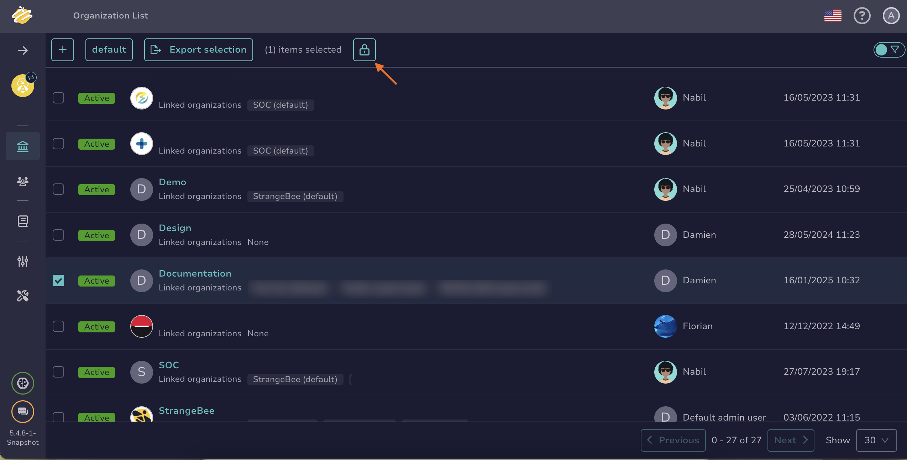

## How to Lock or Unlock an Organization

This topic provides step-by-step instructions for locking or unlocking an [organization](about-organizations.md) in TheHive.

Locking an organization is useful when you want to prevent users from logging in with that organization.

!!! info "Deleting an organization"
    In TheHive, organizations cannot be deleted to ensure database integrity and safety.

{!includes/administrator-access-manage-organizations.md!}

## Lock an Organization

1. As an administrator, go to the **Organizations** view.

    

2. Select the checkbox on the left of the organization to lock. Alternatively, hover over the organization and select .

    

3. If you selected the checkbox, select . If you hovered over the organization and selected , turn on the **Locked** toggle to lock the organization.

    

4. Select **OK** or **Confirm**.

## Unlock an Organization

1. As an administrator, go to the **Organizations** view.

    

2. Select the checkbox on the left of the organization to unlock. Alternatively, hover over the organization and select .

    

3. If you selected the checkbox, select . If you hovered over the organization and selected , turn off the **Locked** toggle to unlock the organization.

    

4. Select **OK** or **Confirm**.

## Next steps

* [Create an Organization](create-an-organization.md)
* [Link or Unlink an Organization](link-unlink-an-organization.md)
* [Add Users to an Organization](add-users-to-an-organization.md)
