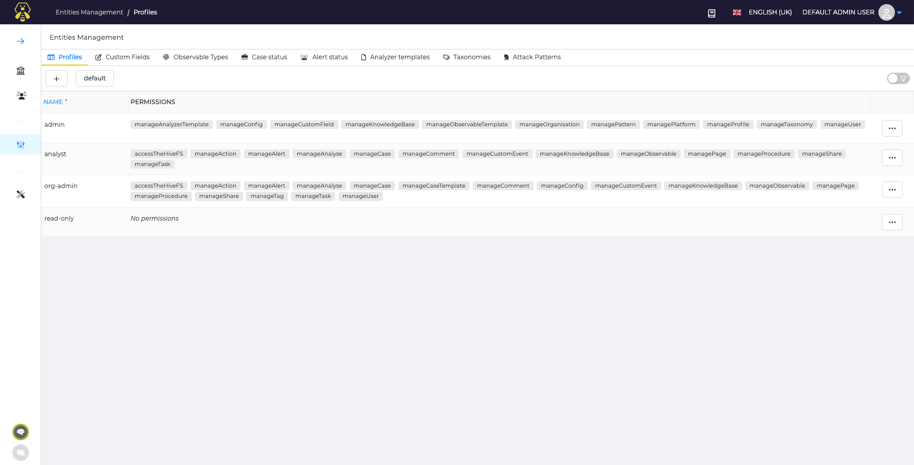
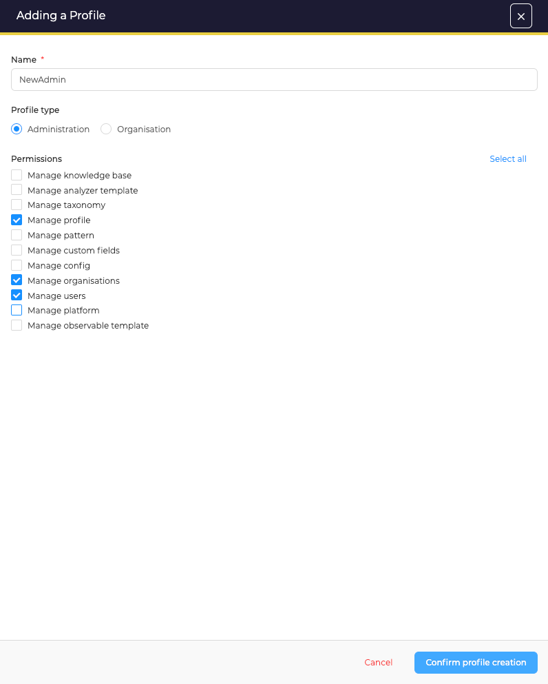
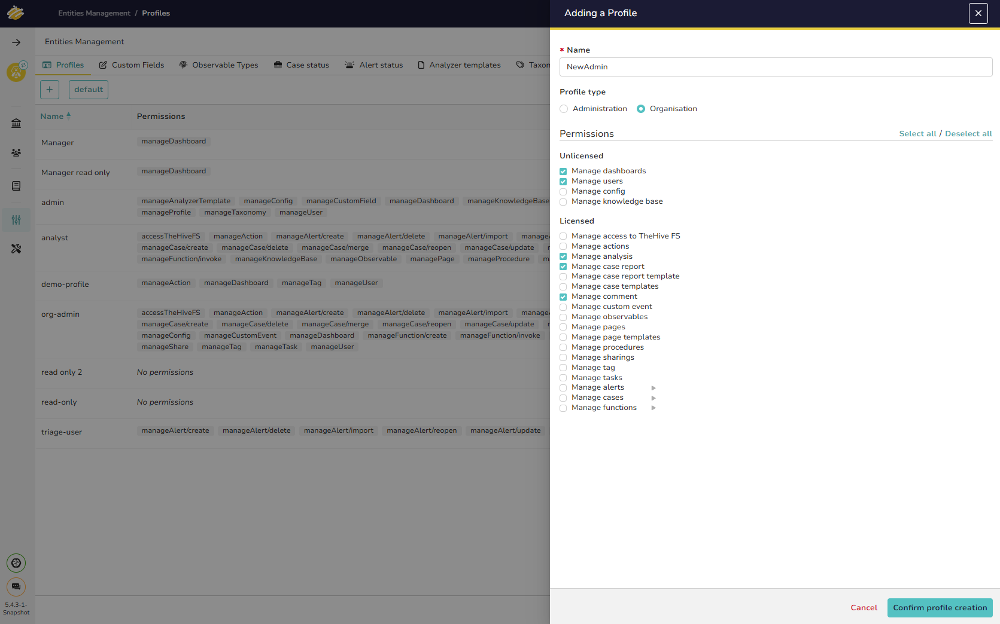
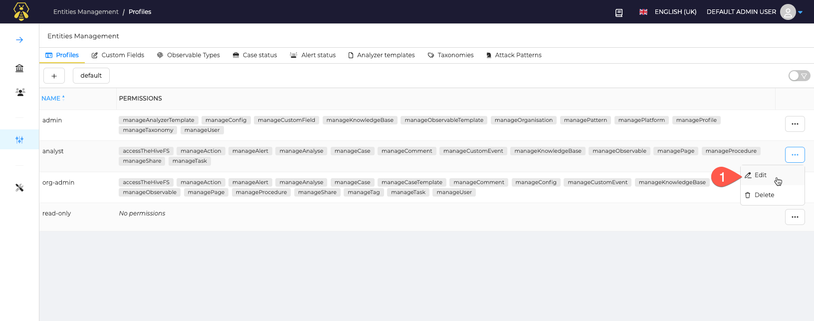

# Profiles

Profiles are available in the first tab of *Entities Management* page.

## Introduction

TheHive comes with a set of predefined profiles for Administrators and Organsations ; this set can be enriched with custom profiles you can create depending on your needs.

!!! Info ""
    A Valid license is required to update profiles

## About Permissions

Each profile is defined by a set of permissions.
There are two profile types:

* Administration, used by users in the Admin organisation, to manage the platform
* Organization used in business organisations

Permissions are named `manageEntity` with `Entity`, an entity in the application. For example: `manageCase`. A permission `manageEntity` means having rights to write, update,delete an entity. 

## Manage Profiles

Except the *admin* profile, all profiles can be customised and deleted.

### Add a profile

* Add a new profile by clicking the **+** button on the Entities Management page, in the Profiles tab
* Then select the type of profile to create, and associated permissions  

Adding a Profile window opens.

1. Enter a **Name** for the new profile.
1. Choose **Profile type**.
1. Select the **Permissions** for that profile type.
1. Click the **Confirm profile creation** button.

## Edit or delete Profile

