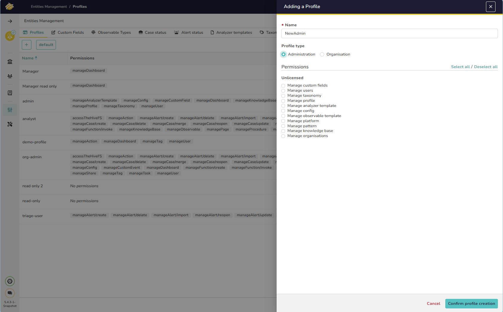
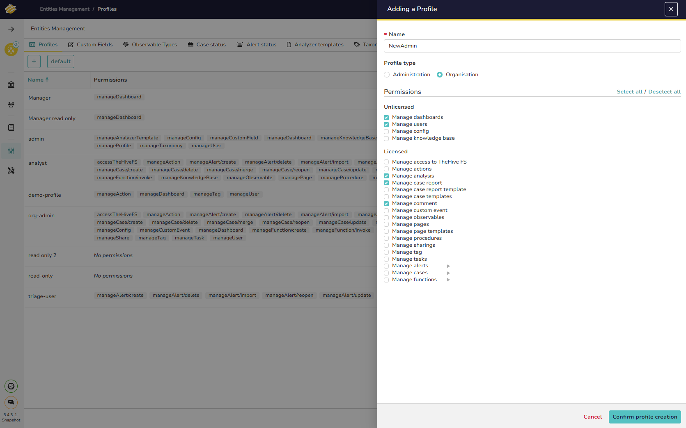
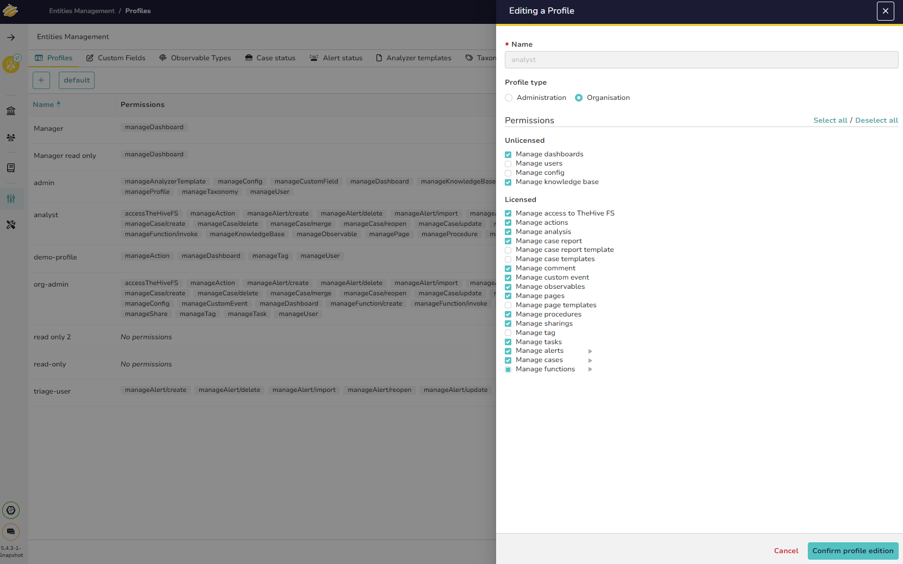
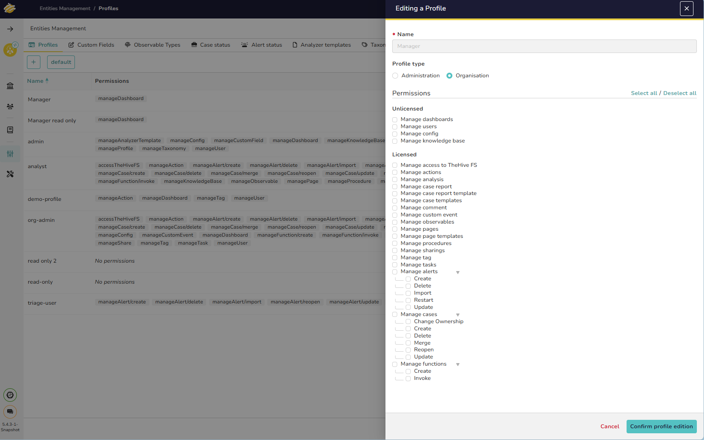

# Profiles

## Introduction

TheHive includes a set of predefined profiles for Administrators and Organizations. This set can be expanded by creating custom profiles tailored to specific needs.

!!! Info ""
    A valid license is required to update profiles.

## About Permissions

Each profile is defined by a set of permissions. There are two profile types:

* **Administration**: Used by users in the Admin organization to manage the platform.
* **Organization**: Used within business organizations.

Permissions follow the format `manageEntity`, where `Entity` represents an application entity. For example, `manageCase` grants the right to create, update, and delete cases.

## Manage Profiles

All profiles, except for the *admin* profile, can be customized or deleted.

### Adding a Profile

1. Navigate to the Profiles tab on the *Entities Management* page and click the :fontawesome-solid-plus: button.
2. Select the type of profile to create and assign the associated permissions.

The **Add a Profile** window will open.

1. Enter a **Name** for the new profile.
2. Choose a **Profile Type**.
3. Select the appropriate **Permissions** for the profile type.
4. Click **Confirm profile creation** to finalize.

## Editing or Deleting a Profile

Profiles can be edited or deleted as required.

---

## Version 5.4.3 Updates

### License-Consumption for Permissions

Starting with version 5.4.3, TheHive introduces a distinction between permissions that consume a license and those that do not. In the profile permission selection screen, permissions are now divided into two categories:

* **Unlicensed Permissions**: Permissions that do not consume a license.
* **Licensed Permissions**: Permissions that consume a license.

Permissions that consume a license are grouped under **Licensed Permissions**, while those that do not consume a license are grouped under **Unlicensed Permissions**.

### Permission Groups

Here is a detailed list of permissions in each group:

#### Unlicensed Permissions

The following permissions do not consume a license and are available under the **Unlicensed** group:

- **Manage dashboards**
- **Manage users**
- **Manage config**
- **Manage knowledge base**

#### Licensed Permissions

The following permissions consume a license and are available under the **Licensed** group:

- **Manage access to TheHive FS**
- **Manage actions**
- **Manage analysis**
- **Manage case report**
- **Manage case report template**
- **Manage case templates**
- **Manage comment**
- **Manage custom event**
- **Manage observables**
- **Manage pages**
- **Manage page templates**
- **Manage procedures**
- **Manage sharings**
- **Manage tag**
- **Manage tasks**
- **Manage alerts**
    - Create
    - Delete
    - Import
    - Restart
    - Update
- **Manage cases**
    - Change Ownership
    - Create
    - Delete
    - Merge
    - Reopen
    - Update
- **Manage functions**
    - Create
    - Invoke

### Selecting Permissions by License Group

When adding or editing a profile, users can easily identify licensed and unlicensed permissions in the permission selection screen. This feature provides administrators with clear visibility into which permissions impact licensing and helps manage profile configurations efficiently.

&nbsp;