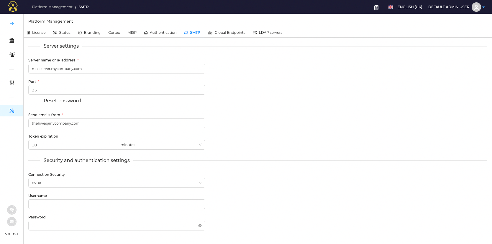

# SMTP

TheHive can connect to a SMTP server to send email notifications, and allow users to define or change their password when forgotten.

## Configure SMTP

On the Platform Management page, select the SMTP tab.

### Configure Server Settings

Define: 

1. **Server name or IP address**
2. **Port**
3. The email address you want to use as the *Sender* in **Send emails from**

### Configure Security and Authentication settings

Define additional security parameters, if required:

1. Select the right protocol from the list in **Connection security**
2. Enter the **Username** amd **Password** if required

### Confirm changes

## Create user account and send a notification

## I forgot my password
Learn how to request a magic link with the [I forgot my password](./../user-guides/forgot-password.md) button.