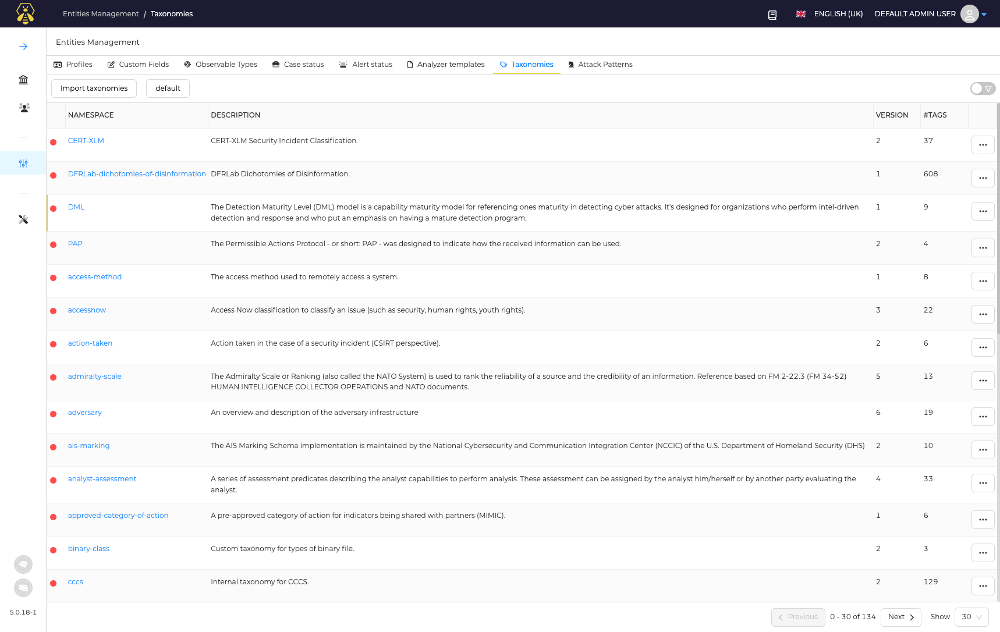
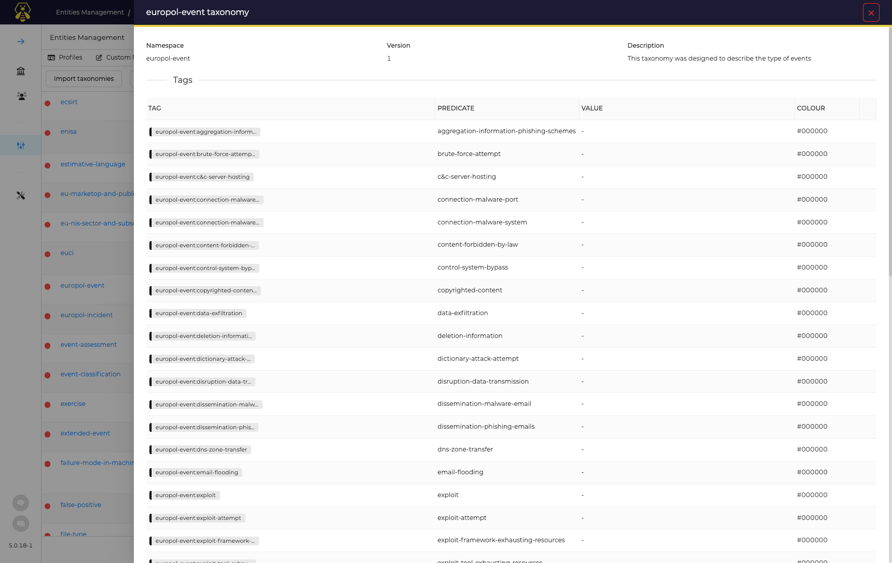
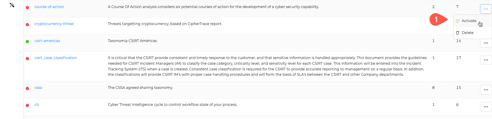
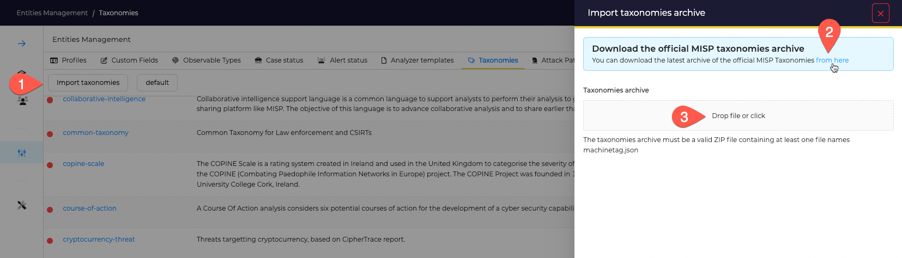

# Taxonomies

Taxonomies are used to defined structured tags in TheHive.
Taxonomies can be configured in the Administrators space: open *Entities Manamgement* and select *Taxonomies* tab.

By default, MISP taxonomies are imported.

## View a taxonomie

To review the list of available tags in one specific taxonomie, click on the desired name; this will open a drawer with the list of tags.

## Activate or delete a taxonomie
By default no taxonomie is activated; so none can be used in *Cases* or *Alerts*. To use a set of tags in *Cases* and *Alerts*, the related taxonomie should be activated.

## Update Taxonomies

TheHive comes with the version of [MISP taxonomies](https://www.misp-project.org/taxonomies.html) available at the moment of the installation. Updating TheHive does not update and add the last available version. So if you want to get the latest version released by MISP people you have to update it manually.

1. Click on the *Import Taxonomies* button
2. Download the last archive available here: [https://github.com/MISP/misp-taxonomies/archive/main.zip](https://github.com/MISP/misp-taxonomies/archive/main.zip)
3. Drag&Drop the downloaded file and click on the *Import* button

## Custom Taxonomies

You can add you own taxonomies by following the [JSON schema](https://github.com/MISP/misp-taxonomies) specified by MISP.