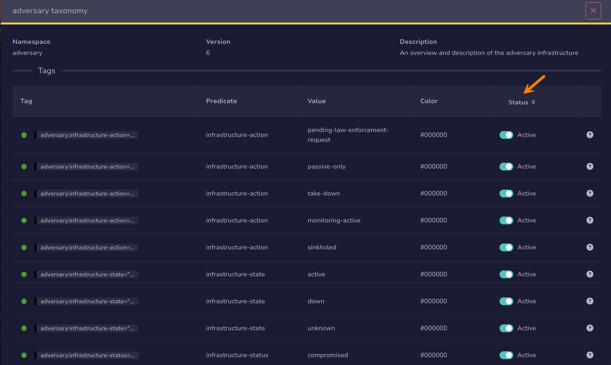

# Activate or Deactivate a Taxonomy Tag

<!-- md:version 5.8 --> <!-- md:permission `[admin] manageTaxonomy` -->

Activate or deactivate an individual tag of a [taxonomy](about-taxonomies.md) in TheHive to control which tags analysts can add to cases, alerts, and observables. Tag status applies to the whole instance, so deactivating a tag affects every organization.

Deactivate single tags when only some tags of a taxonomy are relevant to your organizations, for example because the others overlap with your [custom tags](../../user-guides/organization/configure-organization/manage-custom-tags/about-custom-tags.md).

To stop offering a whole taxonomy at once, [deactivate the taxonomy](activate-deactivate-a-taxonomy.md) instead.

Deactivating a tag doesn't delete it: analysts can no longer add it to cases, alerts, and observables, but those that already carry it keep it.

!!! info "Taxonomy tags only"
    Only taxonomy tags can be deactivated. To make a [custom tag](../../user-guides/organization/configure-organization/manage-custom-tags/about-custom-tags.md) unavailable, [delete it](../../user-guides/organization/configure-organization/manage-custom-tags/delete-a-custom-tag.md).

<h2>Procedure</h2>

1. 

2. 

3. Select the taxonomy that contains the tag.

4. In the **Status** column, turn the toggle off to deactivate the tag, or on to activate it.

    

<h2>Next steps</h2>

* [Activate or Deactivate a Taxonomy](activate-deactivate-a-taxonomy.md)
* [Add a Custom Taxonomy](add-a-custom-taxonomy.md)
* [Update MISP Taxonomies](update-misp-taxonomies.md)
* [Delete a Taxonomy](delete-a-taxonomy.md)
* [Add or Remove Tags](../../user-guides/analyst-corner/cases/tags/add-remove-tags.md)
