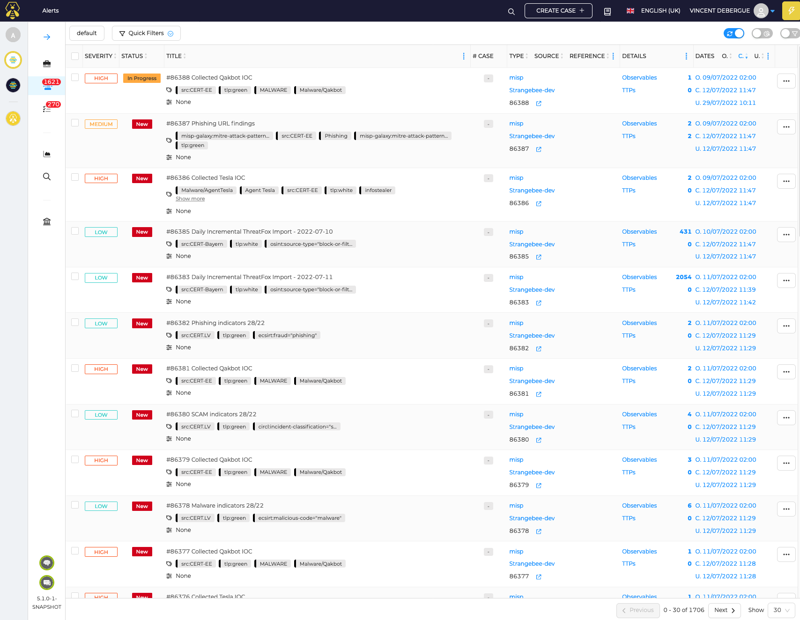
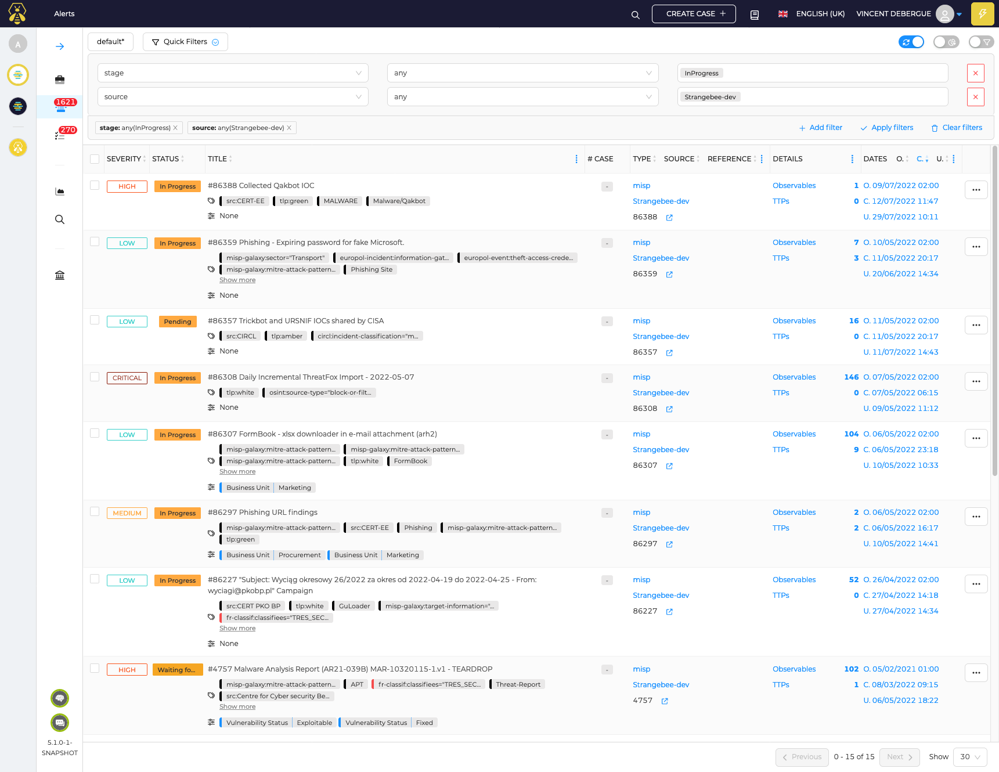
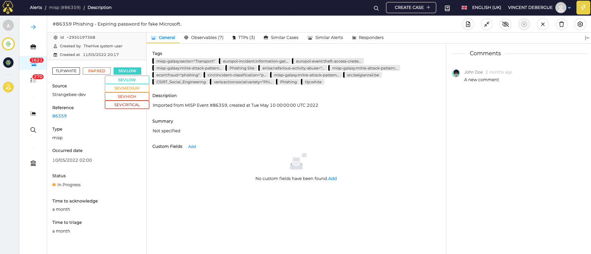
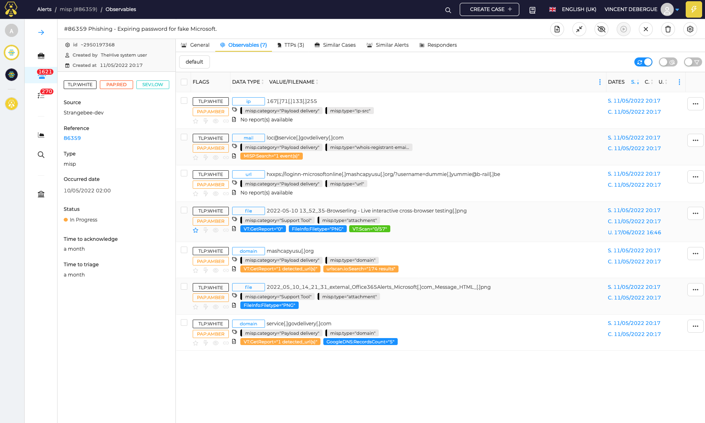
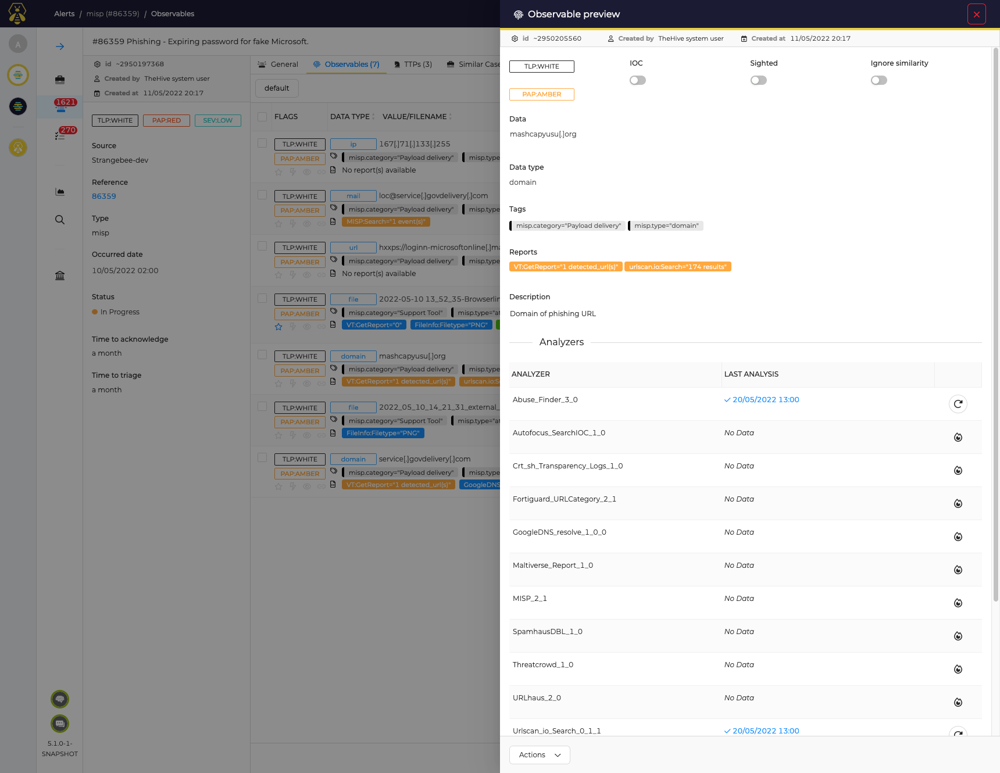

---
hide:
  - navigation
---

# Alert Management

## Alert list
Alerts received by your organization can be viewed in TheHive:

Every user inside the organization can view the alerts. But you will need the permission `manageAlert` to be able to edit alerts.

A user can use predefined filter or custom filters to view only selected alerts:

## Alert details 

From the alert list, an alert can be opened for more investigation. Details are filled, comments by analysts can be made on the alert too:

You can use tags, comments, severity, tlp, pap, custom fields and custom statuses to help categorize your alerts.

Observables from the alert can be further analyzed either by the analysts or by using Cortex analyzers:

Finally, depending on the analyst investigation, an alert can be closed (marked as "False Positive", "Duplicate", "Ignored" or an other custom status) or a case can be created to pursue the investigation.
