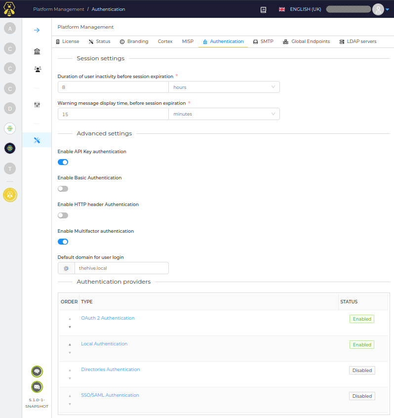
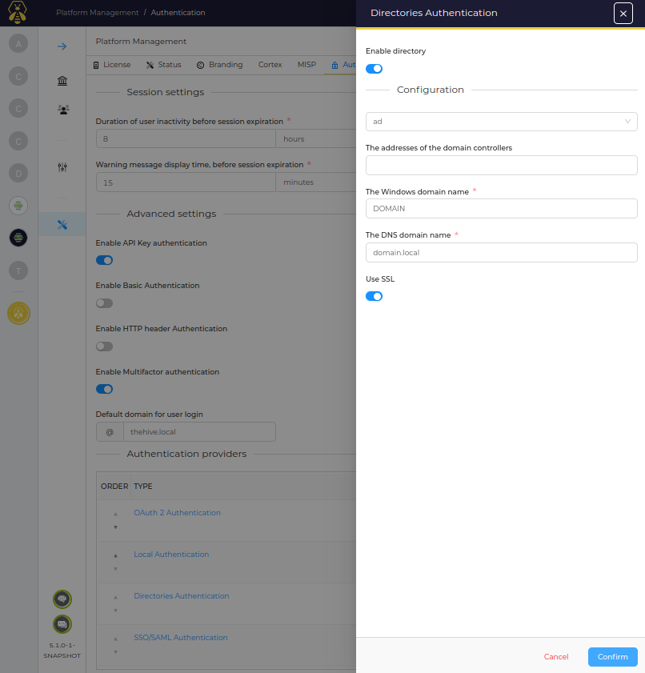
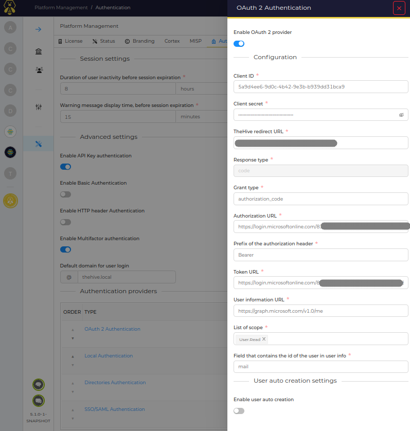
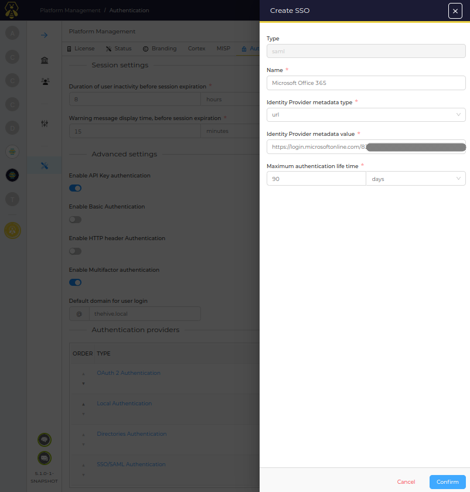
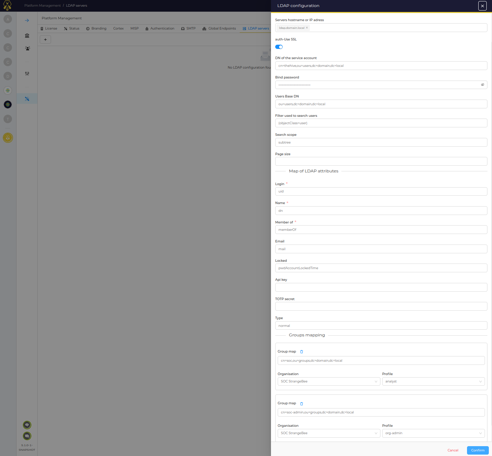

---
hide:
  - navigation
---

# Authentication

TheHive supports several authentication providers:

- local (credential are securely stored in TheHive database)
- directory (LDAP and Active Directory)
- OAuth2/OpenID-Connect
- SAML
- based on HTTP header to delegate authentication to reverse proxy

Multi-factor authentication can be enabled to enforce security on user authentication.

Several authentication providers can be enable. Each of them is check sequentially (order is important).

## Active Directory

## LDAP

## OAuth2 / OpenID-Connect

## SAML

## User synchronisation
The user can be provisionned and deprovisionned automatically based on the content of a directory.
The user data are synchronised periodically. New users in LDAP are created in TheHive, removed users are disabled.

The organization membership and the profile of an user are set using LDAP groups. The configuration contain the mapping of LDAP groups with organization/profile.
