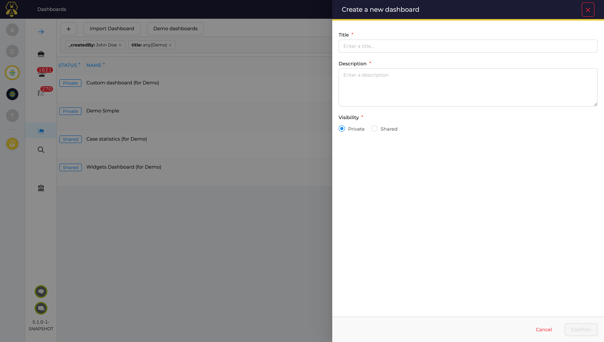
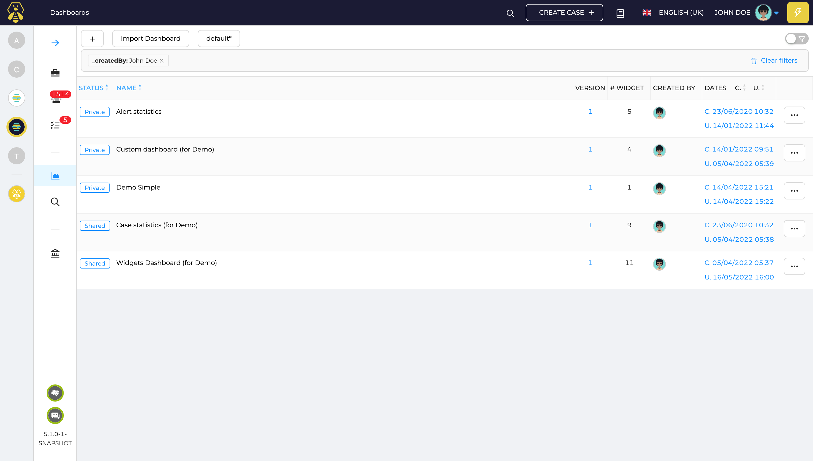
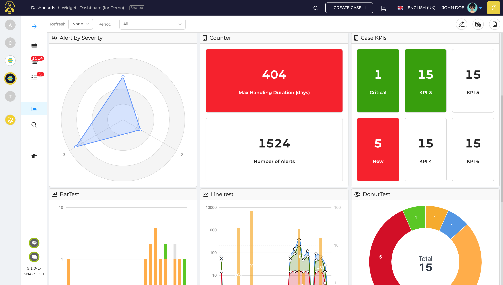
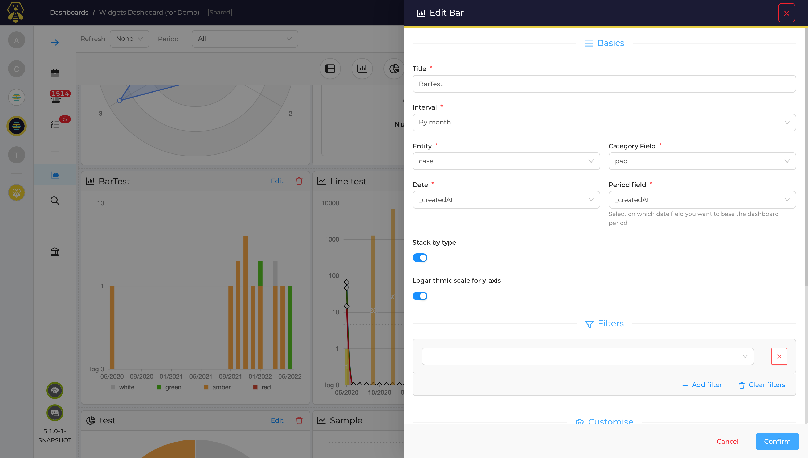
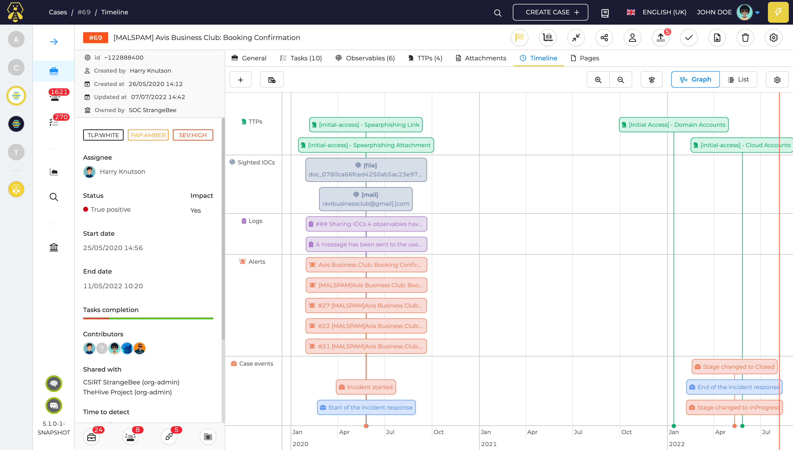
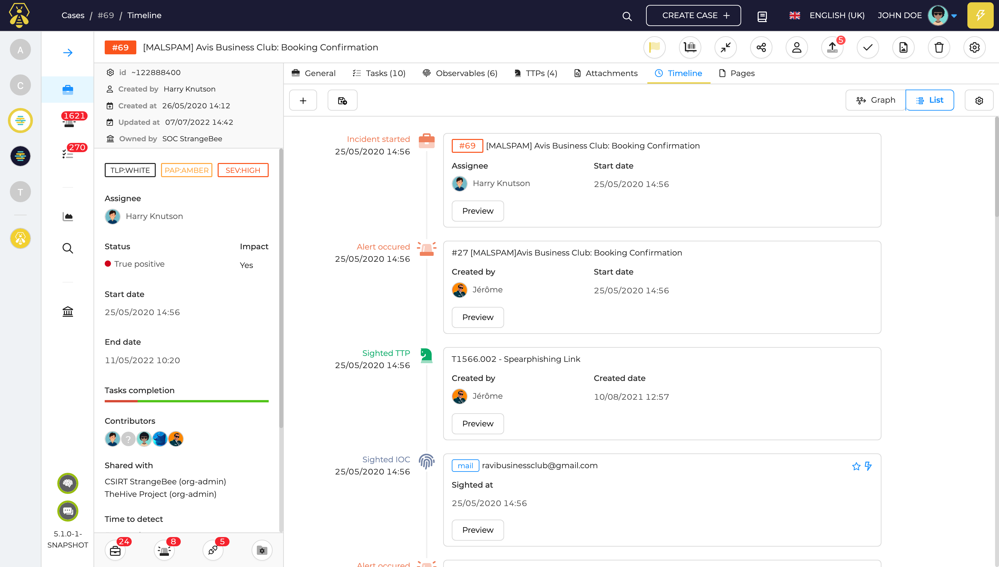

---
hide:
  - navigation
---

# Dashboards and Reporting

TheHive comes with a reporting module that allows designing shared and private dashbords using various widgets for data visualisation. Reports can gather metrics from any data stored in TheHive like cases, alerts, tasks, observables...

## Dashboards

Every user has read access to the dashboards defined in the organization (s)he belongs to. If the `manageDashboard` permission is part of the user's profile, the user can create dashboards.

### Create a dashboard

### List dashboards

### View dashboard

### Configure widgets

## Case timelines

Case timelines are a second part of TheHive's reporting capabilities. Case timelines display any event that happened during the lifecycle of a given case:

- Alert occurences
- Case creation
- Investigation start
- Task completion
- Flagged task logs
- IoC sightings
- Mitre Attack patterns
- Additional custom events

