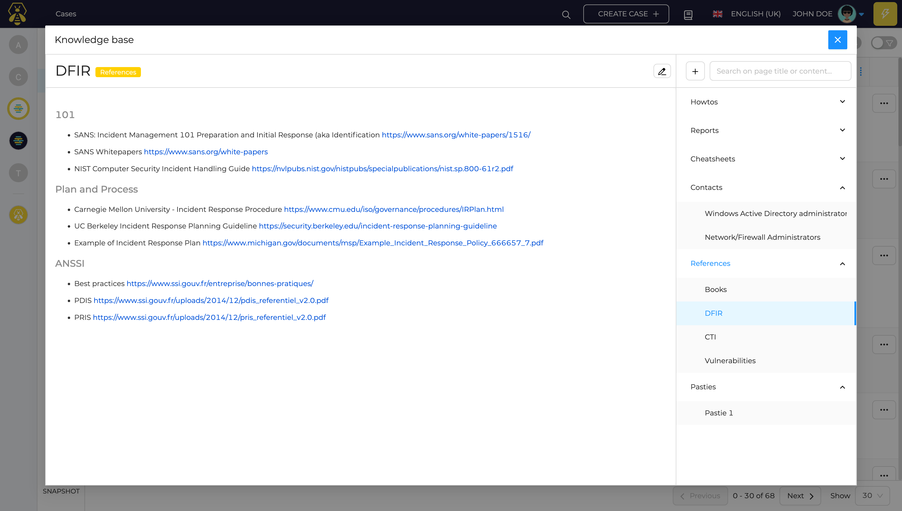
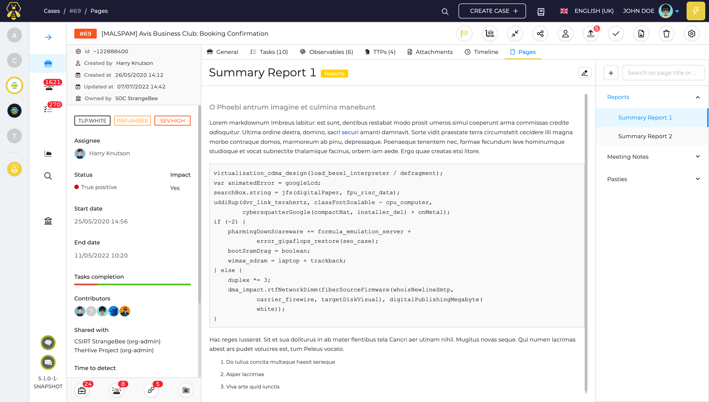

---
hide:
  - navigation
---

# Knowledge Base

TheHive has a knowledge base module that allow writing Markdown pages at two levels:

- Organization level
- Case level

## Organization wiki

Every organization is able to define a set of Markdown pages accessible to all the users. Adding pages requires a `manageKnowledgeBase` user permission.

## Case pages

Within every case, users with `managePage` permissions, can create and write Markdown pages. This feature ca, be used for:

- meeting notes
- reports
- pasties
- any other content

