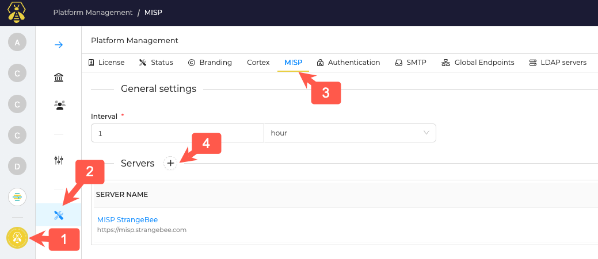
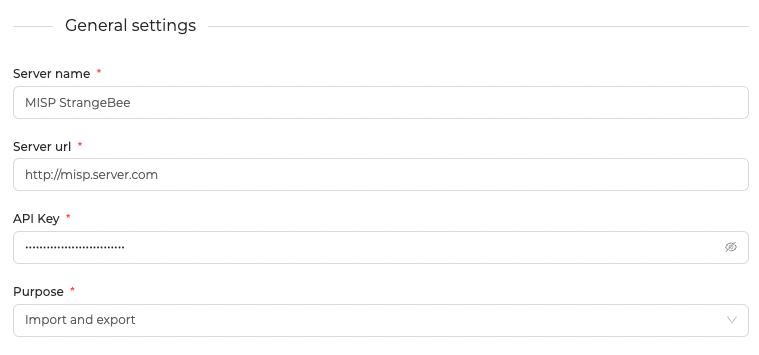
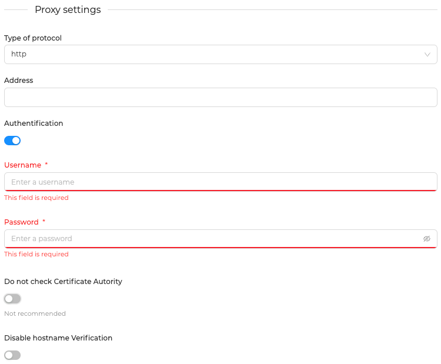
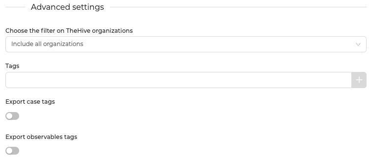
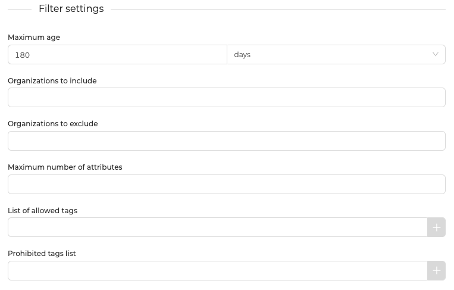

# MISP Integration

TheHive in strongly integrated with MISP (Malware Information Sharing Platform). 

Using it's connector, TheHive has the capabilities to:
- Receive MISP events and ingest them as alerts
- Send TheHive `Cases` to MISP as events

This integration is highly configurable and allows TheHive to synchronize with one or multiple MISP servers.

## Configuration

To add or configure a MISP server, open the Admin Organisation page (1), go to the Platform Management menu (2) and navigate to the MISP tab (3).

Click the "+" button to add a new MISP server (4).

### General settings

This configuration is common to all MISP servers connected to TheHive.

- Interval: define the time interval between each events polling from TheHive to MISP

### Servers General settings

While clicking on add or edit a MISP server, a drawer will appear where you can define the following settings:

- Server name: MISP server name to display within TheHive
- Server URL: URL of the MISP server
- API Key: secret with sufficient permission to get & create MISP events
- Purpose: Chose the synchronization way; Import: only import events from MISP to TheHive. Export: only exports cases from TheHive to MISP. Import and Export allow both ways synchronization

### Server Proxy Settings

Proxy settings should be set only if a proxy is required to reach the MISP server from TheHive.

- Type of protocol: Define on which protocol (HTTP/HTTPS) the proxy is listening
- Address: Define the proxy address
- Authentication: If the proxy require authentication, check this box. Username and password to authenticate must be provided when this box is checked.
- Do not check certificate authority: Do not verify the certificate authority when communicating with the proxy (not recommended, for HTTPS connection only)
- Disable hostname verification: Do not verify the hostname match with the certificate hostname.

### Server Advanced Settings

- Chose the filter on TheHive organizations: For each server, you can define which TheHive organisation(s) to include or exclude of the synchronization (excluded or not included organisations will not receive the MISP events as `Alerts`)
- Tags: Append one or several tags to each MISP event ingested as `Alert` 
- Export case tags: If enabled, the export will include the `Case` tags. 
- Export observables tags: If enabled, the exported `Observables` will include the `Observables` tags.

### Server Filter Settings

This section allows to define filters for MISP events import. 

 - Maximum age: define the maximum age (based on creation date) for an event to be imported in TheHive.
 - Organizations to include: Import only events created by the MISP organisation(s) defined in this field.
 - Organizations to exclude: Import only events NOT created by the MISP organisation(s) defined in this field.
 - Maximum number of attributes: Define a maximum number of MISP attributes (observables) per event to import. 
 - List of allowed tags: Import only events that contains the tags defined in this field
 - Prohibited tags list: Import only events that DON'T contains the tags defined in this field

