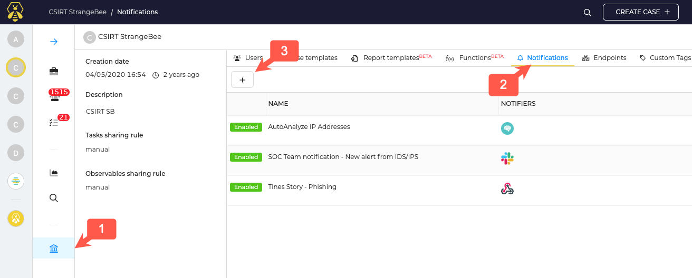
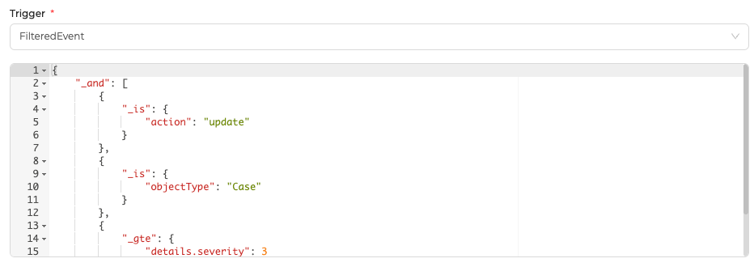
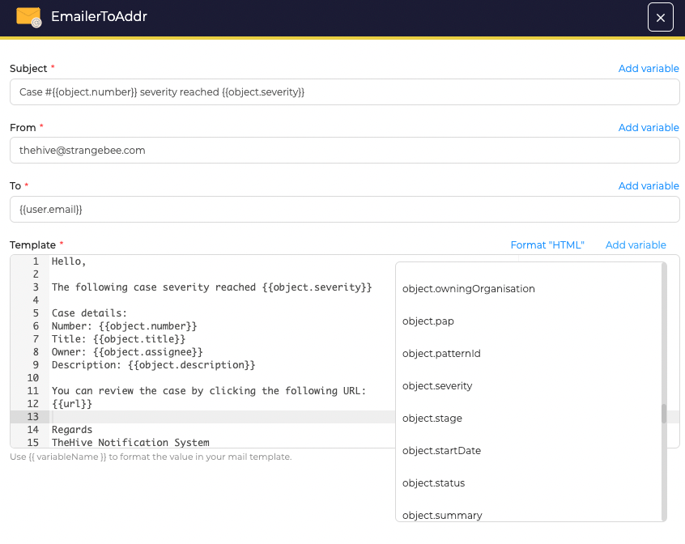

---
hide:
  - navigation
---

# Notifications

TheHive Notifications allow you to automatically react on specific events occurring in TheHive and send notification to defined Endpoints that can be:

- Cortex

- Webhook listener

- Http listener

- Slack

- Mattermost

Endpoints need to be configured prior to use them in Notifications.
You can also send an Email as notification. 

## Notifications management

Notifications are unique to each organisation. With an org admin account open the Organization menu (1), and navigate to the Notifications tab (2).

To create a notification, clic on the "+" button (3)



## Configure a Notification

While clicking on add or edit a notifier, a drawer will appear where you can define the following settings:

- Name: Notification name to display within TheHive
- Send notification to every user in the organisation: Check this box to notify by email every users of the organization this Notifier has triggered
- Trigger: Chose in a list of triggers on which event you want to react. You can also select "FilteredEvent" to create your own event filter.
- Enable notification: Check this box to enable the notifier. Uncheck the box to disable the notifier.

Finally, select which endpoint will receive the notification.

### Pre-defined triggers & FilteredEvent

While configuring the Trigger setting, you can pick a pre-defined trigger from a list, or chose to create your own filters. 

Current pre-defined filters list: 

- AnyEvent

- Case Created

- Case Closed

- Case Shared

- Alert Created

- Alert Imported

- Job Finished

- Alert Observable Created

- Case Observable Created 

- Observable Created

- Log in my task

- Task Assigned

- Task Closed

- Task Mandatory

But you can also chose to use a custom filter to react on specific events. 

Custom filters are JSON format written and can use common operators.
Example with a filter for cases which Severity is updated to High or Critical:



### Use variables in notifications

You can include variables in your Email & HTTP notification. 

Use the "add variable" bouton to see the list of available variables. Example with an email notification:



The templating engine is based on [mustache](https://mustache.github.io) so you can add some logic to your template. Example:

```
{{#if (eq object.severity 2) }}MEDIUM {{else}}Other {{/if}}
```

Some helpers are available to format your data:

| Helper | Description | Usage | Output |
|---     |---          |---    |---     |
| `tlpLabel` | Format the `tlp` field of the object | `{{ tlpLabel object.tlp }} ` | `Amber` |
| `papLabel` | Format the `pap` field of the object | `{{ papLabel object.pap }} ` | `Amber` |
| `severityLabel` | Format the `severity` field of the object | `{{ severityLabel object.severity }} ` | `Critical` |
| `dateFormat` | Format a date field of the object, uses [java date time patterns](https://docs.oracle.com/en/java/javase/11/docs/api/java.base/java/text/SimpleDateFormat.html) | `{{dateFormat audit._createdAt "EEEEE dd MMMMM yyyy" "fr" }}` | `jeudi 01 septembre 2022` |


See our [Leveraging TheHive 5 notifications capabilities](https://blog.strangebee.com/leveraging-thehive5-notification-capabilities-1-2/) blog articles to know more about Notifications
