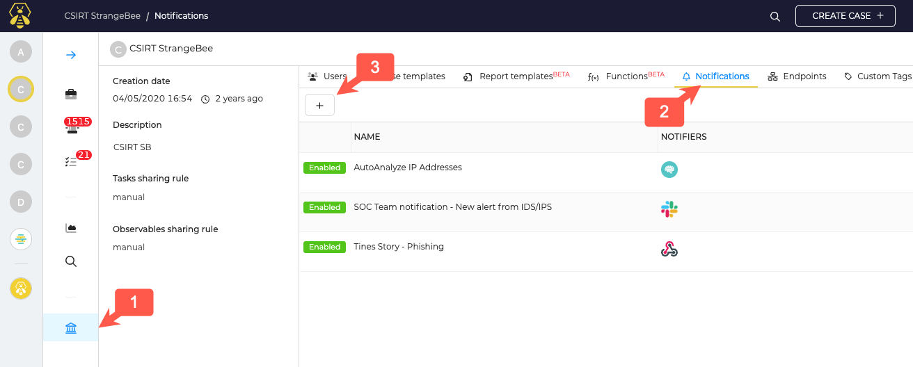

# Notifications

TheHive Notifications allows you to automatically react on specific events occurring in TheHive and send notification to defined Endpoints.

Endpoints can be:
- Cortex
- Webhook listener
- Http listener
- Slack
- Mattermost

Endpoints need to be configured before using them in Notifications.
You can also send an Email as notification. 

## Notification management

Notifications are unique to each organisation. With an org admin account open the Organization menu (1), and navigate to the Notifications tab (2).

To create a notification, clic on the "+" button (3)

