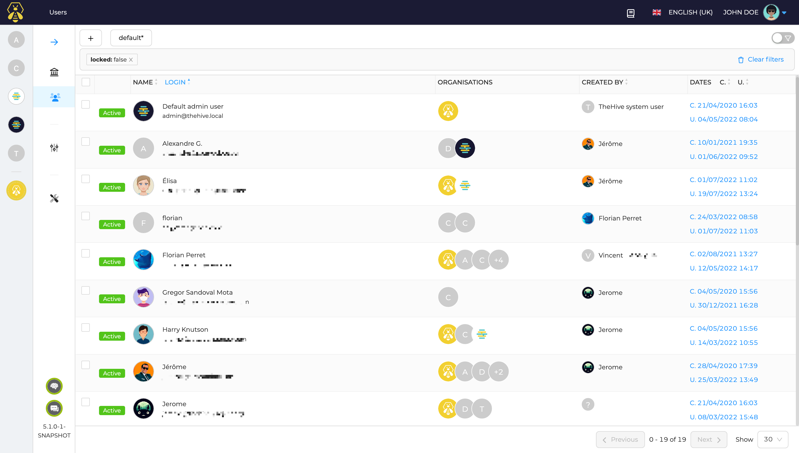
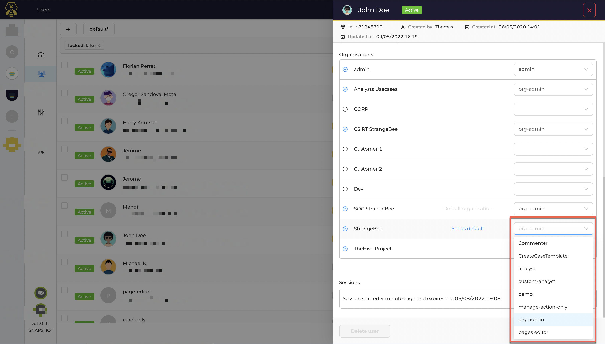
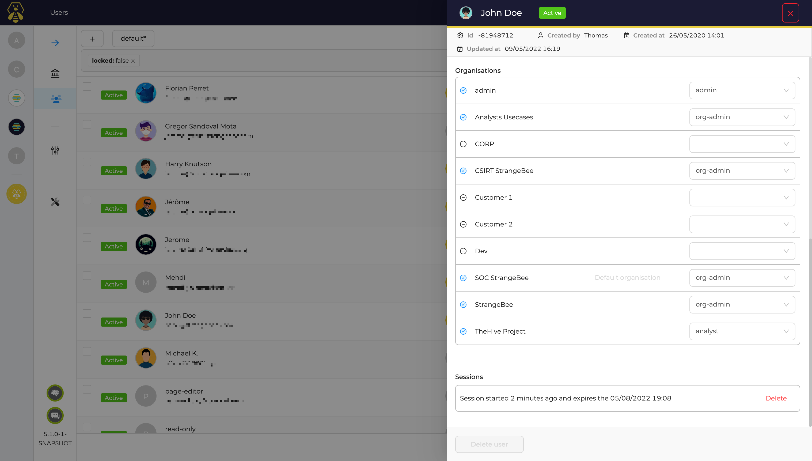
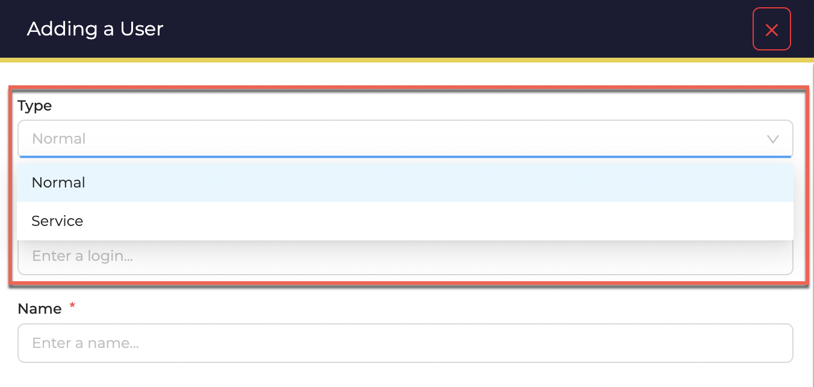
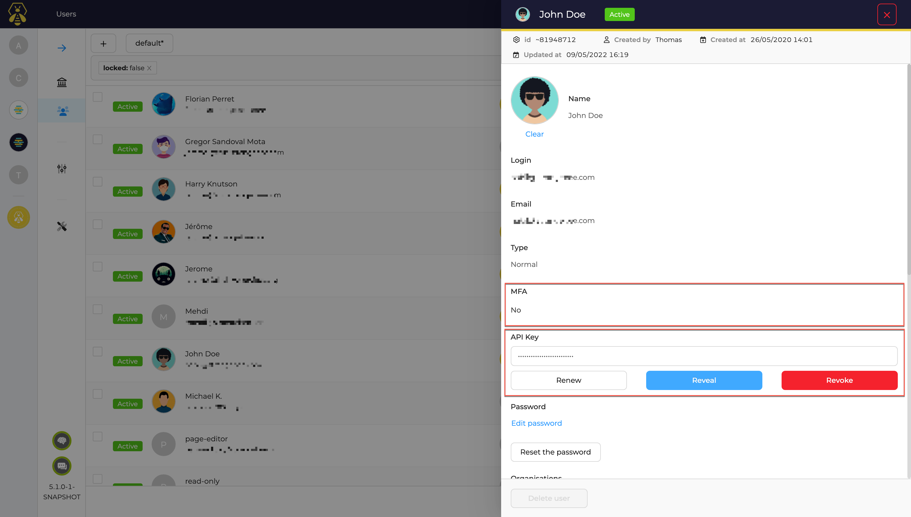

# User Management

In TheHive users can be created once an added to different organistions. User lists are available to `admin` and `org-admin` users:

When adding a user in an organisation, a user profile can be choosen for every organisation:

Users can be created by administrators or organisation administrators or any user having the `manageUser` permission. This permission is included by default in the `admin` and `org-admin` user profiles.

In TheHive, there are two types of users:

- Users with GUI access
- Service account aka. API users

Once created, users can be assigned a password and an API key
