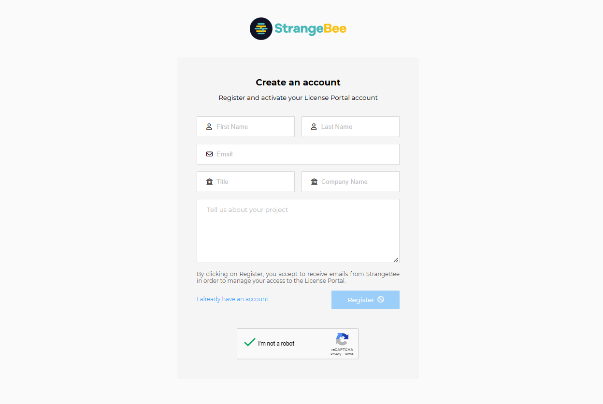
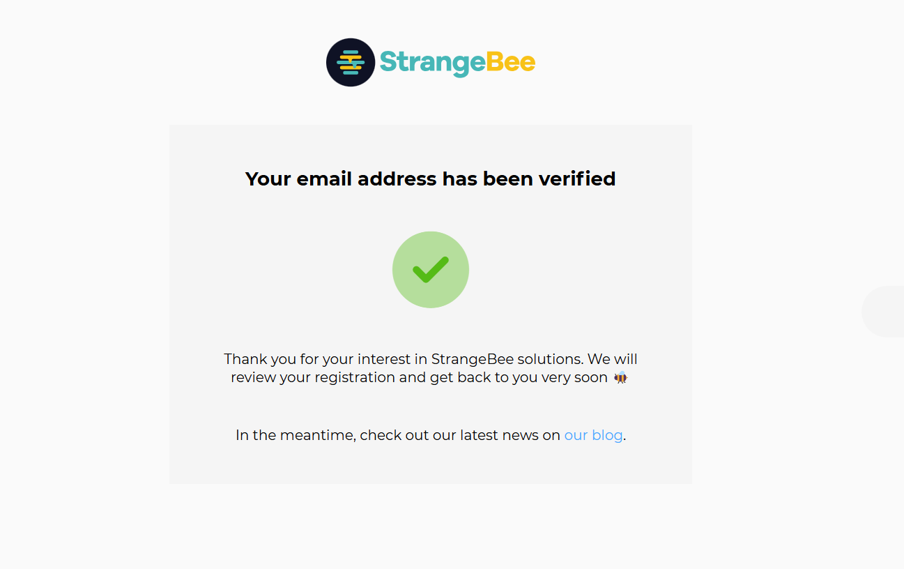
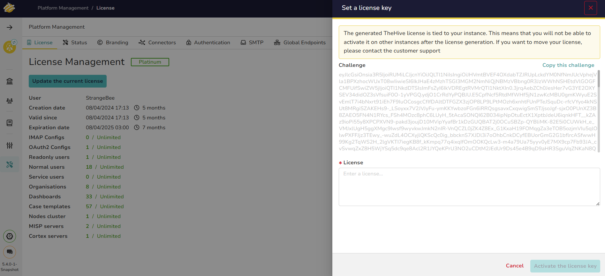

# Activating TheHive License

Starting with version 5.3, community users are required to generate a free **Community License** to run TheHive Community edition. To obtain this license, you need to create an account on the StrangeBee License Portal.

---

## How to Request a Free Community License

### 1. Create an Account on the StrangeBee License Portal

Visit the [StrangeBee License Portal registration page](https://portal.apps.strangebee.com/account/register), and register using your professional email address.

&nbsp;

### 2. Confirm Your Email Address

Check your email inbox for a confirmation message, click the confirmation link to verify your email address, and wait for your account to be validated by the StrangeBee team.

&nbsp;

### 3. Set Up Your Password

Once your account is validated, you will receive a notification. Follow the instructions to configure your password.

&nbsp;

### 4. Log In to the StrangeBee License Portal

Log in to the portal using your credentials.

&nbsp;

### 5. Request a Community License

Click on **"Request a Community License"** to proceed to the license generation page.

&nbsp;

### 6. Retrieve the Challenge from Your TheHive Instance

Open your TheHive instance in a new browser tab, navigate to **Admin > Platform Management > License Management**, and click **"Update the current license"** to display the challenge.

&nbsp;

### 7. Generate Your License Key

Copy the **Challenge** from TheHive, return to the StrangeBee License Portal, and paste it into the corresponding field on the license request page. Submit the form to generate your license key.

&nbsp;

### 8. Activate Your License in TheHive

Copy the generated license key, go back to your TheHive instance, paste the license key into the appropriate field, and confirm to activate your Community License.

&nbsp;

### 9. Enjoy TheHive Community Version

Your TheHive Community edition is now fully activated. You can now explore and use all the features available to you.

---

> **Note:** If you are already using TheHive 5.x Community version, please create your account on the License Portal before upgrading to version 5.3. Without this Community License, your interface will be limited to read-only mode.

&nbsp;