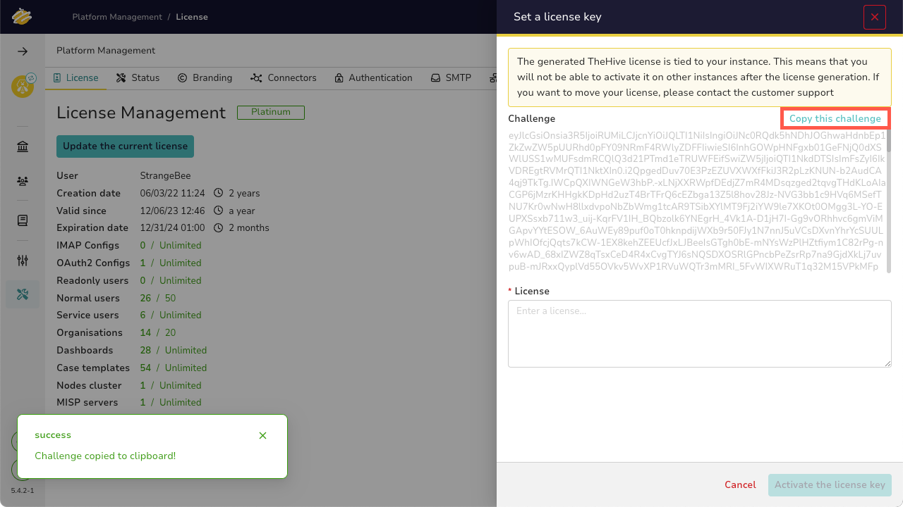

# Activating TheHive License

This section provides information about updating your license for TheHive. By default, TheHive is installed with the community edition license.

To activate a different license, you need to purchase one from StrangeBee. Upon purchasing, StrangeBee will create an account for you on their customer portal, allowing you to activate your license.

---

## Activating Your License

Follow these steps to activate your license:

1. **Access the Platform Management Page**:
    - Navigate to the Platform Management page.
    - Go to the **License** tab.
    - Click the **Update the current license** button.
    
    

2. **Copy the Challenge**:
    - A window will open displaying the challenge.
    - Click **Copy this challenge**.

    

    You will see a message confirming that the challenge has been copied. 

3. **Activate the License on the Customer Portal**:
    - Log in to your account on the StrangeBee customer portal.
    - Use the copied challenge to activate the license.
    - The portal will provide you with an activation license key.

4. **Enter the Activation Key**:
    - Return to the Platform Management page.
    - Enter the activation key in the **License** field.
    - Click the **Activate the license key** button.

    This will activate your license and update your instance with all the features included in your license.

---

## License Capabilities

The license includes the following capabilities:
- Defines the number of users you can create on your platform.
- Based on the number of users and the number of organisations.
- Includes a validation and an expiration date.
- Allows an unlimited number of Readonly users and Service users. Service users can use an API key to call all APIs but do not have access to TheHive interface.

---

## How-to Guide

Below is a video guide that walks you through the process of activating your license in detail.

&nbsp;