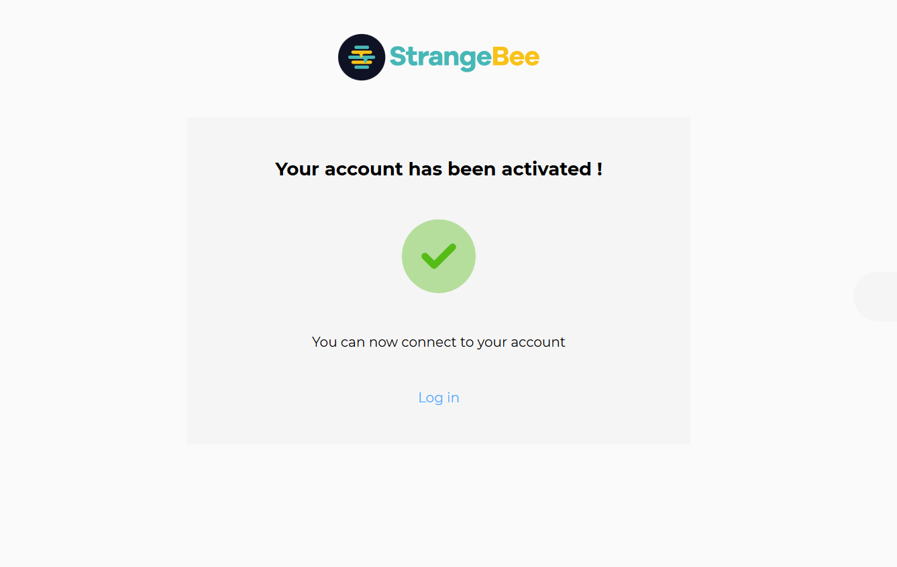
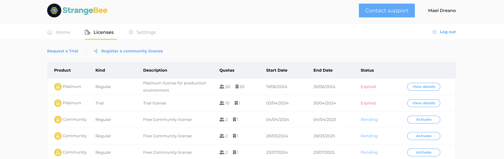

# Activating Paid License

## Overview

In addition to the [Community License](./request-community-license.md), The Hive provides two advanced licensing options tailored to meet various operational requirements.

### Gold License
The Gold License is designed for internal response teams who benefit from enhanced case management lifecycles and integration within their organizational infrastructure.

### Platinum License
The Platinum License is best suited for large teams needing extensive server connections, clustering, and dedicated, continuous support for mission-critical, large-scale incident response operations.

For full details, refer to [The Hive Pricing](https://strangebee.com/thehive-pricing-on-prem/).

&nbsp;

---

## Activating the License

After purchasing a Gold or Platinum subscription, follow the steps below to activate it.

&nbsp;

### 1. Log In to the StrangeBee License Portal

Log in to the portal using your credentials.

&nbsp;

### 2. Activate Your License in StrangeBee License Portal

Go to the Licenses tab, locate your license, and select Activate.

&nbsp;

### 3. Register Your License in TheHive instance

Copy the generated license key, go back to your TheHive instance, paste the license key into the appropriate field, and confirm to activate your license.

&nbsp;
