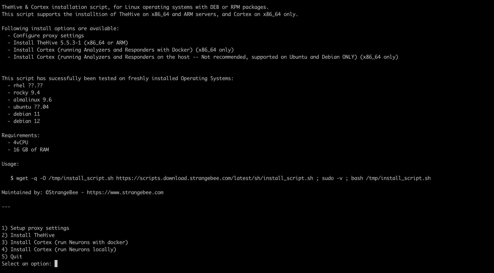

---
hide:
  - toc
---

## Using the Installation Script

TheHive provides users with a streamlined installation process through the **automated installation script**. This script is designed to simplify the setup process across supported operating systems, ensuring efficiency and ease of deployment.

To obtain and install TheHive via our automated installation script, execute the following command in your terminal:

```bash
wget -q -O /tmp/install.sh https://archives.strangebee.com/scripts/install.sh ; sudo -v ; bash /tmp/install.sh
```

This script streamlines the installation procedure, ensuring a successful setup provided that hardware requirements are met. It automates the process of fetching necessary components and configuring the system for optimal performance.



Upon execution, users are presented with several customizable options tailored to their specific requirements:

1. **Setup Proxy Settings:** Configure the host to work seamlessly with an HTTP proxy and integrate custom CA certificates for enhanced security and network compatibility.
2. **Install TheHive:** Effortlessly deploy TheHive 5 along with its dependencies, enabling users to leverage its powerful features for their projects.
3. **Install Cortex:** Facilitate the installation of Cortex and its dependencies to enable the execution of Analyzers & Responders as Docker images, ensuring scalability and efficient resource utilization.
4. **Install Cortex on the Host:** Alternatively, install Cortex and its dependencies directly on the host machine (compatible with Debian and Ubuntu **ONLY**), offering flexibility in deployment options and optimizing system resources.

</br>
!!! Note
    For users requiring more detailed guidance, comprehensive installation guides are available for various deployment scenarios on the following links:

    - [Linux/Unix Based Systems Installation Guide](./step-by-step-installation-guide.md)
    - [TheHive Cluster Deployment](./deploying-a-cluster.md)
    - [Running with Docker](./docker/docker-compose-overview.md)
    - [Kubernetes Deployment](./kubernetes.md)