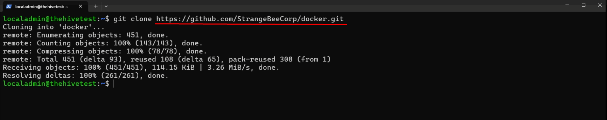
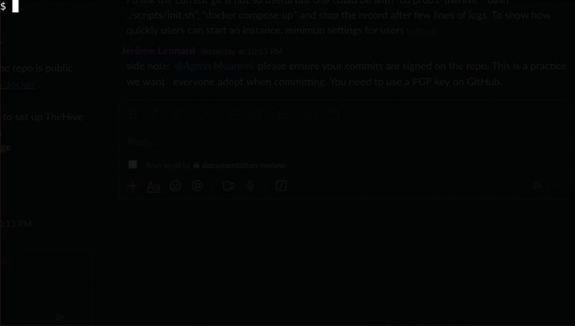
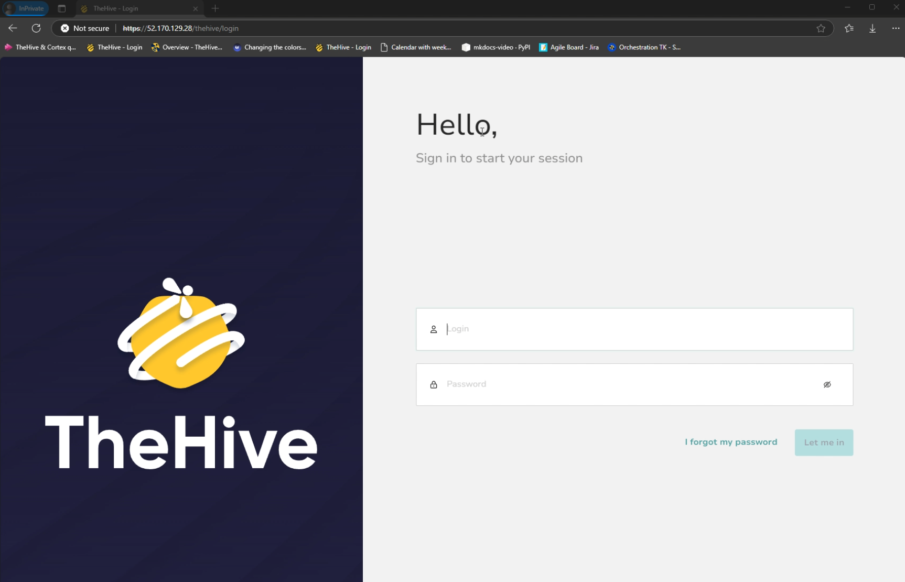

# :material-docker: Running TheHive with Docker

TheHive fully supports Docker, allowing users to quickly deploy and manage their instance of the platform using Docker containers.

We provides and maintain several setup profiles for TheHive and Cortex available on GitHub. This guide will walk you through choose the right profile and setting up TheHive using Docker.

!!! info "Cortex support"
    <!-- md:version 5.5 --> Cortex 3.1.5 and earlier are no longer supported since version 5.5.

---

## Prerequisites

#### Software requirements

- **Docker Engine**: Version `v23.0.15` or later. [Installation instructions](https://docs.docker.com/engine/install/){target=_blank}
- **Docker Compose Plugin**: Version `v2.20.2` or later. [Installation instructions](https://docs.docker.com/compose/install/){target=_blank}
- **jq**: [jq installation instructions](https://jqlang.github.io/jq/){target=_blank}
- **Permissions**: The current user should have at least `sudo` permissions.

&nbsp;

#### Hardware requirements

Hardware requirements will depend on the deployment profile being used. For example, for testing deployments, a CPU with 4 vCPUs and 8 GB RAM is recommended, while for high-performance deployments for TheHive on a dedicated server, a CPU with 8 vCPUs and 32 GB RAM is recommended. For more detailed requirements, please refer to the GitHub link provided below.

Basically, two hardware profiles are recommended to run the full stack for TheHive on a single server (virtual of physical): 

1. 4vCPUs, 16 GB of RAM and 100GB of storage is recommended for most use cases, 
2. 8vCPUs, 32GB of RAM and 150GB of storage for intensive use cases.


---

## Clone the repository

Clone the [StrangeBee Docker repository](https://github.com/StrangeBeeCorp/docker.git) to your local machine:

```sh
git clone https://github.com/StrangeBeeCorp/docker.git
```



---

## Deployment profiles

!!! Warning "**BEFORE** RUNNING ANY COMMAND"
    Please, read carefully the documentation related to the profile you want to use (the `README.md` files you'll find in the GitHub repository).


The prebuilt deployment profiles allow you to quickly set up TheHive based on your specific use case. Choose from the following deployment options:

**Testing Environment**

:  Deploys both TheHive (and [Cortex](../../cortex/index.md)) on a single server for testing purposes. [Link to the testing profile](https://github.com/StrangeBeeCorp/docker/blob/main/testing){target=_blank}

**Production Environment #1 - TheHive**

:  Single server deployment for intensive use of TheHive. [Link to the production profile](https://github.com/StrangeBeeCorp/docker/blob/main/prod1-thehive){target=_blank}

**Production Environment #2 - TheHive**

:  High-performance deployment for TheHive on a dedicated server. [Link to the high-performance production profile](https://github.com/StrangeBeeCorp/docker/blob/main/prod2-thehive){target=_blank}

You can choose the scenario that best suits your needs by selecting the appropriate Docker Compose YAML file.

---

## Starting TheHive

The application stack includes several utility scripts, one of which is the `init.sh` script, which performs the following tasks for you:

- Prompt for a service name to include in the Nginx server certificate.
- Initialize the `secret.conf` files for TheHive and Cortex.
- Generate a self-signed certificate if none is found in the `./certificates` directory.
- Create a `.env` file containing user/group information and other application settings.
- Verify file and folder permissions to ensure proper access rights.

!!! Note "Note"
    TheHive application will run under the user account and group that execute the initialization script.

Follow the steps below to initialize the environment.

### Step 1: Run the initialization script

Execute the `init.sh` script to set up the necessary configurations:

```bash
bash ./scripts/init.sh
```

### Step 2: Run the application stack

```bash
docker compose up
```

or 

```bash
docker compose up -d
```

&nbsp;

!!! Example "How to start quickly with prod1-thehive environment?"
    1. Clone the repository
    2. Open prod1-thehive folder
    3. Initialize the environment
    4. Start the application stack

    


### Step 3: Access the application

Open your browser, and navigate to:

* `https://HOSTNAME_OR_IP/thehive` to connect to TheHive if using the *testing* profile
* `https://HOSTNAME_OR_IP/` to connect to TheHive if using the production profiles

&nbsp;



---

## Additional configuration

For more detailed information on the directory structure, services, scripts, and their respective functions, please refer to the `README.md` file located within each deployment profile:

- [Testing Environment](https://github.com/StrangeBeeCorp/docker/blob/main/testing/README.md){target=_blank}
- [Production Environment #1 - TheHive](https://github.com/StrangeBeeCorp/docker/blob/main/prod1-thehive/README.md){target=_blank}
- [Production Environment #2 - TheHive](https://github.com/StrangeBeeCorp/docker/blob/main/prod2-thehive/README.md){target=_blank}

---

## TheHive Docker entrypoint options

To view a list of all supported options for the Docker entry point, use the -h flag:

```bash
docker run --rm strangebee/thehive:<version> -h
```

The output will display available options, allowing you to configure TheHive according to your requirements.

Available Options:

- `--config-file <file>`: Specifies the path to the configuration file.
- `--no-config`: Prevents TheHive from attempting to configure itself, including adding secrets and Elasticsearch settings.
- `--no-config-secret`: Excludes the addition of a randomly generated secret from the configuration.
- `--secret <secret>`: Sets the secret used to secure sessions.
- `--show-secret`: Displays the generated secret.
- `--no-config-db`: Disables automatic configuration of the database.
- `--cql-hostnames <host>,<host>,...`: Resolves these host names to locate Cassandra instances.
- `--cql-username <username>`: Specifies the username for the Cassandra database.
- `--cql-password <password>`: Specifies the password for the Cassandra database.
- `--cql-datacenter <datacenter>`: Specifies the name of the Cassandra datacenter used by the TheHive node. This parameter is new as of version 5.4.7 and can have different values for each node in cluster mode.
- `--no-cql-wait`: Skips waiting for Cassandra to become available.
- `--bdb-directory <path>`: Defines the location of the local database if Cassandra is not used (default: /data/db).
- `--index-backend`: Specifies the backend to use for index, either 'lucene' or 'elasticsearch' (default: lucene).
- `--es-hostnames`: Specifies the Elasticsearch instances used for index.
- `--es-index`: Specifies the Elasticsearch index name to be used (default: thehive).
- `--no-config-storage`: Disables automatic configuration of storage.
- `--storage-directory <path>`: Specifies the location of local storage if S3 is not used (default: /data/files).
- `--s3-endpoint <endpoint>`: Specifies the endpoint of S3 or other object storage if used, with 's3.amazonaws.com' for AWS S3.
- `--s3-region <region>`: Specifies the S3 region, optional for MinIO.
- `--s3-bucket <bucket>`: Specifies the name of the bucket to use (default: thehive), which must already exist.
- `--s3-access-key <key>`: Specifies the S3 access key (required for S3).
- `--s3-secret-key <key>`: Specifies the S3 secret key (required for S3).
- `--s3-use-path-access-style`: Sets this flag if using MinIO or another non-AWS S3 provider, defaulting to virtual host style.
- `--no-config-cortex`: Excludes Cortex configuration.
- `--cortex-proto <proto>`: Defines the protocol to connect to Cortex (default: http).
- `--cortex-port <port>`: Defines the port to connect to Cortex (default: 9001).
- `--cortex-hostnames <host>,<host>,...`: Resolves these host names to locate Cortex instances.
- `--cortex-keys <key>,<key>,...`: Defines Cortex keys.
- `--kubernetes`: Utilizes the Kubernetes API to join other nodes.
- `--kubernetes-pod-label-selector <selector>`: Specifies the selector to use to select other pods running the app (default app=thehive).
- `--cluster-min-nodes-count <count>`: Specifies the minimum number of nodes to form a cluster (default to 1).
- `migrate <param> <param> ...`: Runs the migration tool.
- `cloner <param> <param> ...`: Runs the cloner tool. 

&nbsp;