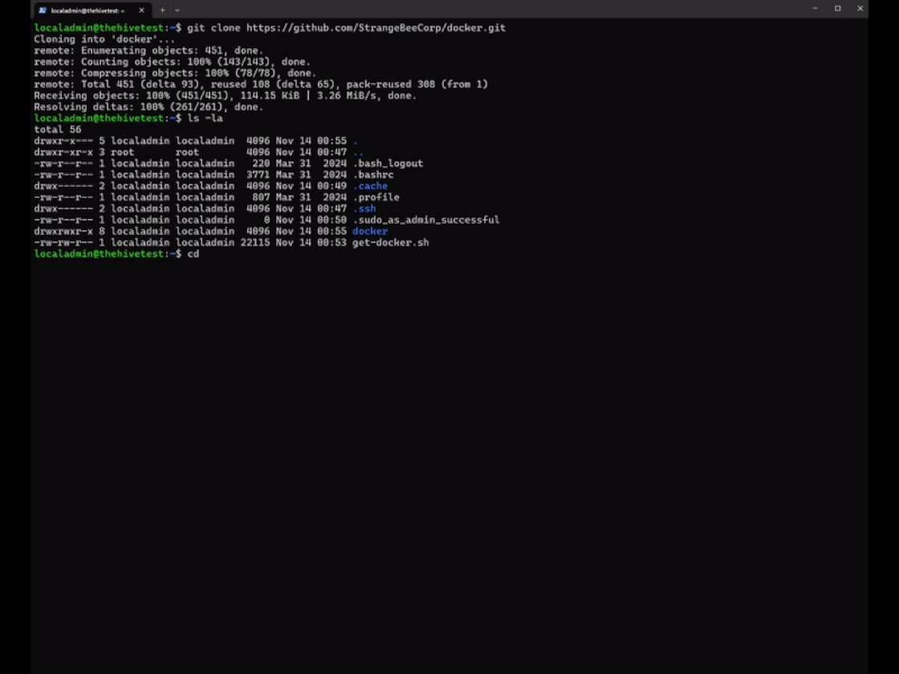

# :material-docker: Running TheHive with Docker

TheHive fully supports Docker, allowing users to quickly deploy and manage their instance of the platform using Docker containers. 

This guide will walk you through setting up TheHive using Docker.

---

## Prerequisites

#### Software Requirements

- **Docker Engine**: Version `v23.0.15` or later. [Installation instructions](https://docs.docker.com/engine/install/)
- **Docker Compose Plugin**: Version `v2.20.2` or later. [Installation instructions](https://docs.docker.com/compose/install/)
- **jq**: [jq installation instructions](https://jqlang.github.io/jq/)
- **Permissions**: The current user should have at least `sudo` permissions.

&nbsp;

#### Hardware Requirements

Hardware requirements will depend on the deployment profile being used. For example, for testing deployments, a CPU with 4 vCPUs and 8 GB RAM is recommended, while for high-performance deployments for TheHive on a dedicated server, a CPU with 8 vCPUs and 32 GB RAM is recommended. For more detailed requirements, please refer to the GitHub link provided below.

---

## Clone the Repository

Clone the [StrangeBee Docker repository](https://github.com/StrangeBeeCorp/docker.git) to your local machine:

```sh
git clone https://github.com/StrangeBeeCorp/docker.git
```


---

## Deployment Profiles

The prebuilt deployment profiles allow you to quickly set up TheHive based on your specific use case. Choose from the following deployment options:

1. **Testing Environment**: Deploys both TheHive (and [Cortex](../../cortex/index.md)) on a single server for testing purposes. [Link to the deployment profile](https://github.com/StrangeBeeCorp/docker/blob/main/testing)
2. **Production Environment #1 - TheHive**: Single server deployment optimized for TheHive. [Link to the deployment profile](https://github.com/StrangeBeeCorp/docker/blob/main/prod1-thehive)
3. **Production Environment #2 - TheHive**: High-performance deployment for TheHive on a dedicated server. [Link to the deployment profile](https://github.com/StrangeBeeCorp/docker/blob/main/prod2-thehive)

You can choose the scenario that best suits your needs by selecting the appropriate Docker Compose YAML file.

---

## Starting TheHive

The application stack includes several utility scripts, one of which is the `init.sh` script, which performs the following tasks for you:

- Prompt for a service name to include in the Nginx server certificate.
- Initialize the `secret.conf` files for TheHive and Cortex.
- Generate a self-signed certificate if none is found in the `./certificates` directory.
- Create a `.env` file containing user/group information and other application settings.
- Verify file and folder permissions to ensure proper access rights.

!!! Note "Note"
    TheHive application will run under the user account and group that execute the initialization script.

Follow the steps below to initialize the environment.

### Step 1: Run the Initialization Script

Execute the `init.sh` script to set up the necessary configurations:

```bash
bash ./scripts/init.sh
```

### Step 2: Run the application stack

```bash
docker compose up
```

or 

```bash
docker compose up -d
```

&nbsp;



### Step 3: Access the application

Open your browser, and navigate to: 

* `https://HOSTNAME_OR_IP/thehive` to connect to TheHive

&nbsp;


---

## Additional Configuration

For more detailed information on the directory structure, services, scripts, and their respective functions, please refer to the README.md file located within each Deployment Profile:

- [Testing Environment](https://github.com/StrangeBeeCorp/docker/blob/main/testing/README.md)
- [Production Environment #1 - TheHive](https://github.com/StrangeBeeCorp/docker/blob/main/prod1-thehive/README.md)
- [Production Environment #2 - TheHive](https://github.com/StrangeBeeCorp/docker/blob/main/prod2-thehive/README.md)

&nbsp;