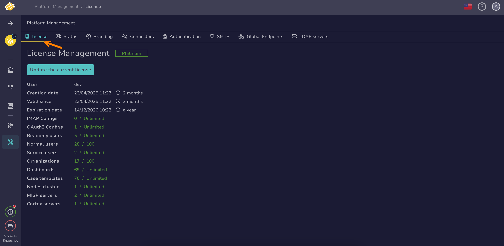

# How to Activate a License

This topic provides step-by-step instructions for activating a [TheHive license](about-licenses.md), whether it’s a Community, Gold, or Platinum license.

!!! note "TheHive On-prem only"
    License activation is required only for TheHive On-prem users. TheHive Cloud Platform users aren't affected because the Platinum license is activated automatically

!!! tip "Platinum trial"
    <!-- md:version 5.3 --> Installing TheHive On-prem includes a 14-day Platinum trial license. After this trial period, TheHive transitions to read-only mode, requiring a valid license for all users for continued full functionality.

!!! warning "Requirements"

    * For Community license: This procedure assumes that you have already obtained a Community license by following the [Request a Community License](request-a-community-license.md) topic
    * For Gold and Platinum licenses: This procedure assumes that you have already [purchased a valid Gold or Platinum license](https://strangebee.com/try-thehive/) and no longer wish or are able to use your trial license.

!!! warning "Required permissions"
    Only users with an admin-type profile that has the `managePlatform` permission can activate a license in TheHive.

## Step 1: Retrieve the challenge from your TheHive instance

1. {!includes/platform-management-view-go-to.md!}

2. Select the **License** tab.

    

3. Select **Update the current license**

    

4. In the **Set a license key** drawer, select **Copy this challenge**.

## Step 2: Generate your license key

## Step 3: Activate your license in TheHive

<h2>Next steps</h2>