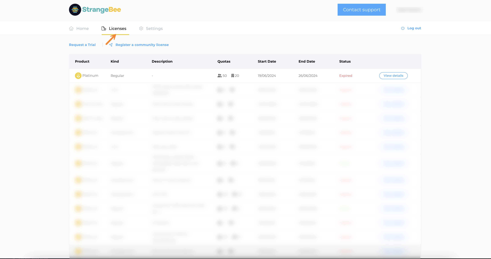
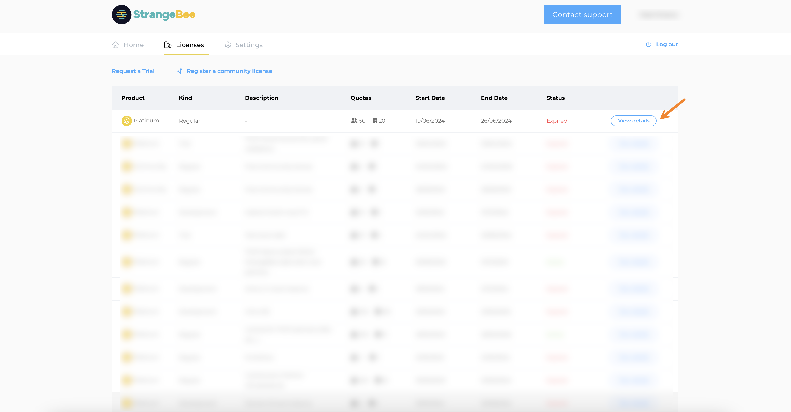
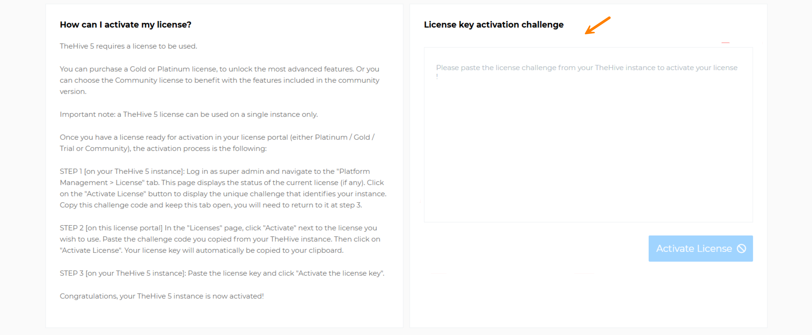

# How to Activate or Update a License

This topic provides step-by-step instructions for activating or updating a [TheHive license](about-licenses.md), whether it’s a Community, Gold, or Platinum license.

!!! tip "Platinum trial"
    <!-- md:version 5.3 --> Installing TheHive On-prem or using TheHive Cloud Platform for the first time includes a 14-day Platinum trial license. After this trial period, TheHive transitions to read-only mode, requiring a valid license for all users for continued full functionality.

!!! warning "Requirements"

    * For Community license: This procedure assumes that you have already obtained a Community license by following the [Request a Community License](request-a-community-license.md) topic.
    * For Gold and Platinum licenses: This procedure assumes that you have already [purchased a valid Gold or Platinum license](https://strangebee.com/try-thehive/) and no longer wish or are able to use your trial license.

!!! warning "Required permissions"
    Only users with an admin-type profile that has the `managePlatform` permission can activate or update a license in TheHive.

## Step 1: Retrieve the challenge from your TheHive instance

1. {!includes/platform-management-view-go-to.md!}

2. Select the **License** tab.

    

3. Select **Update the current license**

    

4. In the **Set a license key** drawer, select **Copy this challenge**.

## Step 2: Generate your license key

1. Log in to the [StrangeBee license portal](https://portal.apps.strangebee.com/login){target=_blank}.

2. Select the **Licenses** tab.

    

3. Select **Activate** or **View details** for your product.

    

4. Paste the challenge into the **License key activation challenge** field.

    

5. Select **Activate license**.

6. Select **Copy the key to clipboard**.

## Step 3: Activate your license in TheHive

1. Go back to your TheHive instance with the **Set a license key** drawer open.

2. Paste the generated license into the **License** field.

3. Select **Activate the license key**.

<h2>Next steps</h2>

* [Configure Authentication](./authentication/configure-authentication.md)
* [Connect a MISP Server](./misp-integration/connect-a-misp-server.md)
* [Add a Cortex Server](./cortex/add-a-cortex-server.md)
* [Configure an SMTP Server](../../administration/configure-smtp-server.md)
* [Create an Organization](../../administration/organizations/create-an-organization.md)
* [Create a User Account](../../user-guides/organization/configure-organization/manage-user-accounts/create-a-user-account.md)
* [Connect a Mailbox](./email-intake-connector/connect-a-mailbox.md)
* [Create a Profile](./profiles/create-a-profile.md)
* [Create a Custom Field](../../administration/custom-fields/create-a-custom-field.md)
* [Create an Observable Type](../../administration/observable-types/create-an-observable-type.md)
* [Create a Status](../../administration/status/create-a-status.md)
* [Import Analyzer Templates](../../administration/import-analyzer-templates.md)
* [Activate or Deactivate a Taxonomy](../../administration/taxonomies/activate-deactivate-a-taxonomy.md)
* [Add a Tactics, Techniques and Procedures Catalog](../../administration/ttps/add-a-catalog.md)