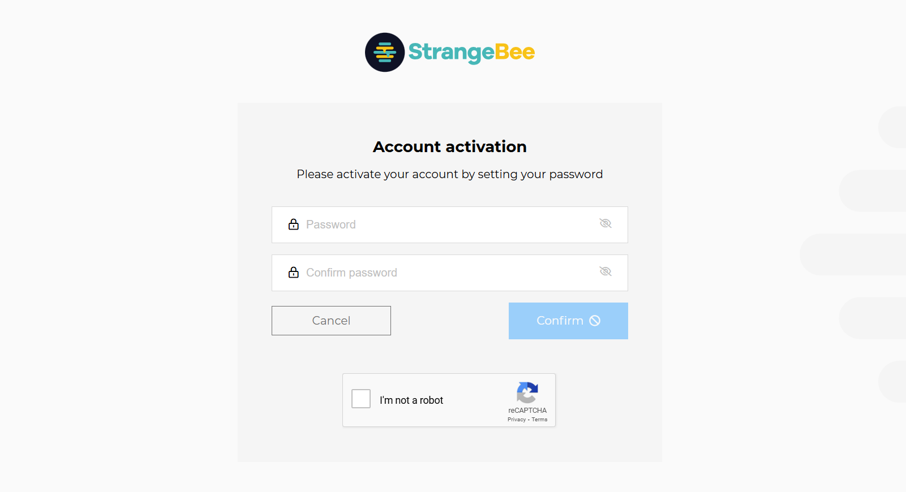
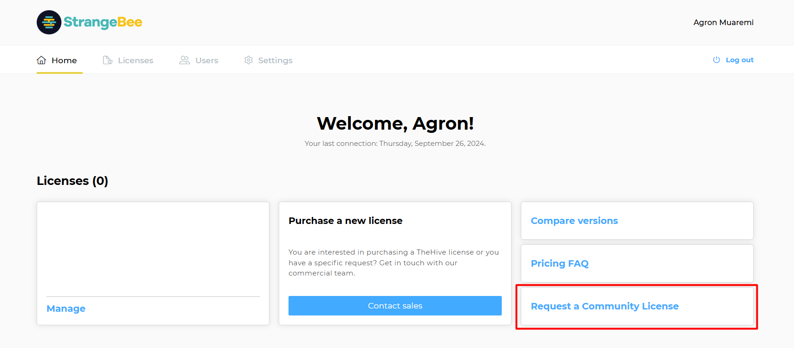
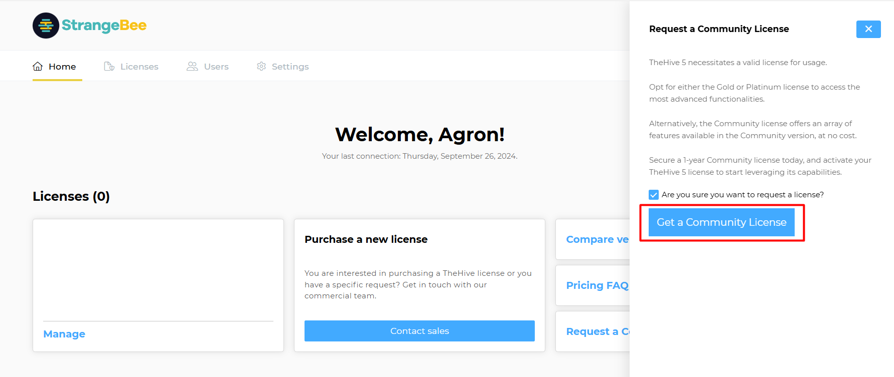

# How to Request a Free Community License

## 1. Create an Account on the StrangeBee License Portal

Visit the [StrangeBee License Portal registration page](https://portal.apps.strangebee.com/account/register){target=_blank}, and register using your professional email address.

&nbsp;

## 2. Confirm Your Email Address

Check your email inbox for a confirmation message, click the confirmation link to verify your email address, and wait for your account to be validated by the StrangeBee team.

&nbsp;

## 3. Set Up Your Password

Once your account is validated, you will receive a notification. Follow the instructions to configure your password.

The license includes the following capabilities:

- Defines the number of users you can create on your platform.
- Based on the number of users and the number of organizations.
- Includes a validation and an expiration date.
- Allows an unlimited number of Unlicensed users and Service users. Service users can use an API key to call all APIs but do not have access to TheHive interface.

&nbsp;

## 4. Log In to the StrangeBee License Portal

Log in to the portal using your credentials.

&nbsp;

## 5. Request a Community License

Click on **"Request a Community License"** to proceed to the license generation page.

&nbsp;

&nbsp;
