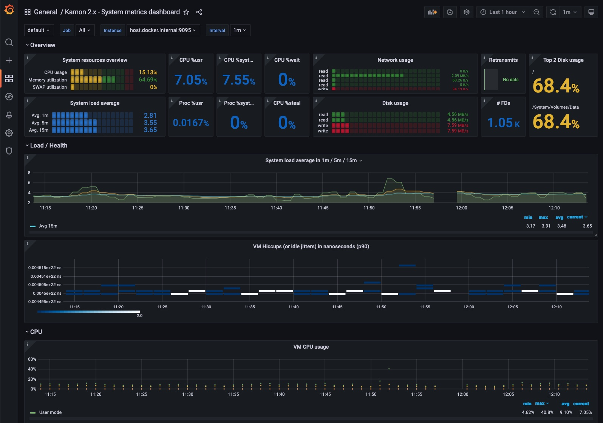

# Set Up Monitoring for TheHive with Prometheus and Grafana

Set up a monitoring stack for TheHive with Prometheus and Grafana to track performance and activity.

By the end, you'll have a fully functional monitoring system displaying real-time metrics about your TheHive instance performance, API requests, and system resources.



!!! warning "Before you begin"

    Before you start, ensure you have:

    * A running [Prometheus](https://prometheus.io/) instance, version 2.x or 3.x 
    * A running [Grafana](https://grafana.com/) instance, version 7.0 or later

## Step 1: Enable monitoring in TheHive

First, we need to activate TheHive built-in monitoring capabilities. TheHive uses the [Kamon](https://kamon.io/) library to collect metrics, but it's turned off by default. The platform includes built-in integration with Prometheus Reporter. For other reporters, contact StrangeBee Support.

1. Open the `/etc/thehive/application.conf` file.

2. In the `application.conf` file, add the following configuration to enable Kamon and the Prometheus reporter:

    ```yaml
    kamon {
      # Activate Kamon module-deactivated by default
      enabled = true

      # Enable the Prometheus reporter
      modules {
        prometheus-reporter.enabled = yes
      }

      environment.tags {
          # Configure additional tags to be sent to Prometheus 
          # See https://kamon.io/docs/latest/reporters/prometheus/#sending-environment-tags-to-prometheus
          # Example: env = prod
      }

      # Reference: https://kamon.io/docs/latest/reporters/prometheus/#configuration
      prometheus {
        include-environment-tags = true
        # Start an embedded server on the specified port 
        # If using Docker, ensure this port is accessible
        embedded-server {
          hostname = 0.0.0.0  # Binds to all interfaces. Required if Prometheus runs outside this host or in a cluster
                              # If Prometheus runs on the same machine, prefer 127.0.0.1 for local-only access
          port = 9095
        }
      }
    }
    ```

    !!! danger "Production security"
        This configuration exposes metrics without authentication on port `9095`. Ensure this port is only accessible to authorized monitoring systems in your environment.

3. Save your modifications in the `application.conf` file.

4. Restart TheHive to apply the changes.

Let's verify that everything is working. Open your browser and navigate to `http://<thehive_hostname>:9095/metrics`.
You should see a page full of metrics in Prometheus format.

## Step 2: Connect Prometheus to TheHive

Now we'll configure Prometheus to collect these metrics from TheHive.

1. Locate and open your `prometheus.yml` configuration file.

2. Add TheHive as a scrape target. The configuration depends on your Prometheus version.

    === "For Prometheus v2.x"

        Add the [scrape configuration](https://prometheus.io/docs/prometheus/latest/configuration/configuration/#scrape_config) to `prometheus.yml`.

        ```yaml
        scrape_configs:
          # ...  other scrape configs 

          - job_name: 'thehive'
            scrape_interval: 30s
            static_configs:
              - targets: ['<thehive_hostname>:9095'] # Set the IP or hostname for TheHive
        ```

    === "For Prometheus v3.x"

        Add the [scrape configuration](https://prometheus.io/docs/prometheus/latest/configuration/configuration/#scrape_config) to `prometheus.yml`.

        ```yaml
        scrape_configs:
          # ...  other scrape configs 

          - job_name: 'thehive'
            scrape_interval: 30s
            fallback_scrape_protocol: PrometheusText0.0.4
            static_configs:
              - targets: ['<thehive_hostname>:9095'] # Set the IP or hostname for TheHive
        ```

        The `fallback_scrape_protocol` ensures compatibility with TheHive metrics format. For more details, check the [Prometheus migration guide](https://prometheus.io/docs/prometheus/latest/migration/#scrape-protocols).

3. Save the configuration file and restart Prometheus.

4. Verify the connection by opening the Prometheus web interface.

    a. Open the Prometheus web interface.

    b. Select **Status** in the top menu.

    c. Select **Targets** from the dropdown.

    d. Check in the **State** column that 'thehive' target state is `UP`.

5. Optional: Configure automatic discovery in Kubernetes

    If you're running TheHive in Kubernetes, you can set up automatic service discovery instead of static configuration by either:

    * Add appropriate labels to your TheHive pods
    * Create a `PodMonitor` resource if using Prometheus Operator

    For detailed instructions, see the [Prometheus Kubernetes configuration](https://prometheus.io/docs/prometheus/latest/configuration/configuration/#kubernetes_sd_config) or [Prometheus Operator](https://prometheus-operator.dev/docs/user-guides/getting-started/) documentation.

## Step 3: Visualize metrics in Grafana

Time to make those metrics visible! We'll set up Grafana dashboards to display TheHive performance data.

1. Open Grafana in your browser and log in.

2. [Configure Prometheus as a data source](https://next.prometheus.io/docs/visualization/grafana/#creating-a-prometheus-data-source):

    a. Select :fontawesome-solid-gear: in the left sidebar.

    b. Select **Data Sources**.

    c. If Prometheus isn't listed, select **Add data source** and select **Prometheus**.

    d. In the **URL** field, enter the appropriate Prometheus server URL.

    e. [Adjust other data source settings](https://grafana.com/docs/grafana/latest/datasources/prometheus/configure/) as desired.

    f. Select **Save & Test**.

3. Now let's import pre-built dashboards to start monitoring TheHive.

    !!! tip "Recommended dashboard templates"
      
        We suggest starting with these Kamon 2.x dashboards, which work well with TheHive:

        * [Kamon 2.x - API Dashboard](https://grafana.com/grafana/dashboards/12317-api-dashboard/) `ID: 12317`: Shows API metrics like request throughput, response latency, and error rates.  
        Note: Some API requests may display latencies of up to 60 seconds. This is expected as TheHive frontend uses long polling for real-time updates, so these legitimate requests will appear as outliers.
        * [Kamon 2.x - System Metrics Dashboard](https://grafana.com/grafana/dashboards/12315-system-metrics-dashboard/) `ID: 12315`: Displays CPU usage, memory consumption, JVM heap usage, and garbage collection stats.
        * [Kamon 2.x - Akka Dashboard](https://grafana.com/grafana/dashboards/10776-kamon-akka-marcelo/) `ID: 10776`: Shows Akka system information, actor metrics, and message processing times.

        For more options, browse the [Grafana dashboard library](https://grafana.com/grafana/dashboards/?pg=docs-grafana-latest-dashboards-variables).

    a. Select **Dashboards** in the left sidebar.

    b. Select **Home** and then **Import**.

    c. Enter the dashboard ID.

    d. Select **Load**.

    e. Select your Prometheus data source.

    f. Select **Import**.

4. Review and adjust the [dashboard variables](https://grafana.com/docs/grafana/latest/dashboards/variables/) to match your environment.

To build custom dashboards from scratch, see [Create a dashboard in Grafana](https://grafana.com/docs/grafana/latest/dashboards/build-dashboards/create-dashboard/).

## Step 4: Verify your monitoring setup

Let's make sure everything is working together:

1. Generate some activity in TheHive.
  
    [Create a case](../user-guides/analyst-corner/cases/create-a-new-case.md), [add some observables](../user-guides/analyst-corner/cases/observables/add-an-observable.md), or [run an analyzer](../user-guides/analyst-corner/cases/observables/run-analyzers-on-an-observable.md).

2. Open your Grafana dashboards. Within a minute or two, you should see:

    * API request metrics appearing in the API Dashboard
    * Memory and CPU usage in the System Metrics Dashboard
    * Actor activity in the Akka Dashboard

You now have a complete monitoring solution for TheHive. Your dashboards will help you track performance, identify bottlenecks, and ensure your TheHive instance runs smoothly.

If you experience performance issues, review and adjust the [CPU and memory allocation](../installation/system-requirements.md) according to your environment.

<h2>Next steps</h2>

* [TheHive Installation System Requirements](../installation/system-requirements.md)
* [Troubleshooting](troubleshooting.md)