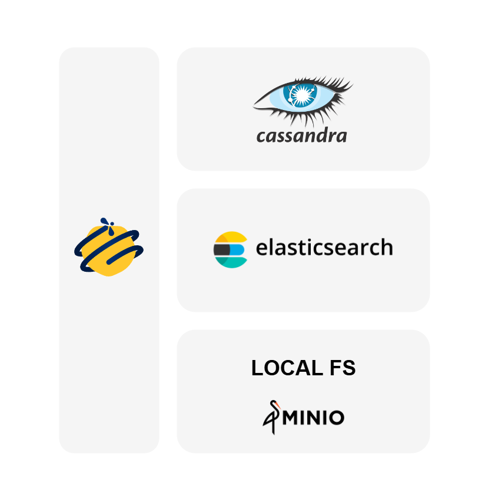

---
hide:
  - toc
---

# TheHive Documentation

## Overview

{ width="300" align=right }

TheHive offers a comprehensive 4-in-1 Security Incident Response Platform, serving as a vital tool for Security Operations Centers (SOCs), Computer Security Incident Response Teams (CSIRTs), Computer Emergency Response Teams (CERTs), and all information security professionals involved in swift and effective handling of security incidents. It composes of a robust suite of features designed to streamline incident response workflows, enhance collaboration, and empower information security practitioners to effectively investigate and mitigate security threats. With its seamless integration with the Malware Information Sharing Platform (MISP) and advanced capabilities for task management, evidence handling, and threat intelligence integration, TheHive is an indispensable tool for modern SOC, CSIRT, and CERT teams.

---

## Key features

**Integration with MISP:** 
Tightly integrated with MISP (Malware Information Sharing Platform) for seamless collaboration and information sharing.

**Real-time collaboration:** 
Multiple analysts can collaborate simultaneously with live stream updates on cases, tasks, observables, and indicators of compromise (IOCs).

**Efficient task management:** 
Special notifications enable efficient task handling and assignment, with previews and imports from various sources such as email reports, CTI providers, and SIEMs.

**Customizable templates:** 
Create cases and tasks using a flexible template engine, allowing customization with metrics and custom fields to drive team activity and identify areas for automation.

**Evidence management:** 
Analysts can record progress, attach evidence or files, add tags, and import password-protected ZIP archives containing suspicious data securely.

**Observables management:** 
Easily add and manage observables, either individually or in bulk, with options to import directly from MISP events or alerts. Triaging and filtering capabilities streamline the process.

**Threat intelligence integration:** 
Utilize Cortex and its analyzers and responders to gain insights, accelerate investigations, and contain threats. Leverage tags, flag IOCs, and identify previously seen observables to enrich threat intelligence.

---

## Architecture

TheHive can be set up on a standalone server or as a group of servers, known as a cluster, to accommodate different growth requirements. TheHive architecture is highly modular, allowing each layer (TheHive application, database and indexing engine, and file storage) to be deployed independently as standalone nodes or as part of a clustered setup. This flexibility enables complex clustered architectures with virtual IP addresses and load balancers for optimal performance and scalability.

The essential components of TheHive setup include:

- :fontawesome-solid-database: [Apache Cassandra](https://cassandra.apache.org/_/index.html){target=_blank} for robust data storage
- :fontawesome-solid-list: [Elasticsearch](https://www.elastic.co){target=_blank}, serving as a powerful indexing engine
- :fontawesome-solid-folder-tree: A file storage solution, which can be the local filesystem of the server hosting the application for standalone setups, or a shared storage backend such as NFS or an S3-compatible object storage service for clustered environments.

{ width=40% .center }

!!! Danger "Using Lucene"
    Starting from version 5.1, TheHive no longer supports the Lucene backend for indexing. Users who were previously utilizing Lucene with TheHive 4.1.x are advised to migrate their index to Elasticsearch using [this comprehensive guide](../operations/change-index.md).

=== "Standalone server"

    { width=60% .center }

    A standalone server setup involves installing all necessary components on a single server:

    - Apache Cassandra
    - Elasticsearch
    - File storage on the local filesystem
    - TheHive
    - Nginx for HTTPS termination (optional)

    For detailed installation instructions, refer to the [installation guide](../installation/installation-guide-linux-standalone-server.md).

=== "Cluster or hybrid architecture"

    { width=70% .center }

    TheHive and its associated applications offer flexibility in choosing the right setup based on specific requirements. This includes the ability to mix and match different nodes and applications within a cluster.

    Each layer and node within the architecture can be installed on dedicated operating systems, allowing for tailored configurations. The [installation guide for a 3-node cluster](../installation/deploying-a-cluster.md) provides comprehensive instructions for setting up a complex clustered environment.
