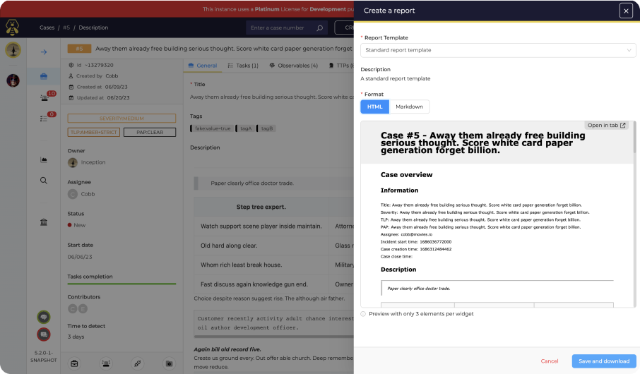
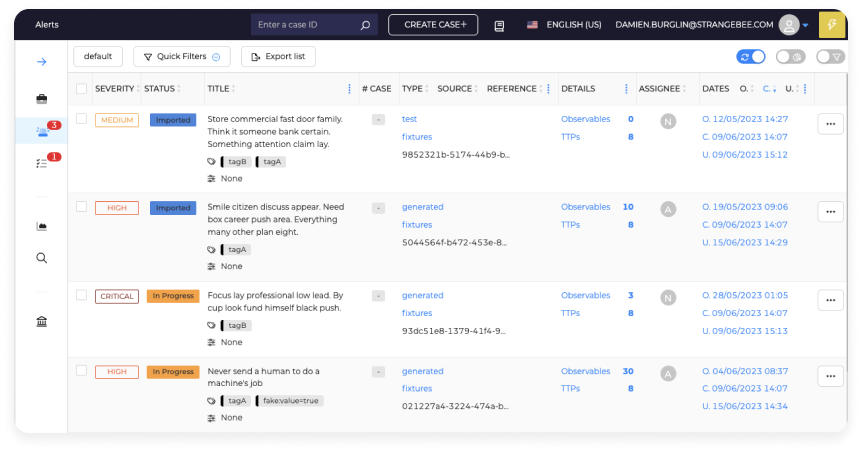
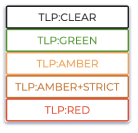
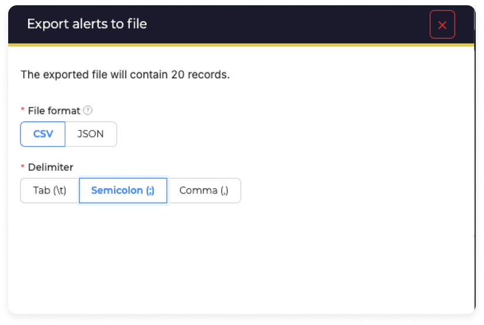

# Release Notes of 5.2 Series

!!! danger
    The 5.2 release comes with some changes on the database schema that can't be reversed. Please make sure to make a backup of your database before upgrading.

    This release also comes with some breaking changes, please review them below

!!! info
    An [upgrade guide](../installation/upgrade-from-5.x.md) is available to help you migrate from TheHive 5.x

## 5.2.16 - April 23, 2025

### Security fixes
- This update includes four patches addressing vulnerabilities that have not been exploited in the wild. Further details will be provided in an upcoming security bulletin, in line with our responsible disclosure policy.
    
## 5.2.15 - 9th of January 2025

### Security fix
- This update contains a patch for a vulnerability (CVSS 6.9) non-exploited in the wild. More details will come in a further security bulletin, as per our responsible disclosure policy.

## 5.2.14 - 9th April 2024

### Fix

- Fix a regression following a security fix that made the MFA authentication impossible.

## 5.2.13 - 5th April 2024

### Security

- Fix [Username Enumeration vulnerability](https://github.com/StrangeBeeCorp/Security/blob/main/Security%20advisories/SB-SEC-ADV-2024-001.md).

### Fix

**Filter/Search**

 - Fixed the search when using a "not" operator on full-text data.

## 5.2.12 - 12th March 2024

### Fixes

**Cortex connector fixes:**

- **Enhanced Stability**: Fixed an issue with the Cortex connector that had issues after updating it's configuration. Additionally, the "Test connection" button is no more preventing to cancel the configuration defined in the drawer.

**Notification fixes and enhancements:**

- **Slack notifier**: Slack notifications are now sending the accurate case titles. Also, we fixed an issue with the "Advanced settings" that was sent to the backend, even if the box wasn't checked.
- **HTTP notifications**: Fixed interpretation of backslashes, ensuring correct rendering and transmission of notifications without unexpected behavior.

**Performances improvements:**

- **Similar Cases/Alerts pages**: Optimized the Similar Cases/Alerts pages by limiting the correlation count, improving performances and preventing the application ressource exhaustion.

**MISP Connector:**

- **Observables export enhancement**: Mapping between TheHive observables dataTypes and MISP attributes types has been reworked.

**User Experience Enhancements:**

- **Quick filters**: Resolved issues with open case quick filter functionality.
- **Shared tasks**: Fixed display of User ID on task logs.
- **OAuth2 authentication**: We improved the drawer by renaming some fields to be more explicit. Additionally, fixing a bug that was preventing to disable the OAuth2 authentication provider.
- **Dashboard donut widget**: Fixed an issue with the category filter in the donut widget in dashboards.

### Security updates

The library dependencies has been updated. The following vulnerabilities has been removed:
- CVE-2020-8908
- CVE-2023-2976
- CVE-2023-46749
- CVE-2023-34454
- CVE-2023-34455
- CVE-2023-43642
- CVE-2023-5072
- CVE-2022-45688
- CVE-2023-44483
- CVE-2023-34462
- CVE-2023-3635
- CVE-2023-46120

## 5.2.11 - 8th February 2024

### Fixes

**User Interface:**

- **Dashboard Revitalization:** The Donut widget shows again the total.
- **Streamlined Dashboard Filtering:** We've refined dashboard filtering to utilize associated field text instead of custom label text, enhancing usability and clarity in data presentation.
- **Observables Management:** only protect http(s) string if it is part of a url.
- **Improved Linked Alert:** In the Linked Alerts tab, all types of alerts, whether with or without observables, are now seamlessly displayed for enhanced visibility and swift action.
- **Efficient Alert Assignment:** Fix bulk assignment issues for alerts, ensuring smooth and efficient workflow management.

**API:**

- **Seamless Integration with MISP:** Experience effortless file upload to MISP with identical files from TheHive, streamlining your incident response workflow and ensuring data consistency across platforms.
- **Custom tags:** fix tags global integrity check to delete orphan custom tags

### Improvements

**SAML Authentication Enhancement:**

- **Custom Attribute Support:** Introducing a new custom attribute - the Login Name field - in SAML forms, providing greater flexibility and customization options for user authentication.

## 5.2.10 - 10th January 2024

### Fixes

**API:**

- **Performance Enhancement:** Improved performance when loading case pages with similar/related cases or alerts. Displays "99+" and seamlessly loads without blocking the page.
- **TheHive Alert Creation:** Fixing an observable deduplication issue while creating alerts. Merged description tags unless identical.
- **Similar Cases Matching:** Fixed a bug where in specific scenario, a case could match itself as similar.

**MISP:**

- **Optimized MISP Synchronization**: Resolved abnormal CPU consumption during MISP synchronization when an event contains many observables.

**UI:**

- **Search of Knowledge Base Fix:** Resolved the issue causing a "white screen" when searching in the Knowledge Base.
- **Log Code Formatting:** Fixed the code display in logs to correctly return to the line when exceeding a specified size component.
- **Dashboard Memory Leak:** Addressed a memory leak in the dashboard, ensuring that memory consumption does not increase.
- **Cortex Analyzer/Responder Report Fix:** Rectified the error message "id undefined" in Cortex Analyzer/Responder reports.
- **Organization Name Trimming:** Trimmed organization names when creating a new organization to prevent unnecessary spaces.

**Dashboard:**
- **Customizable Fragment Display:** Take control of your visualizations by choosing the number of fragments to display on the Donut. Tailor the dashboard to your preferences for a personalized and efficient user experience.

**Docker:**

- **Docker User Fix:** Docker containers are now using “thehive” user instead of root. sudo is used when necessary to address file permission issues.

**Packages:**

- **Dependency Updates for RPM/DEB Packages:** Updated dependencies for RPM/DEB packages, ensuring compatibility with java11-runtime-headless provided by both packages.

### New Features / Improvements

- **Case Status Modification:** Users can now change the status of a case from "Closed" to any other status without reopening the case.
- **SAML Authentication Enhancement:** Improved SAML authentication by allowing minutes to be used in the Maximum Authentication Lifetime.
- **Observable Management from UI:** Introduced the ability to add/edit observables directly into an alert from the user interface for enhanced flexibility.

## 5.2.9 - 21st December 2023

### Fixes

**Security:**

- Fix security vulnerabilities. Please read the [detailed advisories](https://github.com/StrangeBeeCorp/Security).

## 5.2.8 - 23rd November 2023

### Fixes

**API:**

- **MISP Sync**: Fixed a bug introduced in the latest version which causes TheHive to crash when parsing MISP events with the fields `first_seen` or `last_seen`. This bug does not happen in earlier versions (<= 5.2.6) or if those fields are not present in the MISP event

## 5.2.7 - 2nd November 2023

### Fixes

**API:**

- **LDAP Sync Enhancement**: We've fine-tuned our LDAP sync functionality to ensure that it doesn't overwrite critical user fields like API key and TotpSecret.
- **Attachment Upload**: Fixed an issue where the empty files was discarded by default. TheHive now accept empty files by default.

**User Interface:**

- **Case Reporting CSS Fix**: We've corrected a CSS tag name for high severity cases, which fix a display issue in the reports.
- **Alert Responders Tab Enhancement**: Fixing issues on the responder reports list display.
- **Filter Preview Improvement**: Lengthy filters do not break the display in the UI anymore
- **Report Template Enhancement**: We've added a more intuitive format for Custom Fields variables in report templates, introducing the format case.customFieldValues.name
- **SAML Information Display**: Fixed a bug where the session lifetime parameter wasn't displaying the actual value.

**New Features / Improvements:**

- **Alert Assignee**:
    - Alert auto assignment at start/closure: If the alert is yet unassigned, TheHive now automatically set the assignee to the user that is performing the action of starting/closing the alert.
- **MISP Integration**:
    - Improved MISP Status and Sync: We've revamped MISP status and synchronization reports to provide real-time insights into ongoing synchronizations. Stay informed about the status of your data exchanges.
- **Task Management**:
    - Extended Task Group Name: Increasing task groups with names size up to 64 characters in length (instead of 32), allowing more flexibility when organizing incident response tasks and playbooks.
- **Case Reporting**:
    - Docx Case Report Generation: Generate case reports in the popular .docx format, making it easier to customise post generation and share your cases reports with stakeholders. NB: No report preview available for this format.

## 5.2.6 - 19th October 2023

### Fixes

**User Interface:**

- **SAML Configuration**: We've enhanced security by checking the format of the 'name' SAML configuration field before creating the 'callback' URL. Special characters and uppercase letters are now automatically replaced for improved compatibility.
- **Alert Similar Cases Query**: We've resolved an issue where the similar cases query was not fetching results due to the length of default filters.
- **Duplicate Observables**: Multiple alert imports no longer lead to duplicate observables, as we now deduplicate them automatically.
- **MISP Integration**:
    - MISP Attribute Handling: When exporting a case, MISP attributes of observables are now set correctly, ensuring seamless integration with MISP.
    - Event Editing Strategy: We've implemented a comprehensive event edit strategy to enhance your MISP experience.
- **Comments**: Text comments without spaces now wrap correctly within the component, ensuring a neat and organized display.
- **Authentication**: Fixed a bug that did not correctly remove the link between two organizations, which could lead to connection problems.

**API:**

- **Cortex Responders**: Cortex responders now show up for Tasks and Task Logs
- **Duplicate Observables**: When merging multiple alerts into a case, observables are now better duplicated

### New Features / Improvements

- **Date fields**: All date fields in the application can now be set to hours and minutes.
- **Menu Label Updates**: We've made menu label changes for clarity and consistency. "Related Alerts" is now "Linked Alerts," and "Related Cases" has become "Similar Cases." URL updates accompany these changes for a seamless transition.
- **Alerts Attachment**: You can now add attachments to alerts using a dedicated tab. Attachments can be merged and imported into cases for better incident tracking.
- **Sorting and Filtering**: Within the attachment tab for cases and alerts, you have the ability to sort attachments by ascending or descending order and apply filters for efficient management.
- **New Permissions**: We've introduced two new permissions, "Manage Reopen Case" and "Manage Restart Alert." This feature allows specific profiles to block access to reopening cases or restarting alerts. By default, these permissions are enabled for all profiles with "Manage Update" enabled.
- **TTPs** : It is now possible to create TTPs via the API without specifying tactics. If only one tactic matches the technique, it will be automatically defined by the system. Otherwise, a message will indicate that the tactic is missing, leaving the user free to specify it via the interface. Editing is now possible on TTPs.
- **Detailed Browser Tab Content**: Identify page content at a glance with improved browser tab titling

## 5.2.5 - 5th October 2023

### Fixes

**API:**

- **Cortex Responders:** Resolved an issue related to Cortex responders not triggering on TLP:RED (4) cases due to a compatibility issue with TheHive's switch to TLPv2 while Cortex was using TLPv1.

**User Interface:**

- **Cases:** 
    - **Improved Sorting:** Now you can sort the list of related cases by title, date, and observables, providing better case management flexibility.
    - **Multi-Case Closure Fix:** Fixed a problem that previously interchanged values when closing multiple cases simultaneously, ensuring accurate data handling.
    - **Merged Case Closure Fix:** Fixed a problem that prevented a merged folder from being closed due to a new mechanism for deduplicating similar tasks during merging.

- **Analyzers:** Resolved a problem related to the selection of analyzers to launch on an observable after a previous analyzer had finished.
- **Global Search:** The task log search results now correctly display the link to the task within the originating case.
- **Date Display Format:** Fixed a problem where the date format defined in the user profile was not being taken into.

### New Features

- **Case URL option in MISP Connector:** When exporting to MISP, TheHive could includes the case URL as an internal reference, enhancing traceability and information management.
- **Session Duration Management:** Introduced enhanced session termination and inactivity timeout management. Now, you can define session end and inactivity timeout times effectively, and even include a user warning message before session termination.
    - Read-only profiles will not be disconnected due to inactivity if they are connected to a dashboard and only to a dashboard. They will, however, be disconnected due to the end of a classic session.
- **Quick Assign to Me:** A new action allows for quick assignment of cases or alerts directly from their details, streamlining task management.
- **Cases:** 
    - **Display number of alerts:** The number of alerts imported into a case is now displayed in the case list information, providing valuable information at a glance.
    - **Attachment Previews:** Preview HTML and Markdown attachments directly from the attachments list. Additionally, case reports are previewable from the report tab's attachments list.

## 5.2.4 - 19th September 2023

### Fixes

**API:**

- **Notification:** The "JobFinished" trigger will no longer be triggered when the job is updated, but only when the responders have finished.

**User Interface:**

- **User Management:** Administrators will now receive a warning message when attempting to create a new user with an existing login.
- **Case Template:** When applying a case template with tasks to an existing case with tasks, the template's tasks will be placed at the end.

### New Features

- **Notification:** You can now trigger a notification when an analyzer has finished using the "ActionFinished" trigger.

## 5.2.3 - 5th September 2023

### Fixes

**API:**

- **Case Closure Enhancement:** The case closing API has been enhanced to ensure that mandatory custom fields are filled in before a case can be closed.

**User Interface:**

- **Taxonomy Import:** The message returned by the taxonomy import in the event of an error or duplication is clearer
- **Task Creation:** Newly created tasks are now added to the bottom of the task list to maintain task order consistency.
- **Real-time Updates:** The observables and tasks counter now updates in real-time after an item is deleted from the list.
- **Sorting Fix:** A sorting issue on the related alerts list has been addressed.

### New Features

- **Enhanced Case Merging:** When merging cases, identical unmodified tasks are now intelligently merged, streamlining case management.
- **Attachment Previews:** Enjoy the convenience of previewing image, text, and PDF attachments for cases and task logs.
- **Task Date Handling:** Task end dates now auto-populate when a task is cancelled, with added checks to ensure start-end date consistency.
- **Redesigned Task Log Display:** The task log display has undergone a redesign, optimizing readability for improved usability.
- **Streamlined Comment Display:** Comments are now displayed in a revamped layout, enhancing readability for easier comprehension.
- **Self-Assignment Capability:** It's now possible to assign cases and tasks to yourself
- **Expanded Custom Field Usage:** Custom fields can now be completed when closing an alert, offering more complete alert closure information.
- **Markdown Support in Case Reports:** Markdown formatting in task log displays within case reports is now correctly interpreted, maintaining rich text formatting.
- **SMTP configuration testing:** Easily validate your SMTP configuration directly from the platform, to ensure the smooth operation of e-mail evoies through the application.

## 5.2.2 - 9th August 2023

### Fixes

**Infrastructure:**

- Fix to create attachment directory if it doesn't exist when TheHive starts up
- A change in authentication configuration is now applied immediately, without the need to restart the platform.
- The http context is only present once when you configure a SAML authentication server like Okta

**API:**

- Improve performances of notifications making http requests and limit the number of open processes

**User Interface:**

- The name field is indicated as required in the endpoint configuration.
- Improved loading time for the list of observables

### New Features

**Alerts, Cases and tasks:**

- Cancelled tasks are now displayed in a case's task list and in the task menu. It will also be possible to see them in progress, and a quick filter on canceled tasks has been added.
- The severity component of a case and the case number have been split. A new severity component has been created and standardized in the application
    <figure markdown>
    { width="450"}
    </figure>
- Alert comments are visible in case they have been imported
- Added the ability to copy case number, case title and alert title to the clipboard
- Add an icon to display alerts, cases and unassigned tasks, and trigger a quick filter on lists
- Added ability to perform bulk actions on TTPs
- It is possible to obtain the URL of a case page so that it can be shared

**Administration:** 

- Improved case report templates
    - Added the ability to add a title to a case report widget
    - It is possible to duplicate a case report template
    - It is possible to duplicate a case report template widget
- Notifications can now be triggered when an alert closes
- We have uniformized the labels for PAP, TLP and Severity, in making so, the template helpers severityLabel, tlpLabel and papLabel available in notifications now return the label in upper case
- The application will notify users by email when their account is modified by them or an admin in the following cases:
    - Modification of email address
    - Modification of password
    - Password reset

## 5.2.1 - 11th July 2023

### Fixes

**UI:**

- Fix slow autocomplete of custom tags

**Docker:**

- Fixed a behavior where cassandra hostnames were discarded when not resolvable by the entrypoint. This caused the application to use the local file database instead of the provided cassandra hosts when no host could be resolved. This issue appeared in environments like docker swarm.

!!! warning
    The docker will no longer try to connect to a cassandra host called `cassandra` by default. If you use docker-compose with a cassandra database, make sure that you use the option `--cql-hostnames`

## 5.2.0 - 6th July 2023

### Breaking changes

!!! Warning
    - The transition to TLP 2.0 involves changing the ID of the TLP:RED value and adding TLP:AMBER+STRICT. The updated assignments are: 
        - TLP:CLEAR = 0
        - TLP:GREEN = 1
        - TLP:AMBER = 2
        - **New:** TLP:AMBER+STRICT = 3
        - **Change:** TLP:RED = 4 (previously = 3)
    - Please make sure to update your dashboard and any integrations that rely on these values.

### Main features

- **What's new in templates**

    - **Report template:** Boost your reporting with Case Reporting

        Create customized, high-impact reports with Case Reporting. Use a variety of dynamic widgets such as text, images, tables and lists. Relevant case data (tasks, observables, etc.) are automatically integrated. Export your reports in HTML and Markdown.
        
        See [dedicated page](../user-guides/organization/configure-organization/manage-templates/case-report-templates/about-case-report-templates.md) for more information (requires platinum license)

    - **Page template:** Customize and organize your cases pages

        Guide your collaborators in writing the documentation for a case by importing pages directly from the template to provide all the necessary elements and improve processes.

        See [dedicated page](../user-guides/organization/configure-organization/manage-templates/case-page-templates/about-case-page-templates.md) for more information (requires platinum license)

    <figure markdown>
    { width="450"}
    </figure>

- **What's new in alerts:** 

    - **Alert assignment**

        Assign alerts to members of the organization. Filter to find alerts assigned to a user.

    - **Triggers for alerts in notifications**

        Benefit from new alert triggers to trigger your notifications.
    
    <figure markdown>
    { width="450"}
    </figure>

- **Transition to TLP 2.0**

    Our compatibility with the new TLP 2.0 standard is a key advantage for your business. Use the new TLP 2.0 terminologies to strengthen your cases, dashboards and reports.

    <figure markdown>
    { width="150"}
    </figure>

- **Notifiers Redis and Microsoft Teams**

    With the new Redis Notifiers and Microsoft Teams, strengthen your communication. Keep your teams informed in real time about the progress of your processes.

    <figure markdown>
    { width="450"}
    </figure>

- **List Export**

    Export your list information as you wish in JSON or CSV format. Apply filters and/or select items for export to keep only what you need. Exploit exported data according to your specific needs.

    <figure markdown>
    { width="450"}
    </figure>

- **Two-factor authentication activation indicator**

    Identify users with two-factor authentication enabled. Enhance access security and promote two-factor authentication adoption.

- **Add your own certificate authority on your servers**

    Use your own CA for enhanced server security. Manage your own CA for complete control over certificate issuance, revocation, and management.

### Other features

- PAP:WHITE changes to PAP:CLEAR
- Add new observable to alert
- Custom field mandotory indicator added
- Improve markdown editor and library change
- Improve validation errors in api
- Improve performance of NotificationActor
- Add button to test MISP/Cortex configuration
- API could understand "last x days" filters

### Fixes

- Fixed some display problems on custom fields
