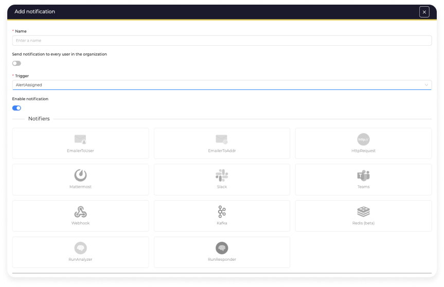

# Release Notes of 5.2 series

!!! danger
    The 5.2 release comes with some changes on the database schema that can't be reversed. Please make sure to make a backup of your database before upgrading.

    This release also comes with some breaking changes, please review them below

!!! info
    An [upgrade guide](../../setup/installation/upgrade-from-5.x) is available to help you migrate from TheHive 5.x

## 5.2.0 - 6st July 2023

### Breaking changes

!!! Warning
    - The transition to TLP 2.0 involves changing the ID of the TLP:RED value and adding TLP:AMBER+STRICT. The updated assignments are: 
        - TLP:CLEAR = 0
        - TLP:GREEN = 1
        - TLP:AMBER = 2
        - **New:** TLP:AMBER+STRICT = 3
        - **Change:** TLP:RED = 4 (previously = 3)
    - Please make sure to update your dashboard and any integrations that rely on these values.

### Main features

- **What's new in templates**
    - **Report template:** Boost your reporting with Case Reporting

        Create customized, high-impact reports with Case Reporting. Use a variety of dynamic widgets such as text, images, tables and lists. Relevant case data (tasks, observables, etc.) are automatically integrated. Export your reports in HTML and Markdown.
        
        See [dedicated page](../user-guides/organisation/templates/report-templates.md) for more information (requires platinum license)

    - **Page template:** Customize and organize your cases pages

        Guide your collaborators in writing the documentation for a case by importing pages directly from the template to provide all the necessary elements and improve processes.

        See [dedicated page](../user-guides/organisation/templates/page-templates.md) for more information (requires platinum license)

    <figure markdown>
    { width="450"}
    </figure>

- **What's new in alerts:** 
    - **Alert assignment**

        Assign alerts to members of the organization. Filter to find alerts assigned to a user.

    - **Triggers for alerts in notifications**

        Benefit from new alert triggers to trigger your notifications.
    
    <figure markdown>
    { width="450"}
    </figure>

- **Transition to TLP 2.0**

    Our compatibility with the new TLP 2.0 standard is a key advantage for your business. Use the new TLP 2.0 terminologies to strengthen your cases, dashboards and reports.

    <figure markdown>
    { width="150"}
    </figure>

- **Notifiers Redis and Microsoft Teams**

    With the new Redis Notifiers and Microsoft Teams, strengthen your communication. Keep your teams informed in real time about the progress of your processes.

    <figure markdown>
    { width="450"}
    </figure>

- **List Export**

    Export your list information as you wish in JSON or CSV format. Apply filters and/or select items for export to keep only what you need. Exploit exported data according to your specific needs.

    <figure markdown>
    { width="450"}
    </figure>

- **Two-factor authentication activation indicator**

    Identify users with two-factor authentication enabled. Enhance access security and promote two-factor authentication adoption.

- **Add your own certificate authority on your servers**

    Use your own CA for enhanced server security. Manage your own CA for complete control over certificate issuance, revocation, and management.

### Other features

- PAP:WHITE changes to PAP:CLEAR
- Add new observable to alert
- Custom field mandotory indicator added
- Improve markdown editor and library change
- Improve validation errors in api
- Improve performance of NotificationActor
- Add button to test MISP/Cortex configuration
- API could understand "last x days" filters

### Fixes

- Fixed some display problems on custom fields
