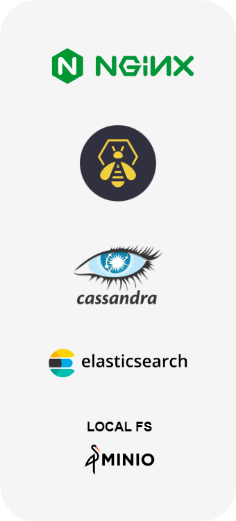
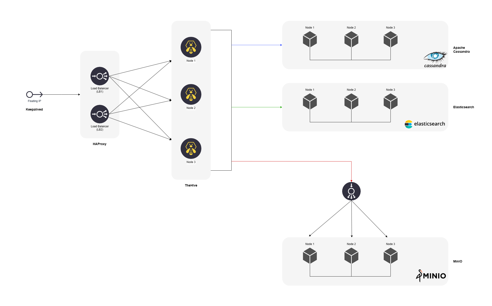

# Installation & configuration guides

## Overview
{ width="450" align=right }
TheHive can be deployed on a standalone server or as a cluster. The application relies on:

:fontawesome-solid-database: [Apache Cassandra](https://cassandra.apache.org/_/index.html) to store data (Supported version: 4.x).

:fontawesome-solid-list:  [Elasticsearch](https://www.elastic.co) as indexing engine (Supported version: 7.x).

:fontawesome-solid-folder-tree:  A file storage solution is also required ; the local filesystem of the server hosting the application is adequate in the standalone server scenario ; [S3 MINIO](https://min.io/) otherwise.

!!! Warning "Using Lucene"
    Starting with TheHive 5.x we strongly recommend using Elasticsearch for production servers. 
    TheHive 4.1.x embbeded **Lucene** to handle the data index ; this is still the case with the latest version with which we suggest to use it only for testing purpose.

## Architecture
Each layer, **TheHive** application, the **Database & index** engine, and **file storage**, is independant and can be set up as a standalone node or cluster. As a result, TheHive could be setup and work in a complex clustered archicteture, using virtual IP addresses and load balancers. 

=== "Standalone server" 
    { align=left width=150 }

    All applications are installed on the same server. 

    - Cassandra
    - Elasticsearch
    - Files are store on the filesystem (or MinIO if desired)
    - TheHive
    - NGINX (optional): to manage HTTPS communications
    <br /> 
    <br /> 

    Instructions included in the [step-by-step installation guide](installation/step-by-step-guide.md) ends up to install a standalone server.


=== "Cluster or hybrid architecture" 
    TheHive and all applications of the stack are flexible enough to choose the right setup according with the needs. 
    
    { align=center }

    Each layer and node can be installed: 
    
    - on a dedicated operating system 
    - with another application (for example: 1 node of Cassandra with 1 not of Elasticseach)

    The [installation guide for a 3 nodes cluster](installation/3-node-cluster.md) gives all details for a more complex setup.

## Requirements
Hardware requirements depends on the number of concurrent users (including integrations) and how they use the system. The following table diplays safe thresholds when hosting all services on the same machine:

| Number of users                                | TheHive                                                             | Cassandra                                                           | ElasticSearch                                                       |
| -----------------------------------------------|: ----------------------------------------------------------------- :|: ----------------------------------------------------------------- :|: ----------------------------------------------------------------- :|
| :fontawesome-solid-user-group: < 10            | 2 :fontawesome-solid-microchip: / 2 GB :fontawesome-solid-memory:   | 2 :fontawesome-solid-microchip: / 2 GB :fontawesome-solid-memory:   | 2 :fontawesome-solid-microchip: / 2 GB :fontawesome-solid-memory:   |
| :fontawesome-solid-user-group: < 20            | 2-4 :fontawesome-solid-microchip: / 4 GB :fontawesome-solid-memory: | 2-4 :fontawesome-solid-microchip: / 4 GB :fontawesome-solid-memory: | 2-4 :fontawesome-solid-microchip: / 4 GB :fontawesome-solid-memory: |
| :fontawesome-solid-user-group: < 50            | 4-6 :fontawesome-solid-microchip: / 8 GB :fontawesome-solid-memory: | 4-6 :fontawesome-solid-microchip: / 8 GB :fontawesome-solid-memory: | 4-6 :fontawesome-solid-microchip: / 8 GB :fontawesome-solid-memory: |

!!! Tip
    If you are installing everything on the same server, we recommend at least 4 cores and 16 GB of RAM. And don't forget to set up `jvm.options` at least for Elasticsearch.

## Operating systems
TheHive has been tested and is supported on the following operating systems: 

- :material-ubuntu: Ubuntu 20.04 LTS
- :material-debian: Debian 11 
- :material-redhat: RHEL 8
- :material-fedora: Fedora 35

StrangeBee also provides an [official Docker image](https://hub.docker.com/r/strangebee/thehive/tags). 


## Installation guides

!!! Tip "Too much in a hurry to read ? "

    If you are using [one of the supported](#operating-systems) operating systems, use our all-in-one **installation script**: 

    ``` bash
    wget -q -O /tmp/install.sh https://archives.strangebee.com/scripts/install.sh ; sudo -v ; bash /tmp/install.sh
    ```

    This script helps with the installation process on a fresh and [supported OS](#operating-systems) ; the program also run successfully if the conditions in terms of hardware requirements are met.

    
    
    Once executed, several options are available: 

    1. Setup proxy settings ; will configure everything on the host to work with a HTTP proxy, and custom CA certificate.
    2. Install TheHive ; use this option to install TheHive 5 and its dependencies
    3. Install Cortex and all its dependencies to run Analyzers & Responders as Docker Iiages
    4. Install Cortex and all its dependencies to run Analyzers & Responders on the host (Debian and Ubuntu **ONLY**)


For each release, DEB, RPM and ZIP binary packages are built and provided.
Discover how to install TheHive quickly by following our installation guides:

### Use a dedicated server
TheHive can be used on virtual or physical servers.

Our [step-by-step guide](installation/step-by-step-guide.md) let you **prepare**, **install** and **configure** TheHive and its prerequisites for Debian and RPM packages based Operating Systems, as well as for other systems and using our binary packages.

### Use Docker :material-docker:
An Official Docker image publicly available. Follow our [installation guide for Docker](installation/docker.md) to use it in production.

### Use Kubernetes :material-kubernetes:

TheHive is now compatible with Kubernetes - follow the related guide [here](https://docs.strangebee.com/thehive/setup/installation/docker/#usage-in-kubernetes).


## Configuration Guides
The configuration files are stored in the `/etc/thehive` folder:

  - `application.conf` contains all parameters and options
  - `logback.xml` is dedicated to log management

```
/etc/thehive
├── application.conf
├── logback.xml
└── secret.conf
```

A separate [secret.conf](configuration/secret.md) file is automatically created by DEB or RPM packages. This file contains a secret that should be used by one instance.

The configuration should only contain the necessary information to start the application: 

- [database and indexing](./configuration/database.md)
- [File storage](./configuration/file-storage.md)
- Connectors enabled
- [Other service parameters](./configuration/service.md)
  
All other settings are available in the application WebUI. 

## Advanced uses cases

### Upgrade from TheHive 4.x (standalone server)

!!! Info "F.A.Q"
    ### Can I upgrade from TheHive 4.0.x ?
    _Yes, all TheHive 4.x can be updated to TheHive 5; Find how to update in [this dedicated guide](./installation/upgrade-from-4.x.md)._

    ### I use TheHive 3.x, can I upgrade my data to TheHive 5 ? 
    _TheHive 3 is out of support since 31 December 2021. Please contact [StrangeBee](mailto:contact@strangebee.com) for further assistance._


### TheHive as a cluster

####  Install a cluster with 3 nodes
If you are looking to install a cluster (fault tolerant, H.A., ...), the following [guide](installation/3-node-cluster.md) details all the installation and configuration steps to make a cluster with 3 nodes working. In this example, the cluster is composed of:

  - 3 TheHive nodes
  - 3 Cassandra nodes
  - 3 Elasticsearch nodes
  - 3 Min.IO nodes

#### Upgrade a cluster 

[Upgrade a cluster](./installation/upgrade-cluster.md)

### Update from TheHive 3.x
TheHive 3.x is not supported any more since 31st of December, 2021. 

Contact [StrangeBee](https://www.strangebee.com) for further assistance at [contact@strangebee.com](mailto:contact@strangebee.com). 