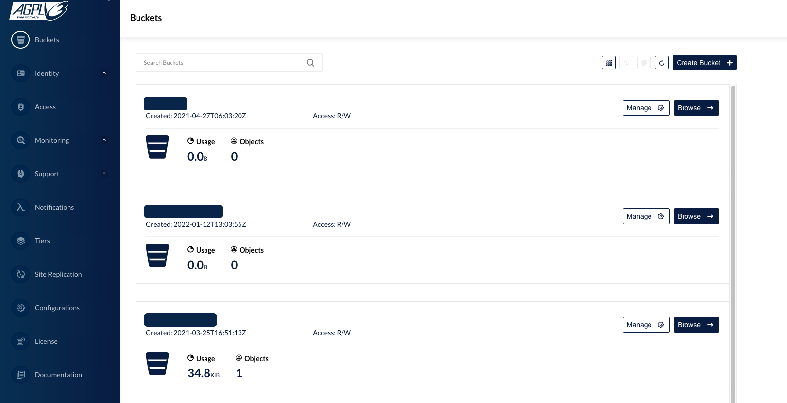

# Setting up a Cluster with TheHive

This guide presents configuration examples for setting up a fault-tolerant cluster for TheHive. Each cluster comprises three active nodes, featuring:

- Cassandra for the database
- Elasticsearch for the indexing engine
- MinIO for S3 data storage
- TheHive
- Haproxy (to demonstrate load balancing)
- Keepalived (to demonstrate virtual IP setup)

!!! Info
    These applications can either be installed on separate servers or on the same server. For the purpose of this documentation, we've chosen to demonstrate the setup on three distinct operating systems.

---

## Architecture Diagram


The diagram above illustrates the key components and their interactions within the cluster architecture.

Each component fulfills a critical role in the functionality and resilience of the cluster:

- **Cassandra**: Acts as the primary database, ensuring robust data storage and retrieval capabilities.
- **Elasticsearch**: Serves as the indexing engine, facilitating efficient search operations within TheHive platform.
- **MinIO**: Provides S3-compatible object storage, offering scalable and resilient storage solutions for TheHive.
- **TheHive**: Central component responsible for incident response management and collaboration within the cluster.
- **Haproxy**: Functions as a load balancer, evenly distributing incoming traffic across multiple nodes for improved performance and availability.
- **Keepalived**: Facilitates the setup of a virtual IP address, ensuring seamless failover and high availability by redirecting traffic to a standby node in case of failure.

The subsequent sections will provide detailed configuration examples and step-by-step instructions for setting up each component within the cluster environment.

---

## Cassandra Setup
{ align=center}

When configuring a Cassandra cluster, we aim to establish a setup comprising three active nodes with a replication factor of 3. This configuration ensures that all nodes are active and data is replicated across each node, thus providing tolerance to the failure of a single node, meaning that if one node experiences hardware issues or network disruptions, the other two nodes continue to store and process incident data seamlessly. This fault-tolerant configuration guarantees uninterrupted access to critical security information, enabling the SOC to effectively manage and respond to cyber threats without downtime or data loss.

!!! Info "Note: For the purposes of this documentation, we assume that all nodes reside within the same network environment."

&nbsp;

### Installation Instructions
To ensure the successful deployment of Cassandra within your cluster, it's essential to install Cassandra on each individual node. Follow the steps outlined in the [**provided guide**](step-by-step-guide.md#apache-cassandra).

!!! Info "A ``node`` in this context refers to each server or machine designated to participate in the Cassandra cluster."

&nbsp;

### Configuration Instructions
For each node in the Cassandra cluster, it's crucial to update the configuration files located at ``/etc/cassandra/cassandra.yml`` with specific parameters to ensure proper functionality. Follow the steps below to modify the configuration:

1. **Update Cassandra Configuration File**: Open the ``/etc/cassandra/cassandra.yml`` file on each node using a text editor.

    !!! Example ""

        ```yaml title="/etc/cassandra/cassandra.yml" hl_lines="13"
        cluster_name: 'thp'
        num_tokens: 256
        authenticator: PasswordAuthenticator
        authorizer: CassandraAuthorizer
        role_manager: CassandraRoleManager
        data_file_directories:
            - /var/lib/cassandra/data
        commitlog_directory: /var/lib/cassandra/commitlog
        saved_caches_directory: /var/lib/cassandra/saved_caches
        seed_provider:
            - class_name: org.apache.cassandra.locator.SimpleSeedProvider
            parameters:
                - seeds: "<ip node 1>, <ip node 2>, <ip node 3>"  # (1)
        listen_interface : eth0 # (2)
        rpc_interface: eth0 # (3)
        endpoint_snitch: SimpleSnitch
        ```

        1.  Ensure to list all IP addresses of the nodes that are included in the cluster
        2.  Ensure to setup the right interface name
        3.  Ensure to setup the right interface name

    - **Cluster Name**: Set the name of the Cassandra cluster.
    - **Number of Tokens**: Configure the number of tokens for each node.
    - **Authentication and Authorization**: Specify the authenticator, authorizer, and role manager.
    - **Directories**: Define directories for data, commit logs, and saved caches.
    - **Seed Provider**: List all IP addresses of nodes included in the cluster (Ensure to list all IP addresses of the nodes that are included in the cluster).
    - **Network Interfaces**: Set up the appropriate network interfaces (Ensure to setup the right interface name).
    - **Endpoint Snitch**: Specify the snitch for determining network topology.

    !!! Info "For detailed explanations of each parameter in the YAML file, refer to our article on Cassandra configuration which can be found [**in the following page**](step-by-step-guide.md#configuration)."

2. **Delete Cassandra Topology Properties File**: Remove the ``cassandra-topology.properties`` file to prevent any conflicts.

    !!! Example ""
        ```
        rm /etc/cassandra/cassandra-topology.properties
        ```
&nbsp;

### Starting the Nodes
To initiate the Cassandra service on each node, follow these steps:

1. **Start Cassandra Service**: Execute the following command on each node to start the Cassandra service:

    !!! Example ""
        ```bash
        service cassandra start
        ```

2. **Verify Node Status**: Ensure that all nodes are up and running by checking their status using the ``nodetool status`` command. Open a terminal and run:

!!! Example ""
    ```bash
    root@cassandra:/# nodetool status
    Datacenter: dc1
    ===============
    Status=Up/Down
    |/ State=Normal/Leaving/Joining/Moving
    --  Address      Load       Tokens       Owns (effective)  Host ID                               Rack
    UN  <ip node 1>  776.53 KiB  256          100.0%            a79c9a8c-c99b-4d74-8e78-6b0c252abd86  rack1
    UN  <ip node 2>  671.72 KiB  256          100.0%            8fda2906-2097-4d62-91f8-005e33d3e839  rack1
    UN  <ip node 3>  611.54 KiB  256          100.0%            201ab99c-8e16-49b1-9b66-5444044fb1cd  rack1
    ```

&nbsp;

### Initializing the Database

To initialize the database, perform the following steps:


1. **Access CQL Shell**: On one of the nodes, access the Cassandra Query Language (CQL) shell by running the following command, providing the IP address of the respective node:

    !!! Example ""
        ```bash
        cqlsh <ip node X> -u cassandra
        ```

    !!! Info "Note that the default password for the cassandra account is ``cassandra``"

2. **Change Superadmin Password**: Begin by changing the password for the superadmin user named cassandra using the following SQL query:

    !!! Example ""
        ```sql
        ALTER USER cassandra WITH PASSWORD 'NEWPASSWORD';
        ```
    
    After executing the query, exit the CQL shell and reconnect.

3. **Ensure User Account Duplication**: Ensure that user accounts are duplicated on all nodes by executing the following SQL query:

    !!! Exemple ""
        ```sql
        ALTER KEYSPACE system_auth WITH replication = {'class': 'SimpleStrategy', 'replication_factor': 3 };
        ```

4. **Create Keyspace**: Create a keyspace named thehive with a replication factor of 3 and durable writes enabled:

    !!! Example ""
        ```sql
        CREATE KEYSPACE thehive WITH replication = {'class': 'SimpleStrategy', 'replication_factor': '3' } AND durable_writes = 'true';
        ```

5. **Create Role and Grant Permissions**: Finally, create a role named thehive and grant permissions on the thehive keyspace. Choose a password for the role:

    !!! Example ""
        ```sql
        CREATE ROLE thehive WITH LOGIN = true AND PASSWORD = 'PASSWORD';
        GRANT ALL PERMISSIONS ON KEYSPACE thehive TO 'thehive';
        ```

---

## Elasticsearch Setup
{ align=center }

### Installation Instructions
To establish a cluster of 3 active Elasticsearch nodes, follow the installation instructions provided on [**this page**](./step-by-step-guide.md#elasticsearch) for each node.

&nbsp;

### Configuration Instructions
For each node, update the configuration files located at `/etc/cassandra/elasticsearch.yml` with the following parameters, ensuring to adjust the network.host accordingly.

!!! Example ""
    ```yaml hl_lines="8"
    http.host:  0.0.0.0
    network.bind_host:  0.0.0.0
    script.allowed_types:  inline,stored
    cluster.name: thehive
    node.name: 'es1'
    path.data: /usr/share/elasticsearch/data
    path.logs: /usr/share/elasticsearch/logs
    network.host: 'es1' # (1)
    http.port: 9200
    cluster.initial_master_nodes: 
      - es1
    node.master: true
    discovery.seed_hosts: # (2)
      - 'es1'
      - 'es2'
      - 'es3'
    thread_pool.search.queue_size: 100000
    thread_pool.write.queue_size: 100000
    xpack.security.enabled: true
    xpack.security.http.ssl.enabled: true
    xpack.security.transport.ssl.enabled: true
    xpack.security.http.ssl.key: /usr/share/elasticsearch/config/certs/es1/es1.key
    xpack.security.http.ssl.certificate: /usr/share/elasticsearch/config/certs/es1/es1.crt
    xpack.security.http.ssl.certificate_authorities: /usr/share/elasticsearch/config/certs/ca/ca.crt
    xpack.security.transport.ssl.key: /usr/share/elasticsearch/config/certs/es1/es1.key
    xpack.security.transport.ssl.certificate: /usr/share/elasticsearch/config/certs/es1/es1.crt
    xpack.security.transport.ssl.certificate_authorities: /usr/share/elasticsearch/config/certs/ca/ca.crt
    ```

    1. Replace es1 with the IP or hostname of the respective node.
    2. Keep this parameter with the same value for all nodes to ensure proper cluster discovery.


!!! Warning
    When configuring Xpack and SSL with Elasticsearch, it's essential to review the documentation specific to your Elasticsearch version for accurate setup instructions. 

&nbsp;

### Custom JVM Options
To customize Java Virtual Machine (JVM) options for Elasticsearch, create a JVM Options File named jvm.options in the directory ``/etc/elasticsearch/jvm.options.d/`` with the following lines:

!!! Example ""
    ```
    -Dlog4j2.formatMsgNoLookups=true
    -Xms4g
    -Xmx4g
    ```

!!! Note "Adjust according to Available Memory - It's important to adjust the heap size values based on the amount of memory available on your system to ensure optimal performance and resource utilization."

&nbsp;

### Starting the Nodes
To start the Elasticsearch service on each node, execute the following command:

!!! Example ""
    ```bash
    service elasticsearch start
    ```

This command initiates the Elasticsearch service, allowing the node to join the cluster and begin handling data requests.

---

## MinIO Setup
{ align=center }
<br/>
MinIO is a scalable, cloud-native object storage system designed to efficiently manage data storage and retrieval in cloud-native environments. Its primary purpose is to provide seamless scalability and reliability for storing and accessing large volumes of data across distributed systems. Within TheHive, MinIO efficiently handles vast amounts of data distributed across multiple nodes, ensuring robustness and optimal performance.

&nbsp;

### Installation Instructions
To implement MinIO with TheHive, follow the procedure outlined below on all servers in the cluster. For this example, we assume a cluster setup consisting of 3 servers named minio1, minio2, and minio3.

!!! Warning
    Unlike Cassandra and Elasticsearch, MinIO requires a load balancer to be installed in front of the nodes to distribute connections effectively.

1. **Create a Dedicated System Account**: First, create a dedicated user and group for MinIO:

    !!! Example ""
        ```bash
        adduser minio-user
        addgroup minio-user
        ```

2. **Create Data Volumes**: Next, create at least 2 data volumes on each server by executing the following commands:

    !!! Example ""
        ```bash
        mkdir -p /srv/minio/{1,2}
        chown -R minio-user:minio-user /srv/minio
        ```

3. **Setting up Hosts Files**: To ensure proper communication between servers in your environment, it's necessary to configure the ``/etc/hosts`` file on all servers:

    !!! Example ""

        ``` title="/etc/hosts"
        ip-minio-1     minio1
        ip-minio-2     minio2
        ip-minio-3     minio3
        ```

    In the above example, replace ip-minio-1, ip-minio-2, and ip-minio-3 with the respective IP addresses of your MinIO servers. These entries map the server names (minio1, minio2, minio3) to their corresponding IP addresses, ensuring that they can be resolved correctly within your network.

4. **Install MinIO**: Installing MinIO and MC Command Line Tool, by first downloading the latest DEB packages for MinIO and MC from the official MinIO website and then installing the downloaded DEB packages using the dpkg command:

    !!! Example "Example for DEB packages"

        ```bash
        wget https://dl.min.io/server/minio/release/linux-amd64/minio_20220607003341.0.0_amd64.deb
        wget https://dl.min.io/client/mc/release/linux-amd64/mcli_20220509040826.0.0_amd64.deb
        dpkg -i minio_20220607003341.0.0_amd64.deb
        dpkg -i mcli_20220509040826.0.0_amd64.deb
        ```

!!! Info "You can find the latest versions of the required packages on the [MinIO download page](https://dl.min.io/). Ensure that you download the appropriate packages for your system architecture and MinIO version requirements."

&nbsp;

### Configuration Instructions

To configure MinIO, create or edit the file ``/etc/default/minio`` with the following settings:

!!! Example ""

    ```conf title="/etc/default/minio"
    MINIO_OPTS="--address :9100 --console-address :9001"
    MINIO_VOLUMES="http://minio{1...3}:9100/srv/minio/{1...2}"
    MINIO_ROOT_USER=thehive
    MINIO_ROOT_PASSWORD=password
    MINIO_SITE_REGION="us-east-1"
    ```

Ensure to replace placeholders such as ``thehive``, ``password``, and ``us-east-1`` with your desired values. These settings define the address, volumes, root user credentials, and site region for your MinIO setup.

&nbsp;

### Enable and Start the Service

Once configured, enable and start the MinIO service using the following commands:

!!! Example ""

    ```bash
    systemctl daemon-reload
    systemctl enable minio
    systemctl start minio.service
    ```

&nbsp;

### Prepare the Service for TheHive

Before proceeding, ensure that all servers are up and running. The following operations should be performed once all servers are operational, as adding a new server afterward is not supported.

!!! Info "Following operations should be performed once all servers are up and running. A new server CAN NOT be added afterward."

1. Connect to one of the MinIO servers using your browser at port 9100: ``http://minio:9100``. You will need to use the access key and secret key provided during the MinIO setup process.

    

2. Create a bucket named thehive.

    

Ensure that the bucket is successfully created and available on all your MinIO servers. This ensures uniformity and accessibility across your MinIO cluster.

---

## TheHive Setup
{ align=left width=100 }

TheHive utilizes the Akka toolkit to effectively manage clusters and enhance scalability. Akka facilitates efficient management of threads and multi-processing, enabling TheHive to handle concurrent tasks seamlessly.

!!! Note
    Akka is a toolkit designed for building highly concurrent, distributed, and resilient message-driven applications for Java and Scala.
    <br/>
    Incorporating Akka into TheHive's configuration ensures robustness and enhances its ability to handle distributed workloads effectively.
    <br/>
    Source: [https://akka.io](https://akka.io)

&nbsp;

### Configuration
#### Cluster
When configuring TheHive for a clustered environment, it's essential to configure Akka to ensure efficient management of the cluster by the application.

In this guide, we assume that node 1 serves as the master node. Begin by configuring the ``akka`` component in the ``/etc/thehive/application.conf`` file of each node as follows:

!!! Example ""
    ```yaml title="/etc/thehive/application.conf"  hl_lines="8 14 15 16"
    akka {
      cluster.enable = on 
      actor {
        provider = cluster
      }
    remote.artery {
      canonical {
        hostname = "<My IP address>" # (1)
        port = 2551
      }
    }
    # seed node list contains at least one active node
    cluster.seed-nodes = [
                          "akka://application@<Node 1 IP address>:2551",  # (2)
                          "akka://application@<Node 2 IP address>:2551",
                          "akka://application@<Node 3 IP address>:2551"
                        ]
    cluster.min-nr-of-members = 2    # (3)
    }
    ```

1.    Set the IP address of the current node.
2.    Ensure consistency of this parameter across all nodes.
3.    Choose a value corresponding to half the number of nodes plus one (for 3 nodes, use 2).

&nbsp;

#### Database and Index Engine Configuration

To ensure proper database and index engine configuration for TheHive, update the /etc/thehive/application.conf file as follows:

!!! Example ""
    ```yaml title="/etc/thehive/application.conf" hl_lines="7"
    ## Database configuration
    db.janusgraph {
      storage {
        ## Cassandra configuration
        # More information at https://docs.janusgraph.org/basics/configuration-reference/#storagecql
        backend = cql
        hostname = ["<ip node 1>", "<ip node 2>", "<ip node 3>"] #(1)
        # Cassandra authentication (if configured)
        username = "thehive"
        password = "PASSWORD"
        cql {
          cluster-name = thp
          keyspace = thehive
        }
      }
    ```

Ensure that you replace ``<ip node 1>``, ``<ip node 2>``, and ``<ip node 3>`` with the respective IP addresses of your Cassandra nodes. This configuration ensures proper communication between TheHive and the Cassandra database, facilitating seamless operation of the platform. Additionally, if authentication is enabled for Cassandra, provide the appropriate username and password in the configuration.

&nbsp;

#### MinIO S3 file storage

To enable S3 file storage for each node in TheHive cluster, add the relevant storage configuration to the ``/etc/thehive/application.conf`` file. Below is an example configuration for the first node:

!!! Example ""
    ```yaml title="/etc/thehive/application.conf"
    storage {
      provider: s3
      s3 {
        bucket = "thehive"
        readTimeout = 1 minute
        writeTimeout = 1 minute
        chunkSize = 1 MB
        endpoint = "http://<IP_MINIO_1>:9100"
        accessKey = "thehive"
        aws.credentials.provider = "static"
        aws.credentials.secret-access-key = "password"
        access-style = path
        aws.region.provider = "static"
        aws.region.default-region = "us-east-1"
      }
    }
    ```

- The provided configuration is backward compatible, ensuring compatibility with existing setups.

- Each TheHive server can connect to one MinIO server, or you can choose to distribute connections across all nodes of the cluster using a load balancer (refer to [**the example for TheHive**](#load-balancers-with-haproxy)).

&nbsp;

### Start the service

Once the configuration is updated, start TheHive service using the following command:

!!! Example ""
    ```bash
    systemctl start thehive
    ```
This command initiates TheHive service, enabling S3 file storage functionality as configured. Make sure to execute this command on each node of TheHive cluster to ensure proper functionality across the entire setup.

---

## Load Balancing with HAProxy
{ align=center }
<br/>
To enhance the availability and distribution of HTTP requests across TheHive cluster, you can integrate a load balancer. The load balancer efficiently distributes incoming requests among the cluster nodes, ensuring optimal resource utilization. Notably, client affinity is not required, meaning that a client does not need to consistently connect to the same node.

Below is a basic example of what should be added to the HAProxy configuration file, typically located at ``/etc/haproxy/haproxy.cfg``. This configuration should be consistent across all HAProxy instances:

!!! Example ""
    
    ```yaml
    # Listen on all interfaces, on port 80/tcp
    frontend thehive-in
            bind <VIRTUAL_IP>:80                # (1)
            default_backend thehive
    # Configure all cluster node
    backend thehive
                balance roundrobin
                server node1 THEHIVE-NODE1-IP:9000 check   # (2)
                server node2 THEHIVE-NODE2-IP:9000 check
                server node3 THEHIVE-NODE3-IP:9000 check
    ```

    1.   Configure the virtual IP address dedicated to the cluster.
    2.   Specify the IP addresses and ports of all TheHive nodes to distribute traffic evenly across the cluster.

This configuration ensures that incoming HTTP requests are efficiently distributed among the cluster nodes.

---

## Virtual IP with Keepalived
{ align=center }
<br/>
If you choose to use Keepalived to set up a virtual IP address for your load balancers, this section provides a basic example of configuration.

Keepalived is a service that monitors the status of load balancers (such as [HAProxy](#load-balancers-with-haproxy)) installed on the same system. In this setup, LB1 acts as the master, and the virtual IP address is assigned to LB1. If the HAProxy service stops running on LB1, Keepalived on LB2 takes over and assigns the virtual IP address until the HAProxy service on LB1 resumes operation.

!!! Example "" 
    
    ```yaml hl_lines="12"
    vrrp_script chk_haproxy {     # (1)
          script "/usr/bin/killall -0 haproxy"  # cheaper than pidof
          interval 2 # check every 2 seconds
          weight 2 # add 2 points of priority if OK
        }
        vrrp_instance VI_1 {
          interface eth0
          state MASTER
          virtual_router_id 51
          priority 101 # 101 on primary, 100 on secondary      # (2)
          virtual_ipaddress {
            10.10.1.50/24 brd 10.10.1.255 dev eth0 scope global  # (3)
          }
          track_script {
            chk_haproxy
        } 
    }
    ```

    1.   Requires Keepalived version > 1.1.13.
    2.   Set `priority 100`` for a secondary node.
    3.   :fontawesome-solid-triangle-exclamation: This is an example. Replace it with your actual IP address and broadcast address.

---

## Troubleshooting

Issues can be encountered during cluster deployment with TheHive. Here are some of the most commonly encountered ones and their solutions:

- **Example 1**: InvalidRequest Error
    
    !!! Example "" 

        ```text
        InvalidRequest: code=2200 [Invalid query] message=”org.apache.cassandra.auth.CassandraRoleManager doesn’t support PASSWORD”.`
        ```

    **Resolution**:

    To resolve this error, set the value ``authenticator: PasswordAuthenticator`` in the ``cassandra.yaml`` configuration file.

&nbsp;

- **Example 2**: UnauthorizedException Caused by Inconsistent Replication
    
    !!! Example "" 

        ```text
        Caused by: java.util.concurrent.ExecutionException: com.datastax.driver.core.exceptions.UnauthorizedException: Unable to perform authorization of permissions: Unable to perform authorization of super-user permission: Cannot achieve consistency level LOCAL_ONE
        ```

    **Resolution**:

    To address this issue, execute the following CQL command to adjust the replication settings for the system_auth keyspace:

    !!! Example "" 

        ```text
        ALTER KEYSPACE system_auth WITH replication = {'class': 'SimpleStrategy', 'replication_factor': 3 };
        ```

    After making this adjustment, perform a full repair using the ``nodetool repair -full`` command to ensure data consistency across the cluster.

&nbsp;