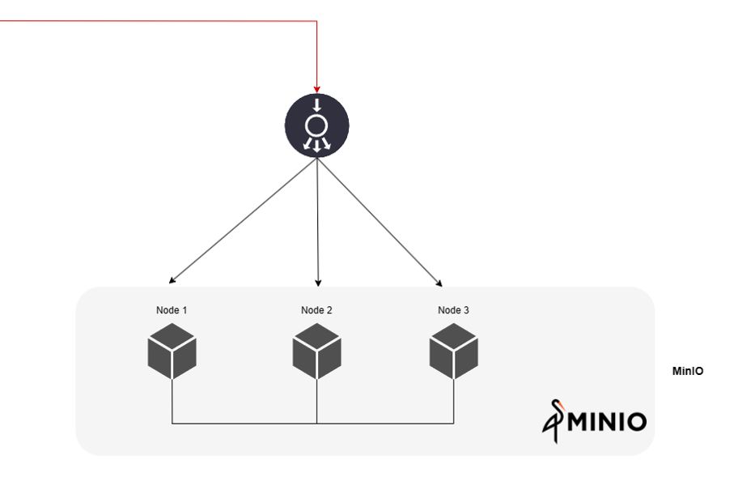
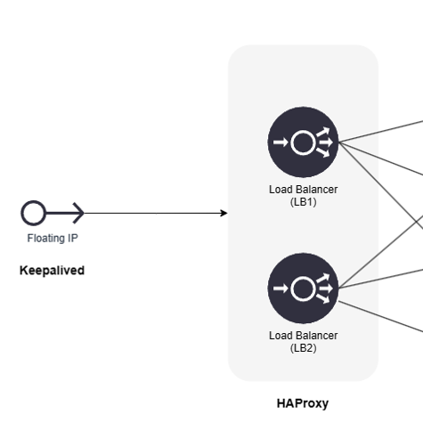

# Use TheHive as a cluster

This guide provides configuration examples for TheHive, Cassandra and MinIO to build a fault-tolerant cluster of 3 active nodes, each one including:

- Cassandra as database
- Elasticsearch as indexing engine
- Minio S3 data storage
- TheHive
- Haproxy (in order to illustrate a load balancer)
- Keepalived (in order to illustrate the setup of a virtual IP)

!!! Info
    All of these applications can be installed on their own server of shared on a same one. For the purpose of this documentation, we decided to use only 3 operating systems.


## Target Architecture


## Cassandra
{ align=center width=500 }

We are considering setting up a cluster of 3 active nodes of Cassandra with a replication factor of 3. That means that all nodes are active and the data is present on each node. 
This setup is tolerant to a 1 node failure.

For the rest of this section, we consider that all nodes sit on the same network.

### Installation
Install Cassandra on each node. Follow the [steps described here](step-by-step-guide.md).


### Configuration 
For each node, update configuration files  `/etc/cassandra/cassandra.yml` with the following parameters:

!!! Example ""

    ```yaml title="/etc/cassandra/cassandra.yml" hl_lines="13"
    cluster_name: 'thp'
    num_tokens: 256
    authenticator: PasswordAuthenticator
    authorizer: CassandraAuthorizer
    role_manager: CassandraRoleManager
    data_file_directories:
        - /var/lib/cassandra/data
    commitlog_directory: /var/lib/cassandra/commitlog
    saved_caches_directory: /var/lib/cassandra/saved_caches
    seed_provider:
        - class_name: org.apache.cassandra.locator.SimpleSeedProvider
          parameters:
            - seeds: "<ip node 1>, <ip node 2>, <ip node 3>"  # (1)
    listen_interface : eth0 # (2)
    rpc_interface: eth0 # (3)
    endpoint_snitch: SimpleSnitch
    ```

    1.  Ensure to list all IP addresses of the nodes that are included in the cluster
    2.  Ensure to setup the right interface name
    3.  Ensure to setup the right interface name


Then, delete file `/etc/cassandra/cassandra-topology.properties`

!!! Example ""
    ```
    rm /etc/cassandra/cassandra-topology.properties
    ```

### Start nodes
On each node, start the service:

!!! Example ""
    ```bash
    service cassandra start
    ```

Ensure that all nodes are up and running:

!!! Example ""
    ```bash
    root@cassandra:/# nodetool status
    Datacenter: dc1
    ===============
    Status=Up/Down
    |/ State=Normal/Leaving/Joining/Moving
    --  Address      Load       Tokens       Owns (effective)  Host ID                               Rack
    UN  <ip node 1>  776.53 KiB  256          100.0%            a79c9a8c-c99b-4d74-8e78-6b0c252abd86  rack1
    UN  <ip node 2>  671.72 KiB  256          100.0%            8fda2906-2097-4d62-91f8-005e33d3e839  rack1
    UN  <ip node 3>  611.54 KiB  256          100.0%            201ab99c-8e16-49b1-9b66-5444044fb1cd  rack1
    ```


### Initialise the database

On one node run (default password for `cassandra` account is `cassandra`):

!!! Example ""
    ```bash
    cqlsh <ip node X> -u cassandra
    ```

- Start by changing the password of superadmin named `cassandra`: 
!!! Example ""
    ```sql
    ALTER USER cassandra WITH PASSWORD 'NEWPASSWORD';
    ```

Exit and reconnect.


- Ensure user accounts are duplicated on all nodes 

!!! Exemple ""
    ```sql
    ALTER KEYSPACE system_auth WITH replication = {'class': 'SimpleStrategy', 'replication_factor': 3 };
    ```

- Create keyspace named `thehive`

!!! Example ""
    ```sql
    CREATE KEYSPACE thehive WITH replication = {'class': 'SimpleStrategy', 'replication_factor': '3' } AND durable_writes = 'true';
    ```

- Create role `thehive` and grant permissions on `thehive` keyspace (choose a password)

!!! Example ""
    ```sql
    CREATE ROLE thehive WITH LOGIN = true AND PASSWORD = 'PASSWORD';
    GRANT ALL PERMISSIONS ON KEYSPACE thehive TO 'thehive';
    ```


## Elasticsearch
{ align=center width=500 }

### Installation
We are considering setting up a cluster of 3 active nodes of Elasticsearch.
Follow this part to install Elasticsearch on your system: [](./step-by-step-guide.md#elasticsearch)

### Configuration
For each node, update configuration files  `/etc/cassandra/elasticsearch.yml` with the following parameters, and update `network.host` accordingly. 

!!! Example ""

    ```yaml hl_lines="8"
    http.host:  0.0.0.0
    network.bind_host:  0.0.0.0
    script.allowed_types:  inline,stored
    cluster.name: thehive
    node.name: 'es1'
    path.data: /usr/share/elasticsearch/data
    path.logs: /usr/share/elasticsearch/logs
    network.host: 'es1' # (1)
    http.port: 9200
    cluster.initial_master_nodes: 
      - es1
    node.master: true
    discovery.seed_hosts: # (2)
      - 'es1'
      - 'es2'
      - 'es3'
    thread_pool.search.queue_size: 100000
    thread_pool.write.queue_size: 100000
    xpack.security.enabled: true
    xpack.security.http.ssl.enabled: true
    xpack.security.transport.ssl.enabled: true
    xpack.security.http.ssl.key: /usr/share/elasticsearch/config/certs/es1/es1.key
    xpack.security.http.ssl.certificate: /usr/share/elasticsearch/config/certs/es1/es1.crt
    xpack.security.http.ssl.certificate_authorities: /usr/share/elasticsearch/config/certs/ca/ca.crt
    xpack.security.transport.ssl.key: /usr/share/elasticsearch/config/certs/es1/es1.key
    xpack.security.transport.ssl.certificate: /usr/share/elasticsearch/config/certs/es1/es1.crt
    xpack.security.transport.ssl.certificate_authorities: /usr/share/elasticsearch/config/certs/ca/ca.crt
    ```

    1. Update this parameter with the IP or hostname of the node
    2. Keep this parameter with the same value for all nodes

!!! Warning
    To configure Xpack and SSL with Elasticsearch, please review the documentation of your version of Elasticsearch. 

### Custom JVM options
add the file `/etc/elasticsearch/jvm.options.d/jvm.options` with following lines:

!!! Example ""
    ```
    -Dlog4j2.formatMsgNoLookups=true
    -Xms4g
    -Xmx4g
    ```

!!! Note "This can be updated according the amount of memory available"

### Start nodes
On each node, start the service:

!!! Example ""
    ```bash
    service elasticsearch start
    ```

## MinIO
{ width=500 }
<br/>
MinIO distributed mode requires fresh directories. Here is an example of implementation of MinIO with TheHive.

The following procedure should be applied **to all servers** belonging the the cluster. We are considering the setup where the cluster is composed of 3 servers named minio1, minio2 & minio3.

!!! Info
    Minio does not work like Cassandra and Elasticsearch. A load balancer should be installed in front of the nodes to distribute connections.

### Create a dedicated system account

Create a dedicated user and group for MinIO. 

```bash
adduser minio-user
addgroup minio-user
```

### Create at least 2 data volumes on each server

Create 2 folders on each server:

```bash
mkdir -p /srv/minio/{1,2}
chown -R minio-user:minio-user /srv/minio
```

### Setup hosts files 

Edit `/etc/hosts` of all servers

```
ip-minio-1     minio1
ip-minio-2     minio2
ip-minio-3     minio3
```

### installation

!!! Example "Example for DEB packages"

    ```bash
    wget https://dl.min.io/server/minio/release/linux-amd64/minio_20220607003341.0.0_amd64.deb
    wget https://dl.min.io/client/mc/release/linux-amd64/mcli_20220509040826.0.0_amd64.deb
    dpkg -i minio_20220607003341.0.0_amd64.deb
    dpkg -i mcli_20220509040826.0.0_amd64.deb
    ```

Visit [https://dl.min.io/]() to find last version of required packages.


### Configuration

Create or edit file `/etc/default/minio`

```conf title="/etc/default/minio"
MINIO_OPTS="--address :9100 --console-address :9001"
MINIO_VOLUMES="http://minio{1...3}:9100/srv/minio/{1...2}"
MINIO_ROOT_USER=thehive
MINIO_ROOT_PASSWORD=password
MINIO_SITE_REGION="us-east-1"
```

### Enable and start the service

```bash
systemctl daemon-reload
systemctl enable minio
systemctl start minio.service
```

### Prepare the service for TheHive

Following operations should be performed once all servers are up and running. A new server CAN NOT be added afterward.  
Connect using the _access key_ and _secret key_  to one server with your browser on port 9100: `http://minio:9100`


Create a bucket named `thehive`


The bucket should be created and available on all your servers. 


## TheHive
{ align=left width=100 }

_Akka_ toolkit is used by TheHive to manage the cluster when this configuration is setup. _Akka_ also helps to manage thread & multi-processing. _Akka_ allows TheHive to be scalable.

!!! Quote
    Akka is a toolkit for building highly concurrent, distributed, and resilient message-driven applications for Java and Scala.
    <br/>
    _Source:_ [https://akka.io](https://akka.io)
<br/>
<br/>

### Configuration
#### Cluster
Unlike the single node configuration, the first thing to configure is _Akka_ to ensure the cluster is well managed by the application.

In this guide, we are considering the node 1 to be the master node. Start by configuring `akka` component by editing the `/etc/thehive/application.conf` file **of each node** like the following:

```yaml title="/etc/thehive/application.conf"  hl_lines="8 14 15 16"
akka {
  cluster.enable = on 
  actor {
    provider = cluster
  }
remote.artery {
  canonical {
    hostname = "<My IP address>" # (1)
    port = 2551
  }
}
# seed node list contains at least one active node
cluster.seed-nodes = [
                      "akka://application@<Node 1 IP address>:2551",  # (2)
                      "akka://application@<Node 2 IP address>:2551",
                      "akka://application@<Node 3 IP address>:2551"
                     ]
cluster.min-nr-of-members = 2    # (3)
}
```

1.    Set the IP address of the node
2.    The value of this parameter should be similar on all nodes
3.    Choose the value corresponding the half number of nodes +1 (for 3 nodes --> 2) 

#### Database and index engine

Update the configuration of thehive accordingly in `/etc/thehive/application.conf` :

```yaml title="/etc/thehive/application.conf" hl_lines="7"
## Database configuration
db.janusgraph {
  storage {
    ## Cassandra configuration
    # More information at https://docs.janusgraph.org/basics/configuration-reference/#storagecql
    backend = cql
    hostname = ["<ip node 1>", "<ip node 2>", "<ip node 3>"] #(1)
    # Cassandra authentication (if configured)
    username = "thehive"
    password = "PASSWORD"
    cql {
      cluster-name = thp
      keyspace = thehive
    }
  }
```

1.  Set IP addresses of Cassandra nodes

#### MinIO S3 file storage
For each TheHive node of the cluster, add the relevant storage configuration. Example for the first node: 

=== "With TheHive 5.0.x"

    ```yaml title="/etc/thehive/application.conf"
    storage {
      provider: s3
      s3 {
        bucket = "thehive"
        readTimeout = 1 minute
        writeTimeout = 1 minute
        chunkSize = 1 MB
        endpoint = "http://<IP_MINIO_1>:9100"
        accessKey = "thehive"
        secretKey = "password"
        region = "us-east-1"
      }
    }
    alpakka.s3.access-style = path
    ```

=== "With TheHive 5.1.0 or higher"

    ```yaml title="/etc/thehive/application.conf"
    storage {
      provider: s3
      s3 {
        bucket = "thehive"
        readTimeout = 1 minute
        writeTimeout = 1 minute
        chunkSize = 1 MB
        endpoint = "http://<IP_MINIO_1>:9100"
        accessKey = "thehive"
        aws.credentials.provider = "static"
        aws.credentials.secret-access-key = "password"
        access-style = path
        aws.region.provider = "static"
        aws.region.default-region = "us-east-1"
      }
    }
    ```

!!! Info 
    - The configuration is backward compatible
    - Either each TheHive server connects to one MinIO server, or **use a load balancer** to distribute connections to all nodes of the cluster (see [the example for TheHive](#load-balancers-with-haproxy)).

### Start the service 
```bash
systemctl start thehive
```

## Load balancers with HAProxy
{ width=400 }
<br/>
In front of TheHive cluster, you can add a load balancer which distributes HTTP requests to cluster nodes. One client does not need to always use the same node as affinity is not required.

Below is an non-optimized example of what should be added in haproxy configuration file, `/etc/haproxy/haproxy.cfg` . Same configuration goes for all HAProxy instances.
In this example, the service is bound on TCP port 80. Bind the service on the virtual IP address that will be set up by _keepalived_ service ([see next part](#virtual-ip-with-keypalived)):

!!! Example ""
    ```text
    # Listen on all interfaces, on port 80/tcp
    frontend thehive-in
            bind <VIRTUAL_IP>:80                # (1)
            default_backend thehive
    # Configure all cluster node
    backend thehive
                balance roundrobin
                server node1 THEHIVE-NODE1-IP:9000 check   # (2)
                server node2 THEHIVE-NODE2-IP:9000 check
                server node3 THEHIVE-NODE3-IP:9000 check
    ```

    1.  Configure the virtual IP address dedicated to the cluster
    2.  Configure all nodes IP addresses and port of TheHive


## Virtual IP with Keypalived
{ width=400 }
<br/>
If you decide to use _keepalived_ to setup a virtual IP address for load balancers, this part contains a basic example of configuration.

This service checks if the load balancers (for example [HAProxy](#load-balancers-with-haproxy)), installed on the same system, is running or not. In our case, LB1 is master so the virtual IP address is on LB1 server. if haproxy service is not running any more, keepalived on server LB2 is setting up the virtual ip address until haproxy service on LB1 server is running again.

!!! Example "" 
    ```yaml hl_lines="12"
    vrrp_script chk_haproxy {     # (1)
          script "/usr/bin/killall -0 haproxy"  # cheaper than pidof
          interval 2 # check every 2 seconds
          weight 2 # add 2 points of priority if OK
        }
        vrrp_instance VI_1 {
          interface eth0
          state MASTER
          virtual_router_id 51
          priority 101 # 101 on primary, 100 on secondary      # (2)
          virtual_ipaddress {
            10.10.1.50/24 brd 10.10.1.255 dev eth0 scope global  # (3)
          }
          track_script {
            chk_haproxy
        } 
    }
    ```

    1.   Requires keepalived version > 1.1.13
    2.   Use `priority 100` for a secondary node
    3.   :fontawesome-solid-triangle-exclamation: This is an example. Update with your IP address and broadcast address


## Troubleshooting

!!! Example "Example of error message in /var/log/cassandra/ log files"

    ```text
    InvalidRequest: code=2200 [Invalid query] message=”org.apache.cassandra.auth.CassandraRoleManager doesn’t support PASSWORD”.`
    ```

    set the value `authenticator: PasswordAuthenticator` in `cassandra.yaml`

    ---

    ```
    Caused by: java.util.concurrent.ExecutionException: com.datastax.driver.core.exceptions.UnauthorizedException: Unable to perform authorization of permissions: Unable to perform authorization of super-user permission: Cannot achieve consistency level LOCAL_ONE
    ```

    Fix it by running following CQL command: 

    ``` sql
    ALTER KEYSPACE system_auth WITH replication = {'class': 'SimpleStrategy', 'replication_factor': 3 };
    ```

    and with the following command: 

    ```bash
    nodetool repair -full
    ```