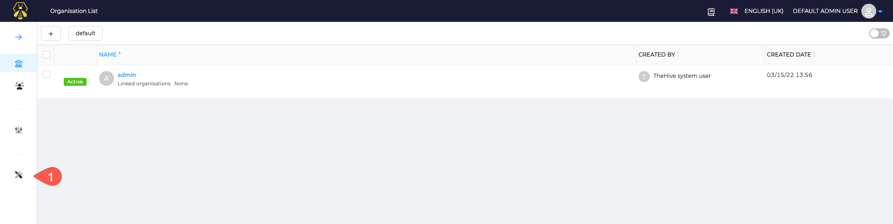
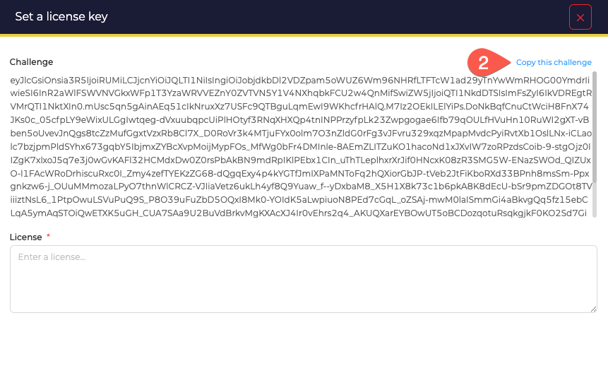
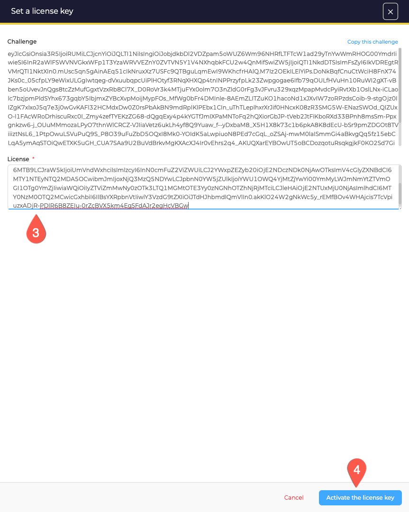

# :material-license: Activate a license

## Community

With the default license, TheHive is free to use with 2 users and 1 organisation. 

## Enable a license
_Trial_, _Gold_ or _Platinum_ licenses unlock advanced features and a set of accounts and organisation included.

## Get a license 
Request a license by contacting StrangeBee - [https://www.strangebee.com](https://www.strangebee.com) or [contact@strangebee.com](mailto:contact@strangebee.com). 

## Enable a license
!!! Tip
    Default admin credentials are `admin@thehive.local` / `secret`

Connect as administrator and follow this guide: 

- Copy the challenge and send it to StrangeBee

- Get back the corresponding license, enter in the UI and activate

