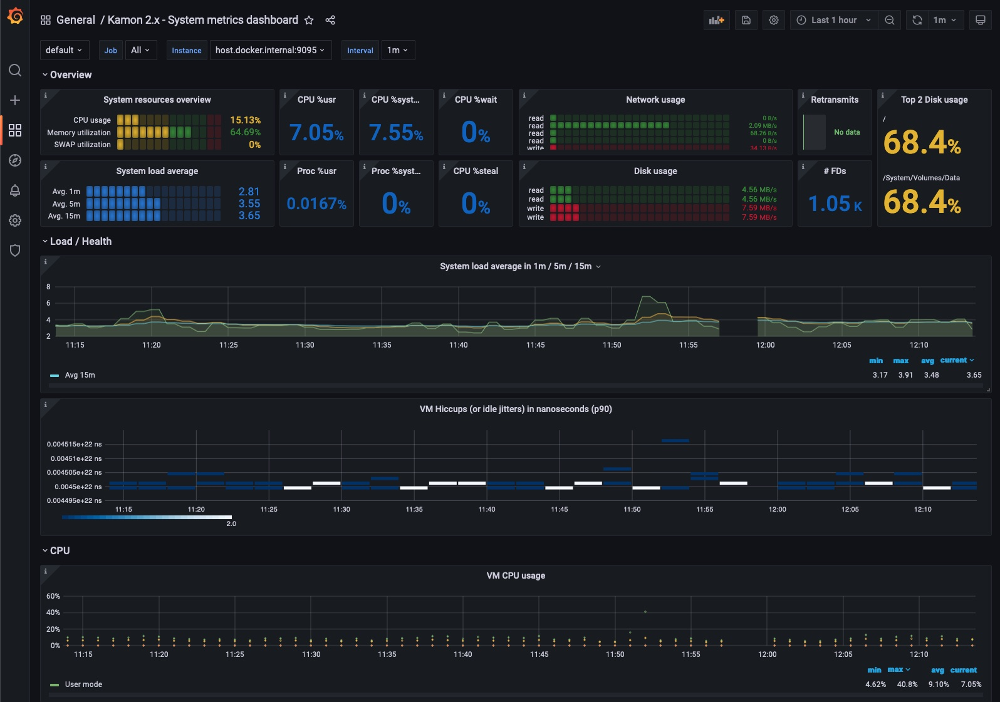

# Monitoring TheHive

The monitoring will allow you to get metrics about the behavior of your TheHive instance: request time, cpu and memory usage ...

TheHive uses the library [kamon.io](https://kamon.io/) and by default the monitoring is **disabled**

TheHive ships with the integration for Prometheus reporter. <br> Other reporters are **not** included by TheHive. If you would like to see a reporter included by default in TheHive, contact us.




## Metrics setup with Prometheus and Grafana

Here we will setup metrics reporting with [Prometheus](https://prometheus.io/) and [Grafana](https://grafana.com/)

### TheHive configuration

In your `application.conf`, add this section to the configuration:

```
kamon {
    # Activate kamon module - disabled by default
    enabled = true

    # Activate the prometheus reporter
    modules {
      prometheus-reporter.enabled = yes
    }

    environment.tags {
        # Setup additional tags that will be sent to prometheus 
        # See https://kamon.io/docs/latest/reporters/prometheus/#sending-environment-tags-to-prometheus
        # ex: env = prod
    }

    # Reference: https://kamon.io/docs/latest/reporters/prometheus/#configuration
    prometheus {
      include-environment-tags = true
      # Start and embedded-server on the provided port. 
      # If using docker, make sure that this port is accessbile
      embedded-server {
        hostname = 0.0.0.0
        port = 9095
      }
    }
}
```

You will need to restart TheHive for the configuration to take effect

To check that the prometheus reporter is working, connect to <http://THEHIVE:9095/metrics>
You should see a list of metrics that are reported by TheHive.


### Prometheus configuration

Add the [scrape configuration](https://prometheus.io/docs/prometheus/latest/configuration/configuration/#scrape_config) to prometheus configuration `prometheus.yml`

```yaml
scrape_configs:
  # ...  other scrape configs 

  - job_name: 'thehive'
    scrape_interval: 30s
    static_configs:
      - targets: ['THEHIVE:9095'] # set the ip or hostname for TheHive
```

In a dynamic environment like kubernetes, the TheHive service can be automatically discovered by prometheus. You can enable this with labels on your pod or by adding a `PodMonitor` resource. See the adaquate documentation: Prometheus [configuration](https://prometheus.io/docs/prometheus/latest/configuration/configuration/#kubernetes_sd_config) or Prometheus [operator](https://prometheus-operator.dev/docs/user-guides/getting-started/)


### Grafana configuration

- Make sure that prometheus is setup as a Datasource inside Grafana
- Import dashboards or create your own. We recommend the following dashboards (these dashboards were not created by Strangebee):
    - [Kamon 2.x - API dashboard](https://grafana.com/grafana/dashboards/12317-api-dashboard/): see API metrics like throughoutput, latency, % of error status. *Note that TheHive frontend uses long polling, some requests take 60 seconds and they will appear as outliers in this dashboard*
    - [Kamon 2.x - System metrics dashboard](https://grafana.com/grafana/dashboards/12315-system-metrics-dashboard/): see info about CPU or memory usage, JVM metrics like Heap usage or GC
    - [Kamon 2.x - Akka](https://grafana.com/grafana/dashboards/10776-kamon-akka-marcelo/): info about Akka system, actors, processing time

