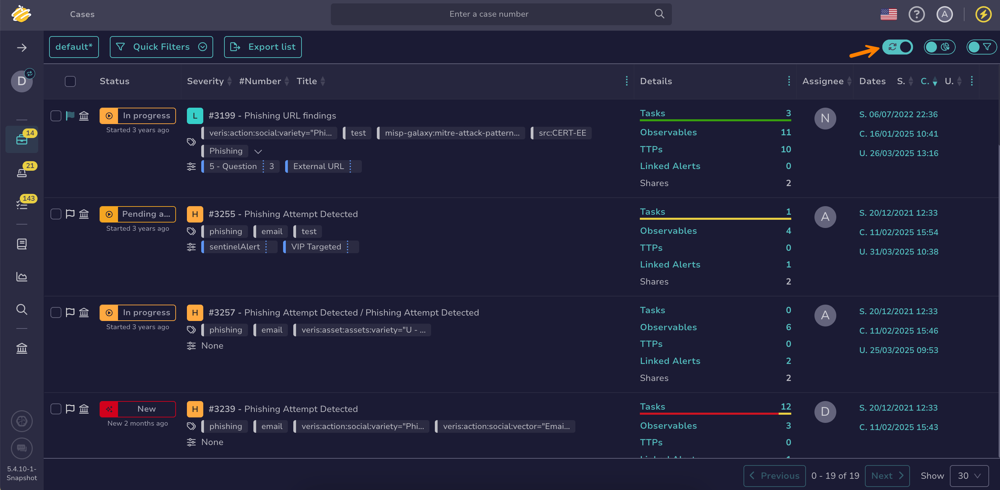

# About Autorefresh

Autorefresh is a feature that automatically refreshes lists to display new elements in TheHive.

## Update frequency

When turned on, autorefresh updates the lists every time there is an event worth mentioning in the [live feed](about-live-feed.md).

    

## Manual refresh

If users prefer not to configure autorefresh, they can still manually update their lists.

    

<h2>Next steps</h2>

* [About the Live Feed](about-live-feed.md)