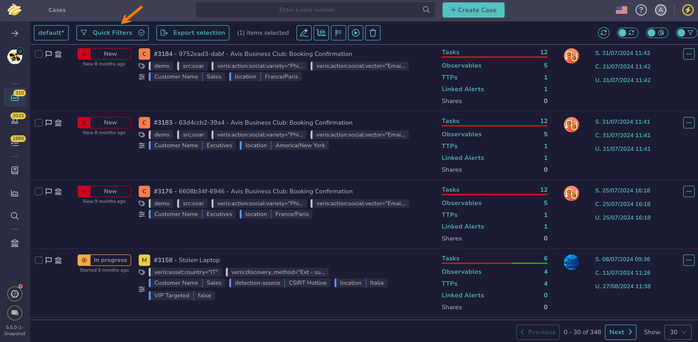

# About Filtering and Sorting

This topic explains how filtering and sorting work in TheHive.

## Filtering elements

Filtering in TheHive refines displayed lists across multiple views.

### Applying filters

Applying filters requires turning on the **Filters** toggle at the top right of the page to access filtering options and manually enter filter values.

When available, these quicker alternatives provide filtering options without manual value entry:

* Using predefined quick filters

    Select the **Quick filters** dropdown to access predefined filters. All users have access to these filters and can't modify them.

    

* Selecting values directly from a list

    Select specific values within a list to apply filters dynamically.

    

### Filter logic

Filters are combined using the `AND` operator, meaning all selected conditions must be met.

{!includes/elasticsearch-limitation.md!}

### Saving filters

Applied filters can be saved in [a view](about-views.md) to avoid reapplying them repeatedly. Selecting the saved view applies the filters automatically.

## Sorting elements

### Applying sorting

Sorting in TheHive organizes displayed lists across various views.

Selecting the small arrows next to a field name sorts the list. The first click sorts in ascending order, the second click sorts in descending order, and the third click removes the sorting. The field name and selected arrow highlight to indicate the active sort.

### Sorting logic

Sorting applies to only one field at a time, as multiple-field sorting isn't supported.

### Saving sorting

Applied sorting can be saved in [a view](about-views.md) to avoid reapplying it repeatedly. Selecting the saved view applies the stored sorting automatically.

<h2>Next steps</h2>

* [About Views](about-views.md)