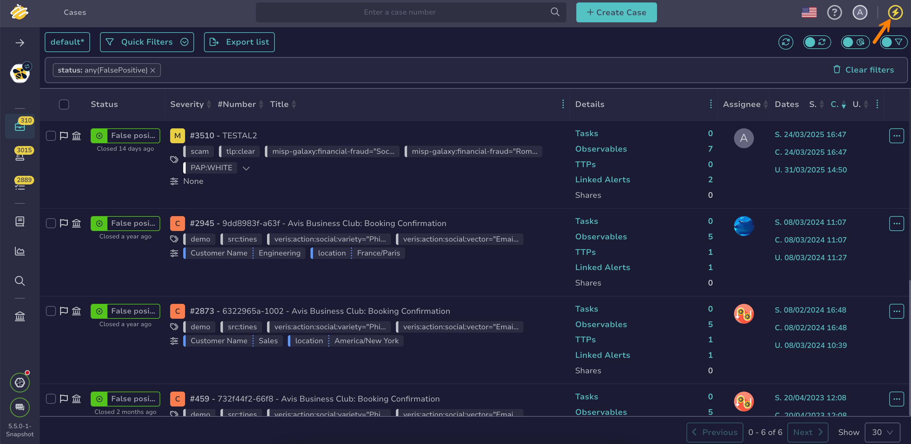
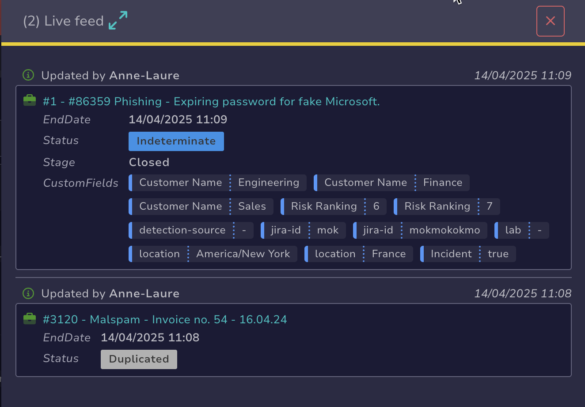

# About the Live Feed

The Live Feed is a feature that displays the latest key events from the [audit logs](../organization/about-audit-logs.md).

This topic explains what the Live Feed covers.

## Elements

The Live Feed contains links to cases, alerts, and observables.

## Scope

The results in the Live Feed depend on the user's context. In global views, it displays all types of events.

When viewing a case description, alert description, task details, or observable details, it only shows events related to the respective item.

## Limits

For performance reasons, the Live Feed displays only the last 10 events from the past 24 hours.

<h2>Next steps</h2>

* [About Audit Logs](../organization/about-audit-logs.md)