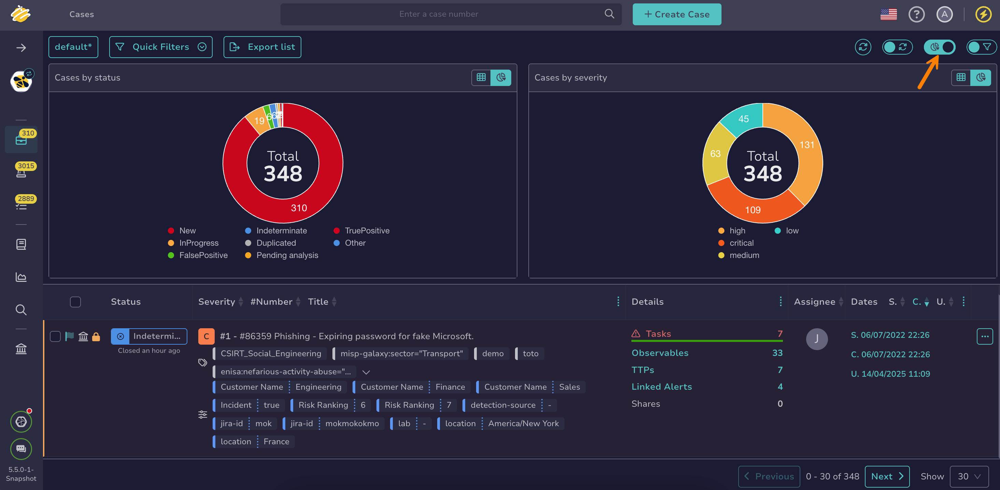

# About Statistics

Predefined statistics are available in TheHive for [cases](../analyst-corner/cases/about-cases.md), [alerts](../analyst-corner/alerts/about-alerts.md), and [observables](../analyst-corner/cases/observables/about-observables.md) lists.

For custom statistics and dashboards, refer to the [About Dashboards](../analyst-corner/dashboard/about-dashboards.md) topic.

## Available statistics

Cases statistics available:

* Cases by status
* Cases by severity

Alerts statistics available:

* Alerts by status
* Alerts by type

Observables statistics available:

* Observables by data type
* Observables as indicator of compromise (IOC)

## Filters on statistics

Selecting a value in the statistics automatically [filters](about-filtering-and-sorting.md) the lists based on that value.

<h2>Next steps</h2>

* [Create a Dashboard](../analyst-corner/dashboard/create-a-dashboard.md)