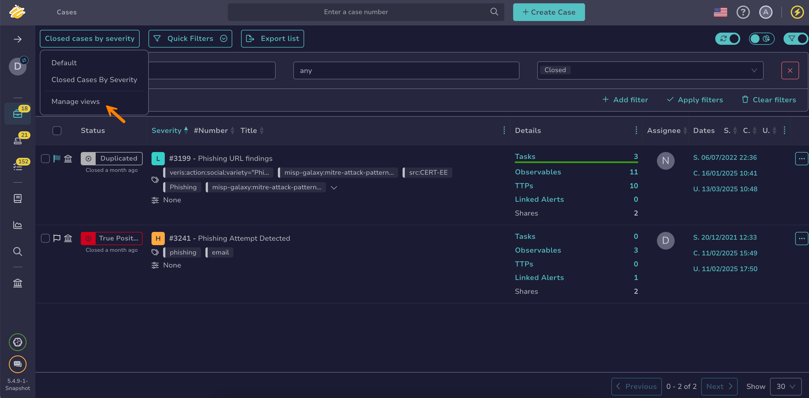

# About Views

Views are a feature that allows you to save [filters and sorting](about-filtering-and-sorting.md) applied to a list in TheHive.

## Managing views

### Default view

A *Default* view with no filters or sorting is always available. You can't modify or delete it.

### Saving views

When you apply a new filter or sorting, an asterisk (*\**) appears next to the view name:

* To save the changes in the current view, select **Save view**.
* To save the changes as a new view, select **Save view as**.

### Actions

You can switch views by selecting the view name in the top left of the screen.

To delete existing views, select **Manage views**. You can't rename an existing view.

### Scope

Views are user-specific and list-specific, meaning each user has access to their own saved views, which apply only to a specific list.

### Behavior

The last used view is automatically applied by default when accessing a list.

## Next steps

* [About Filtering and Sorting](about-filtering-and-sorting.md)