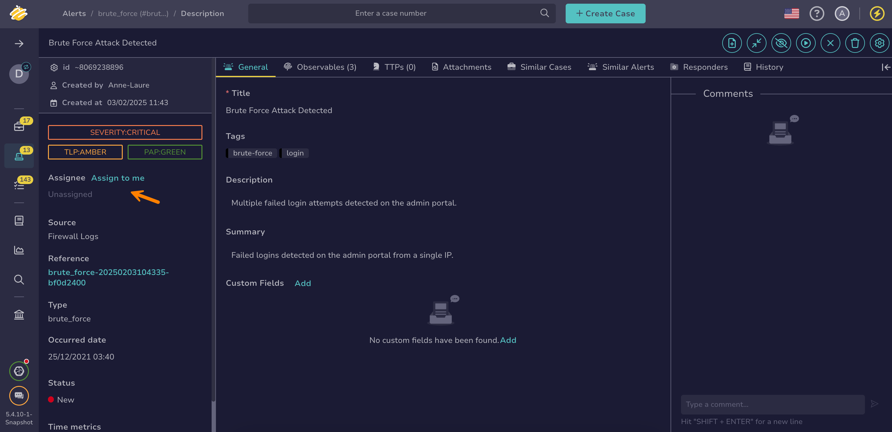

# Assign an Alert

<!-- md:permission `manageAlert/update` -->

Assign an [alert](about-alerts.md) in TheHive to yourself or another user for triage.

## Assign an alert to yourself

1. 

2. Select :fontawesome-solid-ellipsis: next to the alert you want to assign to yourself.

3. Select **Assign to me**.

## Assign an alert to another user

1. [Find the alert](./search-for-alerts/find-an-alert.md) you want to assign.

2. In the alert, select an assignee in the left pane.

    

3. Select **Save**.

<h2>Next steps</h2>

* [Change an Alert Status](change-status-alert.md)
* [Ignore Alert Updates from MISP](ignore-alert-updates-misp.md)