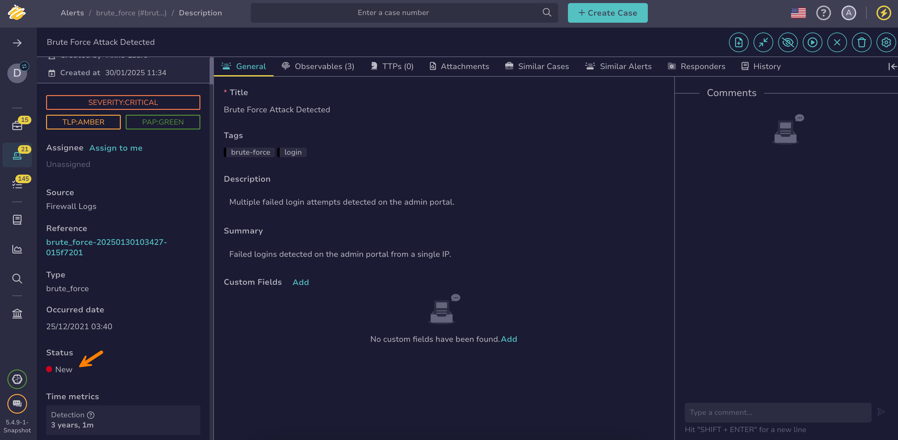

# How to Change an Alert Status

This topic provides step-by-step instructions for changing the [status](../../../administration/status/about-statuses.md) of an alert in TheHive.

{!includes/access-change-status-alert.md!}

<h2>Procedure</h2>

1. Find [the alert](../alerts/search-for-alerts/find-an-alert.md) you want to update.

2. In the alert description, move through the **Status** section in the left panel.

    

3. Select the new status from the dropdown list.

    !!! tip "Can't find a status?"
        If you can't find the status you need, it may be due to one of the following reasons:  
        - The status isn't available from the alert description page. Statuses linked to the *In progress* stage are available only when [starting the investigation of an alert](../alerts/start-investigating-an-alert.md). Statuses linked to the *Closed* stage are available only when [closing an alert](../alerts/close-an-alert.md).  
        - The status doesn't exist yet, or someone may have deleted or hidden it. Contact someone with admin-level permissions to [create it](../../../administration/status/create-a-status.md) or [restore it](../../../administration/status/change-visibility-of-a-status.md).

4. Select **Save**.

<h2>Next steps</h2>

* [Start Investigating an Alert](../alerts/start-investigating-an-alert.md)
* [Merge Alerts](../alerts/alerts-description/merge-alerts.md)
* [Run Responders](../alerts/alerts-description/run-responders.md)