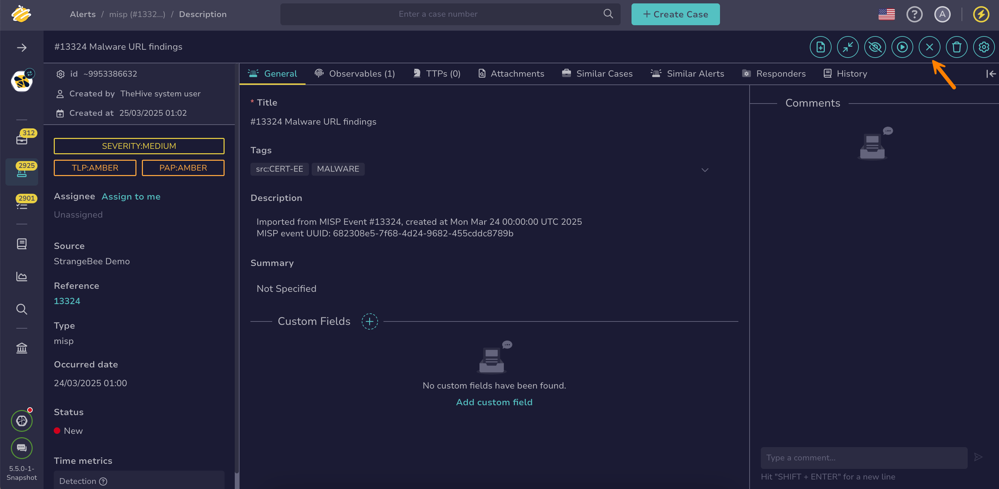

# How to Close an Alert

This topic provides step-by-step instructions for closing an [alert](about-alerts.md) in TheHive.

{!includes/access-close-alerts.md!}

<h2>Procedure</h2>

1. [Find the alert](../alerts/search-for-alerts/find-an-alert.md) you want to close.

2. In the alert description, select :fontawesome-solid-xmark:.

    

3. In the **Change the alert status** drawer, select the [status](../../../administration/status/about-statuses.md) that explains why the alert wasn't escalated to a new or existing case for further investigation.

4. Optional: Enter a summary describing why the alert wasn't escalated to a case.

5. Add or remove values in [custom fields](../../../administration/custom-fields/about-custom-fields.md) as needed. 

    !!! info "Custom fields completion"
        You must complete all mandatory custom fields to close an alert.

6. Select **Confirm**.

<h2>Next steps</h2>

* [New Case from Selection](../alerts/alerts-description/new-case-from-selection.md)
* [Merge Alerts](../alerts/alerts-description/merge-alerts.md)