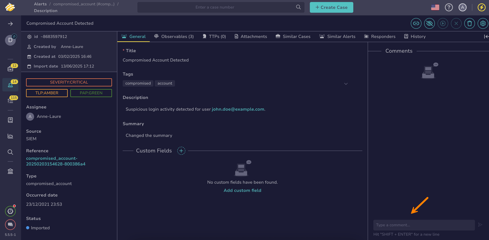

# Comment on an Alert

<!-- md:permission `manageComment` -->

Add comments to [alerts](../alerts/about-alerts.md) to document triage decisions, share initial findings, or provide context for escalation decisions. Comments help maintain a clear record of why an alert was handled in a specific way.

<h2>Procedure</h2>

1. [Find the alert](../alerts/search-for-alerts/find-an-alert.md) where you want to add a comment.

2. In the right pane, enter your comment.

    

3. Select **Send** to post the comment.

<h2>Next steps</h2>

* [Enter Values in Custom Fields](../cases/custom-fields/enter-values-in-custom-fields.md)
* [Add an Observable](../cases/observables/add-an-observable.md)
* [Add or Remove Tags](../cases/tags/add-remove-tags.md)
* [Change Case or Alert Classification Settings](../cases/change-case-alert-classification-settings.md)
* [Assign an Alert](assign-an-alert.md)
* [Change an Alert Status](change-status-alert.md)
* [Enrich Alert Details](enrich-alert-details.md)
