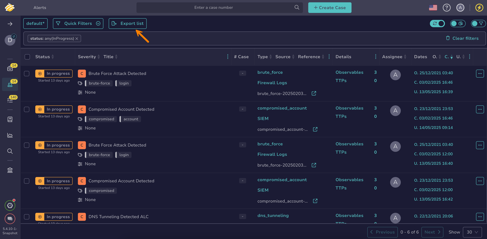

# Export a List of Alerts

Export a list of [alerts](about-alerts.md) in TheHive to share information, create reports, or analyze data outside the platform.

<h2>Procedure</h2>

1. 

2. Select **Export list** to export all displayed alerts, reflecting the applied [filters and sorting](../about-filtering-and-sorting.md). To export a specific selection of alerts, select :fontawesome-regular-square: next to the alerts you want to export, then select **Export selection**.

    

3. In the **Export alerts to file** drawer, select your preferred formatting options.

4. Select **Export to file**.

<h2>Next steps</h2>

* [Start Working on an Alert](start-investigating-an-alert.md)
* [Add an Alert to an Existing Case](add-an-alert-to-an-existing-case.md)
* [Create a Case from an Alert](create-a-case-from-an-alert.md)
* [Assign an Alert](assign-an-alert.md)
* [Change an Alert Status](change-status-alert.md)
* [Enrich Alert Details](enrich-alert-details.md)
* [Close an Alert](close-an-alert.md)
* [Reopen an Alert](reopen-an-alert.md)