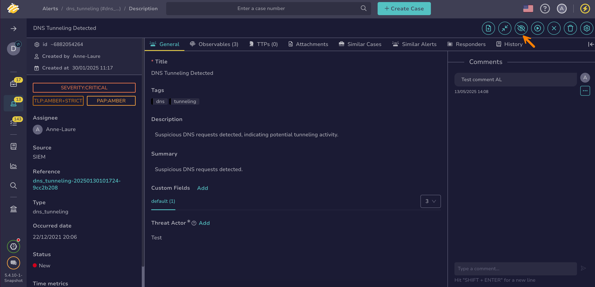

# How to Ignore Alert Updates from MISP

This topic provides step-by-step instructions for ignoring alert updates from [MISP](../../../administration/misp-integration/about-misp-integration.md) in TheHive.

MISP is an open-source threat intelligence platform that integrates with TheHive to retrieve events from MISP servers and convert them into alerts. By default, TheHive automatically updates these alerts when the corresponding MISP events change, which may also update the alerts’ statuses.

Use this procedure to turn off automatic updates for specific alerts.

!!! warning "Requirements"
    Automatic alert updates are available only for alerts created through [MISP server integrations](../../../administration/misp-integration/connect-a-misp-server.md).

{!includes/access-manage-alert-updates-misp.md!}

<h2>Procedure</h2>

1. [Find the alert](./search-for-alerts/find-an-alert.md) you want to exclude from automatic updates.

2. In the alert description, select **Ignore new updates**.

    

<h2>Next steps</h2>

* [Change an Alert Status](change-status-alert.md)
* [Start Investigating an Alert](start-investigating-an-alert.md)
* [Assign an Alert](assign-an-alert.md)