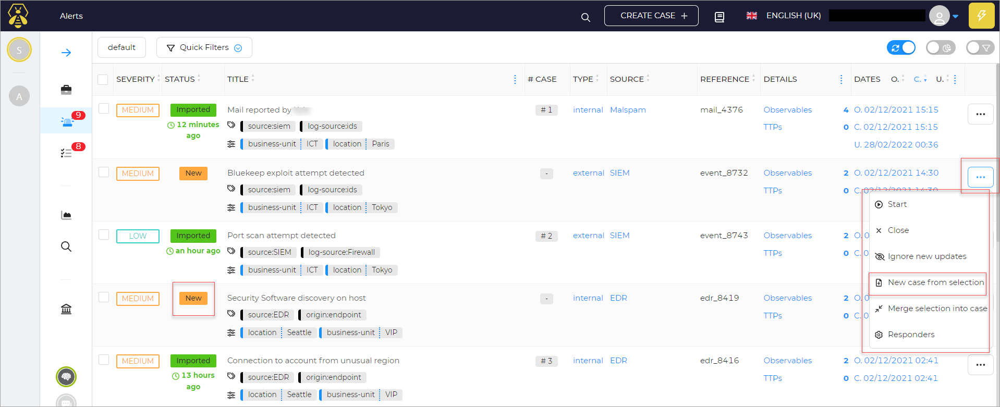
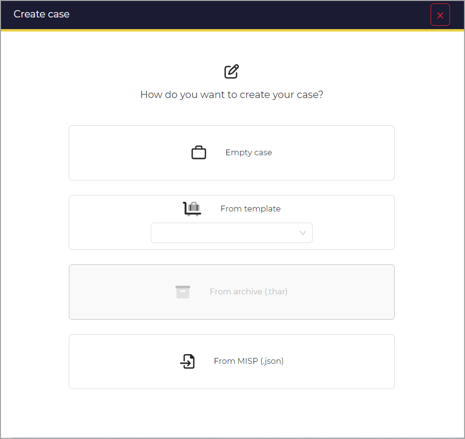

# New case from selection

In this section you can find information about creating a new case from selection. 

On the main alerts page, where all alerts are displayed, there are various types of alerts, including new and imported ones. The **New Case from Selection** option is only available for new alerts listed.

## Steps to Add a New Case from a Selected Alert

1. Navigate to the alert details page.
2. Select the alert for which you want to create a new case.
3. Click on the **New Case from Selection** option.

A new window opens.

## Important Notes

- **Single Case Creation**: The **New Case from Selection** option allows the creation of only one case, regardless of how many alerts are selected.
- **Merge Action**: Similarly, the merge button also merges only one case at a time, regardless of the number of selected alerts.

For bulk actions, such as creating multiple cases or merging multiple alerts, use the bulk action buttons available at the top of the alerts list.