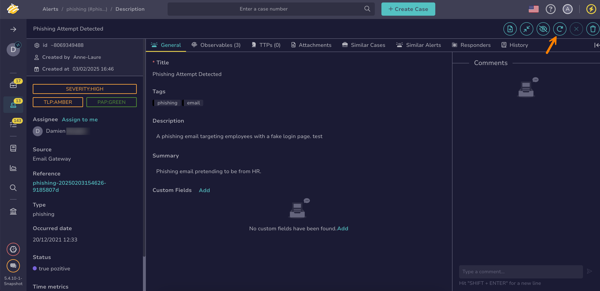

# How to Reopen an Alert

This topic provides step-by-step instructions for reopening an [alert](about-alerts.md) in TheHive.

Use this procedure to reopen a closed alert and change its [status](../../../administration/status/about-statuses.md) so that it moves from the *Closed* stage to the *In progress* stage.

{!includes/access-reopen-alerts.md!}

<h2>Procedure</h2>

1. [Find the alert](./search-for-alerts/find-an-alert.md) you want to reopen.

2. In the alert, select **Restart**.

    

3. In the **Change the alert status** drawer, update the [status](change-status-alert.md) for the alert, complete the analysis, and assign it to someone else if needed.

4. Select **Confirm**.

<h2>Next steps</h2>

* [Change an Alert Status](change-status-alert.md)
* [Ignore Alert Updates from MISP](ignore-alert-updates-misp.md)