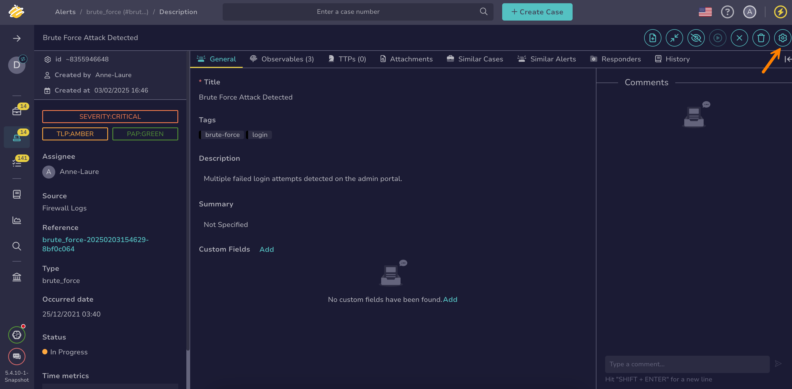
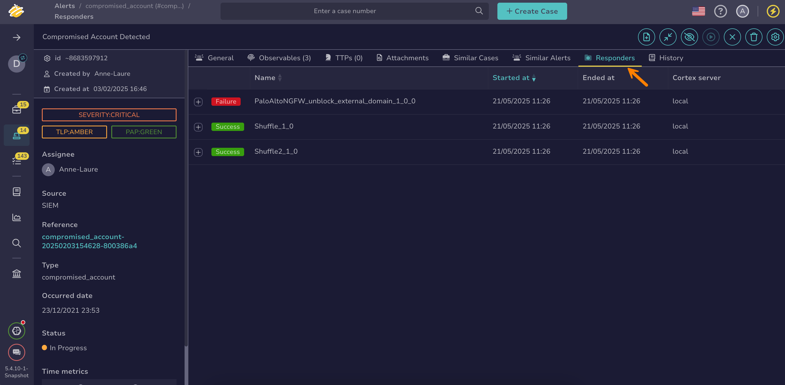

# Run Responders and Review Reports for an Alert

[Cortex responders](../../../administration/cortex/about-cortex.md) execute actions on cases, alerts, observables, tasks, and task logs.

Run responders on an [alert](about-alerts.md) to execute automated actions such as closing an external ticket or performing a predefined response within TheHive.

!!! note "Observables not included"
    Running a responder on an alert doesn't run it on the observables linked to the alert. To run responders on an observable, see [Run Responders and Review Reports for an Observable](../cases/observables/run-responders-on-an-observable.md).

!!! tip "Running functions on an alert"
    <!-- md:version 5.4 --> Did you know it’s possible to run functions on alerts just like running responders? See [Run a Function on a Case or an Alert](../../organization/configure-organization/manage-functions/run-a-function-case-alert.md) for detailed instructions.

## Run responders on an alert

1. [Locate the alert](./search-for-alerts/find-an-alert.md) on which you want to run responders.

2. In the alert, select **Responders**.

    

3. In the **Run actions on current alert** drawer, select the responders you want to run.

4. Select **Launch actions**.

5. Select **Confirm**.

## Review responder reports for an alert

1. [Locate the alert](./search-for-alerts/find-an-alert.md) on which you ran responders.

2. In the alert, select the **Responders** tab to check the status of the executed responders.

    

<h2>Next steps</h2>

* [Enrich Alert Details](enrich-alert-details.md)
* [Change an Alert Status](change-status-alert.md)
* [Add an Alert to an Existing Case](add-an-alert-to-an-existing-case.md)
* [Create a Case from an Alert](create-a-case-from-an-alert.md)
* [Close an Alert](close-an-alert.md)