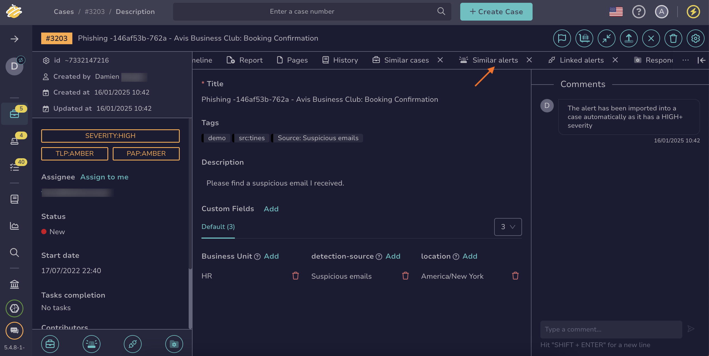

# How to Find an Alert

This topic provides step-by-step instructions for using various methods to search for an [alert](../about-alerts.md) in TheHive.

If you’re unsure which method to use, refer to the [Overview of Search Methods for Alerts](overview-search-methods-alert.md) topic.

## Method 1: Similar alerts

*Use this method if you want to find one or more alerts similar to a known alert and need to perform actions on them simultaneously.*

1. Open a case, an alert, or a task, and select the **Similar alerts** tab.

    

2. {!includes/apply-filters.md!}

3. {!includes/search-results.md!}

---

## Method 2: Filters in the Alerts view

*Use this method if you need to search for one or more alerts to perform actions on them simultaneously.*

1. Go to the **Alerts** view from the sidebar menu.

    

2. {!includes/apply-filters.md!}

3. {!includes/search-results.md!}

---

## Method 3: Global Search feature

*Use this method if you need to conduct advanced searches for one or more alerts without requiring simultaneous actions.*

1. Go to the **Global Search** view from the sidebar menu.

    

2. Select the **Alerts** item on the **Search scope** pane.

    

    {!includes/global-search-all-elements.md!}

3. {!includes/global-search-search-box.md!}

4. {!includes/global-search-additional-filters.md!}

5. {!includes/search-results.md!}

## Next steps

* [Actions](../alerts-description/actions.md)
* [Merge Alerts](../alerts-description/alerts/merge-alerts.md)
* [New Case From Selection](../alerts-description/alerts/new-case-from-selection.md)
* [Preview Alerts](../alerts-description/alerts/preview-alerts.md)
* [Run Responders](../alerts-description/alerts/run-responders.md)
* [View Responders](../alerts-description/alerts/view-responders.md)
* [View Observables](../alerts-description/alerts/view-observables.md)
* [View Similar Alerts](../alerts-description/alerts/view-similar-alerts.md)
* [View Similar Cases](../alerts-description/alerts/view-similar-cases.md)
* [View TTPs](../alerts-description/alerts/view-ttps.md)
