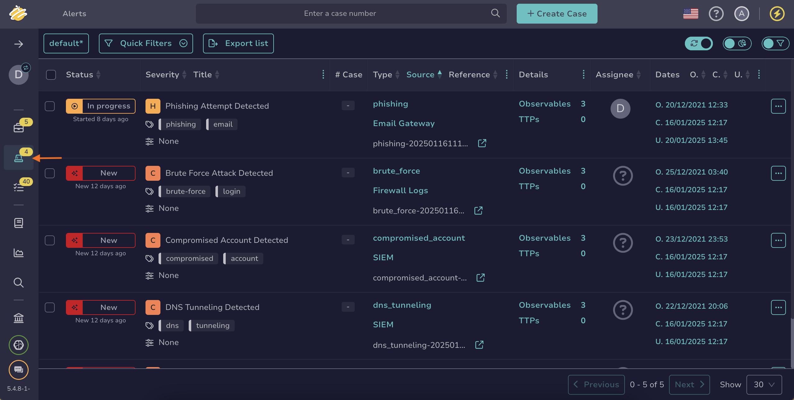
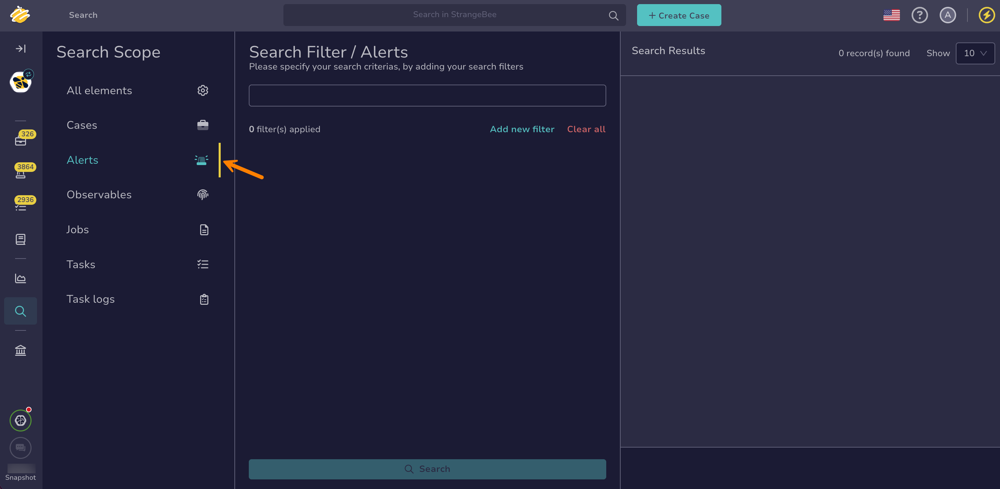

# How to Find an Alert

This topic provides step-by-step instructions for using various methods to search for an [alert](../about-alerts.md) in TheHive.

If you’re unsure which method to use, refer to the [Overview of Search Methods for Alerts](overview-search-methods-alert.md) topic.

!!! tip "Can't find an alert?"
    Ensure [autorefresh](../../about-autorefresh.md) is turned on to automatically display new alerts in lists.

## Method 1: Similar alerts

*Use this method if you want to find one or more alerts similar to a known alert and need to perform actions on them simultaneously.*

1. Open a case, an alert, or a task, and select the **Similar alerts** tab.

    

2. {!includes/apply-filters.md!}

3. {!includes/search-results.md!}

For more information, see the [Find Similar Alerts and Cases](../find-similar-alerts-cases.md) topic.

---

## Method 2: Filters in the Alerts view

*Use this method if you need to search for one or more alerts to perform actions on them simultaneously.*

1. Go to the **Alerts** view from the sidebar menu.

    

2. {!includes/apply-filters.md!}

3. {!includes/search-results.md!}

{!includes/views-filters-sorts.md!}

---

## Method 3: Global Search feature

*Use this method if you need to conduct advanced searches for one or more alerts without requiring simultaneous actions.*

1. Go to the **Global Search** view from the sidebar menu.

    

2. Select the **Alerts** item on the **Search scope** pane.

    

    {!includes/global-search-all-elements.md!}

3. Enter the keywords you want to search for in the search box displayed by default.

    !!! tip "<!-- md:version 5.4.7 --> Wildcard character"
        You can use the wildcard character *\** to broaden your searches.

        The wildcard character acts as a placeholder that matches zero or more characters, helping you find variations of a term or incomplete information.
        
        Examples of use cases:  
        - Email domains: Entering *\*@gmail.com* will return entities containing the gmail.com domain.  
        - IP subnets: Entering *192.168.\*.\** will return entities with IP addresses in the 192.168.x.x subnet.  
        - URLs: Entering *https://malwaredomain.com/\** will return entities hosted under the malwaredomain.com directory.

        Other advanced search options, such as Boolean and phrase searches, are not currently supported.

4. {!includes/global-search-additional-filters.md!}

5. {!includes/search-results.md!}

<h2>Next steps</h2>

* [Actions](../alerts-description/actions.md)
* [Merge Alerts](../alerts-description/merge-alerts.md)
* [New Case From Selection](../alerts-description/new-case-from-selection.md)
* [Preview Alerts](../alerts-description/preview-alerts.md)
* [Run Responders](../alerts-description/run-responders.md)
* [View Responders](../alerts-description/view-responders.md)
* [View Observables](../alerts-description/view-observables.md)
* [View Similar Alerts](../alerts-description/view-similar-alerts.md)
* [View Similar Cases](../alerts-description/view-similar-cases.md)
* [View TTPs](../alerts-description/view-ttps.md)
