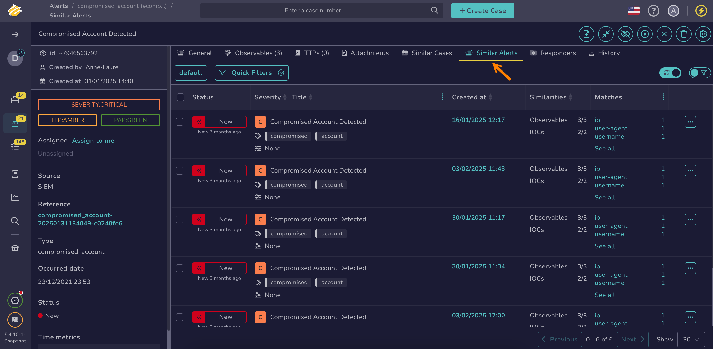

# Find an Alert

Search for [alerts](../about-alerts.md) in TheHive using different methods depending on your needs—from quick searches to advanced filtering.

If you’re unsure which method to use, refer to the [Overview of Search Methods for Alerts](overview-search-methods-alert.md) topic.

!!! tip "Can't find an alert?"
    Ensure [autorefresh](../../about-autorefresh.md) is turned on to automatically display new alerts in lists.

## Method 1: Search bar

<!-- md:version 5.6 -->

*Simple searches for one or more alerts without requiring simultaneous actions.*

1. In the search bar at the top of the page, enter your search text.

    

    

    

2. Select a result from the list, or choose **All results** to view the full set of matches.

!!! note "Refine results"
    The search bar searches across all element types—cases, alerts, observables, tasks, task logs, and jobs. It also doesn't support filters.  

    Use the [Global Search feature](#method-4-global-search-feature) when you need to refine results more precisely.

---

## Method 2: Similar alerts

*If you want to find one or more alerts similar to a known alert and need to perform actions on them simultaneously.*



1. Open a case, an alert, or a task, and select the **Similar alerts** tab.

    

2. 

3. 

For more information, see the [Find Similar Alerts and Cases](../../cases/find-similar-alerts-cases.md) topic.

---

## Method 3: Filters in the Alerts view

*If you need to search for one or more alerts to perform actions on them simultaneously.*

1. 

2. 

    

3. 

---

## Method 4: Global Search feature

*Advanced searches for one or more alerts without requiring simultaneous actions.*

1. Go to the **Global Search** view from the sidebar menu.

    

2. Select the **Alerts** item on the **Search scope** pane.

    

    

3. Enter the keywords you want to search for in the search box displayed by default.

    

    

4. 

5. 

<h2>Next steps</h2>

* [Start Working on an Alert](../start-investigating-an-alert.md)
* [Assign an Alert](../assign-an-alert.md)
* [Ignore Alert Updates from MISP](../ignore-alert-updates-misp.md)
* [Add an Alert to an Existing Case](../add-an-alert-to-an-existing-case.md)
* [Create a Case from an Alert](../create-a-case-from-an-alert.md)
* [Run Responders and Review Reports for an Alert](../run-responders-on-an-alert.md)
* [Find Similar Alerts or Cases](../../cases/find-similar-alerts-cases.md)
* [Close an Alert](../close-an-alert.md)
* [Reopen an Alert](../reopen-an-alert.md)
