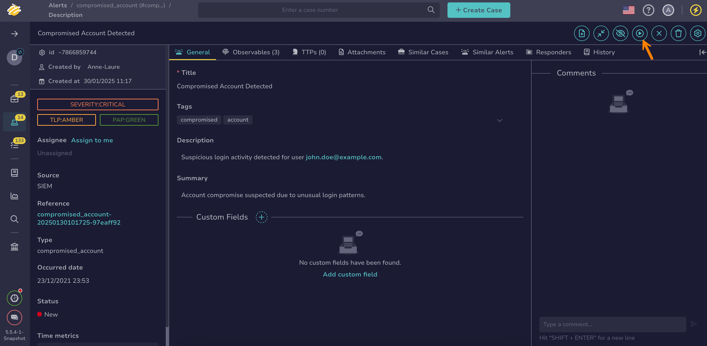

# How to Start Investigating an Alert

This topic provides step-by-step instructions for starting the investigation of an [alert](about-alerts.md) in TheHive.

Use this procedure to begin the triage process for an alert. This automatically updates the alert’s status to one associated with the *In progress* stage. To assign a different status within the same stage, see [Change an Alert Status](change-status-alert.md).

<h2>Procedure</h2>

1. [Find the alert](./search-for-alerts/find-an-alert.md) you want to start investigating.

2. In the alert description, edit any field in the **General** tab, or select **Start** to update the [status](change-status-alert.md) for the alert, write an initial analysis, and assign it to someone else if needed.

    

3. Select **Confirm**.

<h2>Next steps</h2>